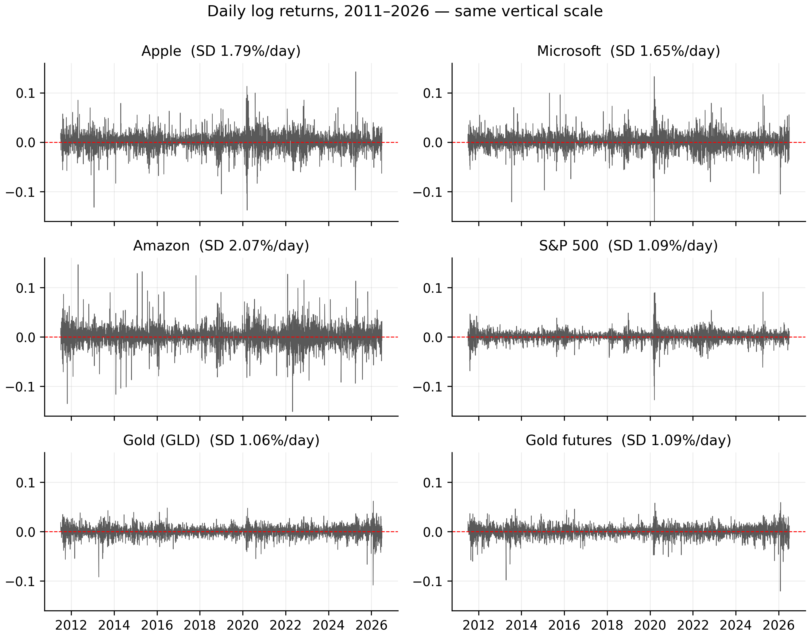
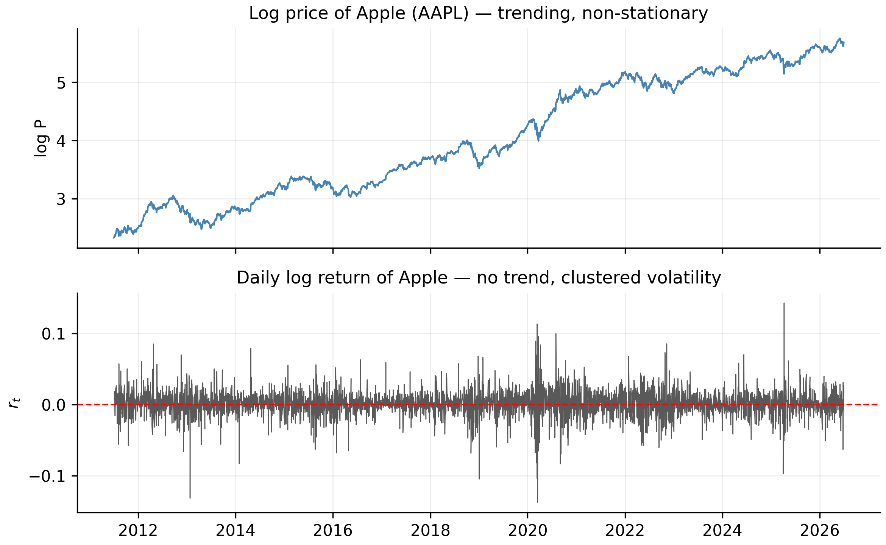

# Asset Returns: Simple and Log {#sec-returns}

Most studies of financial time series work with **returns** rather than
**prices**. Tsay [@tsay2010] opens his book with the same choice, and gives two
reasons: first, a return is a *complete and scale-free* summary of an investment
opportunity — you do not need to know how many dollars were invested to interpret
it; second, return series have **much nicer statistical properties** than price
series, which is exactly what our models will need.

This chapter defines the two return concepts we use everywhere — **simple**
returns and **log** returns — shows how they differ on our real data, and makes
precise *why* the switch from prices to returns matters for everything that
follows.

::: {.callout-note appearance="simple"}
Throughout, each code block has an **R** and a **Python** tab — click to switch.
The code is there for you to copy and run on your own machine; in the text we
report the **results as clear numbers and tables**, not raw console output, so the
insight stays front and centre.
:::

## From prices to returns {#sec-price-to-return}

Let $P_t$ denote the (adjusted) closing price of an asset at the end of day $t$.
The price itself answers "how much is one share worth?", but it is a poor unit
for *analysis*: Apple's adjusted price climbs from about \$10 to about \$315 over
our sample, while the S&P 500 index sits in the thousands. The two live on
completely different scales and cannot be compared directly. A **return**
normalises this away by asking a scale-free question: *by what fraction did the
investment grow from one day to the next?*

## Simple returns {#sec-simple}

::: {.definition}
A **simple net return** is the fraction by which an investment grows from one day to
the next — exactly what happens to a dollar you put in.
:::

The **one-period simple net return** on day $t$ is the fractional change in price,

$$
R_t = \frac{P_t - P_{t-1}}{P_{t-1}} = \frac{P_t}{P_{t-1}} - 1 .
$$ {#eq-simple}

The quantity $1 + R_t = P_t / P_{t-1}$ is the **gross return** — the factor by
which one dollar grows in a day. If $R_t = 0.02$ the price rose 2%, and one
dollar became \$1.02.

Simple returns are the honest description of what happens to your money, and they
have one property that is easy to state and easy to forget: **they compound
multiplicatively across time, not additively.** Holding the asset for $k$ days
turns one dollar into the *product* of the daily gross returns,

$$
1 + R_t(k) = \frac{P_t}{P_{t-k}} = \prod_{j=0}^{k-1}\bigl(1 + R_{t-j}\bigr).
$$ {#eq-simple-multi}

So the $k$-day return is **not** the sum of the daily returns. This is why you
cannot simply add up daily percentage changes to get a monthly figure — a
recurring source of error, and the single most practical reason log returns
exist.

## Log returns {#sec-log}

::: {.definition}
A **log return** is the natural logarithm of the gross return, $r_t = \ln(1+R_t)$. It
is the workhorse of this book because it **adds across time** and is **symmetric** in
gains and losses.
:::

The **continuously compounded** or **log return** is the natural logarithm of the
gross return,

$$
\begin{aligned}
r_t &= \ln\!\bigl(1 + R_t\bigr) = \ln\frac{P_t}{P_{t-1}} \\
    &= \ln P_t - \ln P_{t-1}.
\end{aligned}
$$ {#eq-log}

Writing $p_t = \ln P_t$ for the log price, a log return is simply the
**first difference of the log price**, $r_t = p_t - p_{t-1}$. This tiny
reformulation buys three properties that we will use constantly.

**1. Log returns add up across time.** Because logs turn products into sums, the
awkward product in @eq-simple-multi collapses into a clean sum:

$$
r_t(k) = \ln\frac{P_t}{P_{t-k}} = \sum_{j=0}^{k-1} r_{t-j}.
$$ {#eq-log-additive}

The $k$-day log return is exactly the sum of the daily log returns. Temporal
aggregation — daily to weekly, weekly to monthly — becomes addition, and
multi-step forecasts of cumulative returns become sums of one-step forecasts.
We rely on this directly when we forecast over the July holdout in a later
chapter.

**2. Log returns are approximately equal to simple returns when moves are small.**
A first-order Taylor expansion of @eq-log gives

$$
r_t = \ln(1 + R_t) \approx R_t - \tfrac{1}{2} R_t^2 + \cdots
$$ {#eq-approx}

so for the small daily moves typical of liquid markets the two are almost
identical. They diverge only when $|R_t|$ is large — precisely on crash and spike
days, as we verify below.

**3. Log returns are more symmetric and better behaved in the tails.** A simple
return is bounded below by $-100\%$ (a stock cannot lose more than its value under
limited liability), so $R_t \in [-1, \infty)$ — an asymmetric, one-sided range.
The log return $r_t \in (-\infty, \infty)$ is symmetric around zero, which is what
makes symmetric distributions a reasonable *starting* assumption for $r_t$ (an
assumption we later test and relax).

Computing both return series is a one-liner in either language:

::: {.panel-tabset}

## R

```r
aapl <- read.csv("data/AAPL.csv")
aapl$Date <- as.Date(aapl$Date)
P <- aapl$Adjusted

R_simple <- P / c(NA, head(P, -1)) - 1     # simple return  (eq-simple)
r_log    <- c(NA, diff(log(P)))            # log return     (eq-log)
```

## Python

```python
import pandas as pd, numpy as np

aapl = pd.read_csv("data/AAPL.csv", parse_dates=["Date"])
P = aapl["Adjusted"]

R_simple = P / P.shift(1) - 1              # simple return  (eq-simple)
r_log    = np.log(P).diff()               # log return     (eq-log)
```

:::

On the first few trading days of our sample, the two definitions are visually
indistinguishable — the log return is just a hair smaller than the simple return:

| Date | Adjusted price | Simple $R_t$ | Log $r_t$ |
|:-----------|-------------:|-----------:|----------:|
| 2011-07-01 | 10.2756 | — | — |
| 2011-07-05 | 10.4603 | 1.7975% | 1.7815% |
| 2011-07-06 | 10.5301 | 0.6668% | 0.6646% |
| 2011-07-07 | 10.6929 | 1.5465% | 1.5347% |
| 2011-07-08 | 10.7681 | 0.7027% | 0.7002% |

: First five days of Apple: simple vs log returns {#tbl-first-days}

## How different are they, really? {#sec-compare}

On our data the two definitions are numerically almost interchangeable *on a
typical day*, and visibly different *on extreme days*. The code below computes, for
each series, the mean and standard deviation of daily simple returns, the worst
and best single days, and the **largest absolute gap** $|R_t - r_t|$ over the whole
sample.

::: {.panel-tabset}

## R

```r
symbols <- c("AAPL","MSFT","AMZN","SPX","GLD","GCF")

describe_one <- function(sym) {
  P  <- read.csv(sprintf("data/%s.csv", sym))$Adjusted
  Rs <- P / c(NA, head(P, -1)) - 1
  rl <- c(NA, diff(log(P)))
  data.frame(Series = sym,
             Mean   = mean(Rs, na.rm = TRUE),
             SD     = sd(Rs,   na.rm = TRUE),
             Min    = min(Rs,  na.rm = TRUE),
             Max    = max(Rs,  na.rm = TRUE),
             MaxGap = max(abs(Rs - rl), na.rm = TRUE))
}
do.call(rbind, lapply(symbols, describe_one))
```

## Python

```python
symbols = ["AAPL","MSFT","AMZN","SPX","GLD","GCF"]

def describe_one(sym):
    P  = pd.read_csv(f"data/{sym}.csv")["Adjusted"]
    Rs = P / P.shift(1) - 1
    rl = np.log(P).diff()
    return dict(Series=sym, Mean=Rs.mean(), SD=Rs.std(),
                Min=Rs.min(), Max=Rs.max(), MaxGap=(Rs-rl).abs().max())

pd.DataFrame([describe_one(s) for s in symbols])
```

:::

The estimated numbers:

| Series | Mean (daily) | SD (daily) | Worst day | Best day | Max \|simple − log\| | Gap date |
|:-------|:------------:|:----------:|:---------:|:--------:|:-------------------:|:--------:|
| AAPL | 0.107% | 1.79% | −12.9% | +15.3% | 1.067% | 2025-04-09 |
| MSFT | 0.092% | 1.65% | −14.7% | +14.2% | 1.206% | 2020-03-16 |
| AMZN | 0.105% | 2.07% | −14.0% | +15.7% | 1.123% | 2012-04-27 |
| SPX  | 0.052% | 1.09% | −12.0% |  +9.5% | 0.781% | 2020-03-16 |
| GLD  | 0.031% | 1.05% | −10.3% |  +6.4% | 0.567% | 2026-01-30 |
| GCF  | 0.034% | 1.09% | −11.4% |  +6.1% | 0.699% | 2026-01-30 |

: Simple vs log returns across all six series {#tbl-compare}

Three things in @tbl-compare are worth pausing on.

First, the **daily means are tiny relative to the daily standard deviations**.
Apple returns about $0.11\%$ per day on average with a standard deviation of about
$1.8\%$ — the "signal" is dwarfed by the "noise" by more than a factor of ten.
This is the numerical face of a theme we develop throughout: the *level* of
returns is very hard to predict, while their *volatility* is not.

Second, the **worst days cluster where you would expect**. The S&P 500's minimum
one-day return of roughly $-12\%$ lands on **2020-03-16**, the COVID crash; the
largest simple-vs-log gaps for MSFT and SPX fall on that same date. Gold (`GLD`,
`GCF`) has a noticeably *narrower* range than the equities — an early hint that
gold's risk profile is genuinely different.

Third, the **gap between simple and log returns is negligible until it isn't**.
For all six series the maximum gap over fifteen years is around one percentage
point, and it occurs only on the single most violent day. This justifies the
convention we adopt from here on: **we model log returns**, and read them as
approximate percentage changes.

### The six series side by side {#sec-six-series}

Because returns are scale-free, we can finally put all six instruments on one
common axis — impossible with prices. @fig-returns-grid plots every daily
log-return series on the *same* vertical scale.

{#fig-returns-grid}

::: {.panel-tabset}

## R

```r
symbols <- c("AAPL","MSFT","AMZN","SPX","GLD","GCF")
op <- par(mfrow = c(3, 2), mar = c(2, 4, 2, 1))
for (sym in symbols) {
  d <- read.csv(sprintf("data/%s.csv", sym)); d$Date <- as.Date(d$Date)
  r <- c(NA, diff(log(d$Adjusted)))
  plot(d$Date, r, type = "l", col = "grey30", ylim = c(-0.16, 0.16),
       xlab = "", ylab = "r_t", main = sym); abline(h = 0, col = "red", lty = 2)
}
par(op)
```

## Python

```python
import matplotlib.pyplot as plt
symbols = ["AAPL","MSFT","AMZN","SPX","GLD","GCF"]
fig, ax = plt.subplots(3, 2, figsize=(9, 7), sharex=True)
for a, sym in zip(ax.ravel(), symbols):
    d = pd.read_csv(f"data/{sym}.csv", parse_dates=["Date"]).set_index("Date")
    np.log(d["Adjusted"]).diff().plot(ax=a, lw=0.4, color="0.35")
    a.set_ylim(-0.16, 0.16); a.axhline(0, color="red", ls="--"); a.set_title(sym)
plt.tight_layout(); plt.show()
```

:::

Two contrasts jump out and recur throughout our analysis. First, **the equities are
noticeably more volatile than gold**: Amazon's daily standard deviation is $2.07\%$
and Apple's $1.79\%$, versus about $1.05\%$ for both gold series — gold's panel
visibly hugs the zero line. Second, **volatility clustering is universal**: the
2020 COVID burst is the loudest event in every panel, and calm and turbulent
stretches alternate everywhere. That shared feature is what the GARCH models will
exploit; the differing amplitudes are why each series needs its *own* fitted
parameters, not one set for all.

### Additivity and the compounding trap {#sec-additivity}

The additivity in @eq-log-additive is a correctness guarantee. The daily log
returns of Apple sum *exactly* to the total log return over the sample, whereas
naively summing the daily *simple* returns gives a badly wrong total.

::: {.panel-tabset}

## R

```r
P <- read.csv("data/AAPL.csv")$Adjusted

sum(diff(log(P)))                       # sum of daily log returns
log(tail(P, 1) / head(P, 1))            # log(P_last / P_first) -> identical
sum(P / c(NA, head(P, -1)) - 1, na.rm = TRUE)   # summing simple returns: WRONG
tail(P, 1) / head(P, 1) - 1             # true total simple return
```

## Python

```python
P = pd.read_csv("data/AAPL.csv")["Adjusted"]

np.log(P).diff().sum()                  # sum of daily log returns
np.log(P.iloc[-1] / P.iloc[0])          # log(P_last / P_first) -> identical
(P / P.shift(1) - 1).sum()              # summing simple returns: WRONG
P.iloc[-1] / P.iloc[0] - 1              # true total simple return
```

:::

::: {.callout-important}
## The compounding trap, in numbers
For Apple over the full sample: the daily **log** returns sum to **3.4238**,
*exactly* equal to $\ln(P_{\text{last}}/P_{\text{first}}) = 3.4238$. Exponentiating
recovers a gross return of about **30.7×** — Apple roughly *thirty-folded* on an
adjusted basis, a total simple return near **2,969%**. Naively adding the daily
**simple** returns instead gives only about **4.03** (≈403%) — wrong by nearly an
order of magnitude, because it ignores compounding.
:::

A cleaner illustration of the same asymmetry: a $+50\%$ day followed by a $-50\%$
day does **not** get you back to par. In simple terms you end at
$1.5 \times 0.5 = 0.75$, a $-25\%$ loss; in log terms the moves are $\ln 1.5 =
0.405$ and $\ln 0.5 = -0.693$, summing to $-0.288$ — the same $-25\%$
($e^{-0.288}-1 \approx -0.25$), but expressed additively.

## Why returns beat prices {#sec-why-returns}

The scale argument in @sec-price-to-return is the intuitive reason to prefer
returns. The deeper reason is **statistical**, and it is why our modelling and
forecasting toolkit is even possible.

Almost every model we use — the autocorrelation and ARMA machinery, the GARCH
volatility models — assumes the series is **weakly stationary**: its mean, variance,
and autocovariances do not drift over time.

Prices flagrantly violate this. A price series wanders like a **random walk** — it
trends, has no fixed mean, and its variance grows without bound. Returns, by contrast,
fluctuate around a small, roughly constant mean with a stable spread. Differencing the
log price (exactly what @eq-log does) turns a non-stationary price into a stationary
return.

@fig-price-vs-return makes the contrast visible. The top panel is Apple's log
*price* — a trending, non-stationary line. The bottom panel is its log *return* —
no trend, hovering around zero, but with conspicuous **bursts of volatility** (the
2020 COVID crash above all). That clustering of calm and stormy periods is
**volatility clustering**, the empirical fact that motivates the GARCH stage of our
forecasting toolkit [@cont2001].

{#fig-price-vs-return}

The code that produces this figure:

::: {.panel-tabset}

## R

```r
aapl <- read.csv("data/AAPL.csv"); aapl$Date <- as.Date(aapl$Date)
lp <- log(aapl$Adjusted); rl <- c(NA, diff(lp))

op <- par(mfrow = c(2, 1), mar = c(3, 4, 2, 1))
plot(aapl$Date, lp, type = "l", col = "steelblue",
     xlab = "", ylab = "log P", main = "Log price of Apple (AAPL)")
plot(aapl$Date, rl, type = "l", col = "grey30",
     xlab = "", ylab = "r_t", main = "Daily log return of Apple")
abline(h = 0, col = "red", lty = 2)
par(op)
```

## Python

```python
import matplotlib.pyplot as plt
aapl = pd.read_csv("data/AAPL.csv", parse_dates=["Date"]).set_index("Date")
lp = np.log(aapl["Adjusted"])

fig, ax = plt.subplots(2, 1, figsize=(8, 5), sharex=True)
lp.plot(ax=ax[0], color="steelblue", title="Log price of Apple (AAPL)")
lp.diff().plot(ax=ax[1], color="0.3", title="Daily log return of Apple")
ax[1].axhline(0, color="red", ls="--")
plt.tight_layout(); plt.show()
```

:::

We can put a formal number on "non-stationary" with an **Augmented Dickey–Fuller
(ADF)** test, whose null hypothesis is a unit root (non-stationarity). We only
preview it here; the full treatment is in @sec-unitroot.

::: {.panel-tabset}

## R

```r
library(tseries)
P <- read.csv("data/AAPL.csv")$Adjusted
adf.test(log(P))           # ADF on the log PRICE
adf.test(diff(log(P)))     # ADF on the log RETURN
```

## Python

```python
from statsmodels.tsa.stattools import adfuller
P = pd.read_csv("data/AAPL.csv")["Adjusted"]
adfuller(np.log(P))                    # ADF on the log PRICE
adfuller(np.log(P).diff().dropna())    # ADF on the log RETURN
```

:::

::: {.callout-note}
## What the test says
On Apple's log **price**, ADF returns a **large $p$-value (about 0.3)** — it
**fails to reject** a unit root, so the price is statistically a non-stationary
random walk. On the log **return**, ADF returns a $p$-value at the **floor of the
test (0.01)** — a decisive rejection, so the return is stationary. This is the
formal license to build models on returns, not prices. (Unit-root tests are
subtler than one clean example suggests — the S&P 500's price is a borderline case
we dissect in @sec-unitroot.)
:::

## How this chapter feeds the toolkit {#sec-relevance}

Because we model **log returns**, every series we feed into a later model is
approximately stationary — the precondition the **ARMA** and **GARCH** models
require. The observation that the daily mean is tiny next to the daily standard
deviation is why our **forecasts** will be modest for the *level* of returns and
substantial for their *volatility*. The **additivity** of log returns
(@eq-log-additive) turns one-step forecasts into coherent multi-step forecasts
over the July holdout. The **volatility clustering** in @fig-price-vs-return
motivates the volatility-modelling stage of the toolkit. And gold's **narrower
range** foreshadows the point where an asymmetric volatility model essential for the
stocks proves unnecessary for gold.

::: {.callout-tip}
## Key takeaways
- A **simple return** $R_t = P_t/P_{t-1} - 1$ compounds *multiplicatively*
  (@eq-simple-multi); a **log return** $r_t = \ln(P_t/P_{t-1})$ *adds* across time
  (@eq-log-additive), is $\approx R_t$ for small moves, and is symmetric.
- On our data the two agree to a few thousandths of a percent on ordinary days and
  gap by about a percentage point only on the most extreme day.
- **Prices are non-stationary; returns are stationary** — the statistical reason
  every model that follows is built on returns.
- Always compute returns from the **adjusted** close, and model **log returns**.
:::
