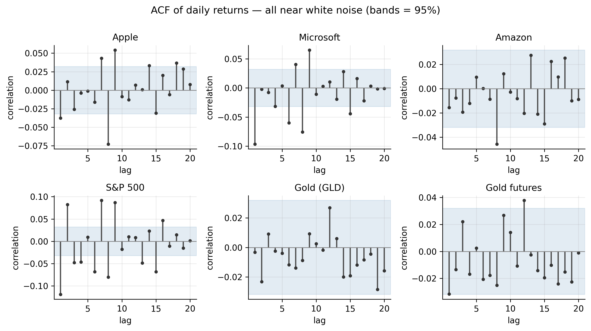
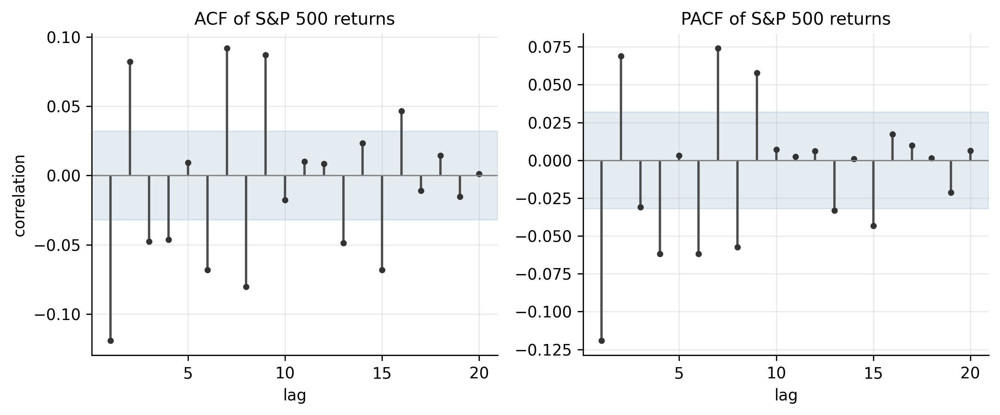
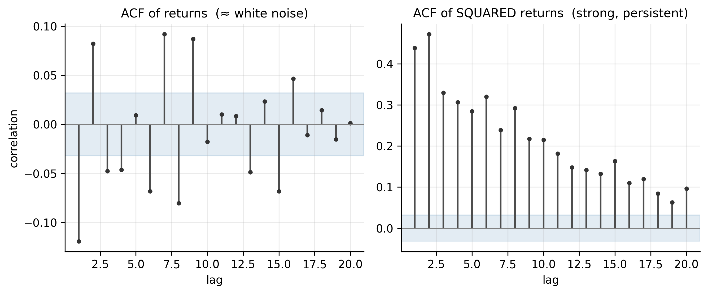
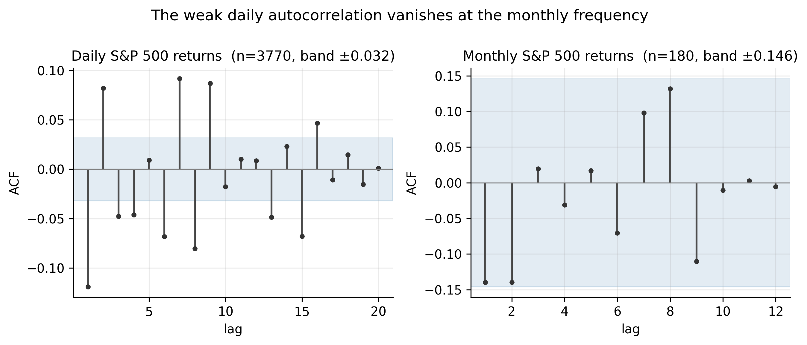
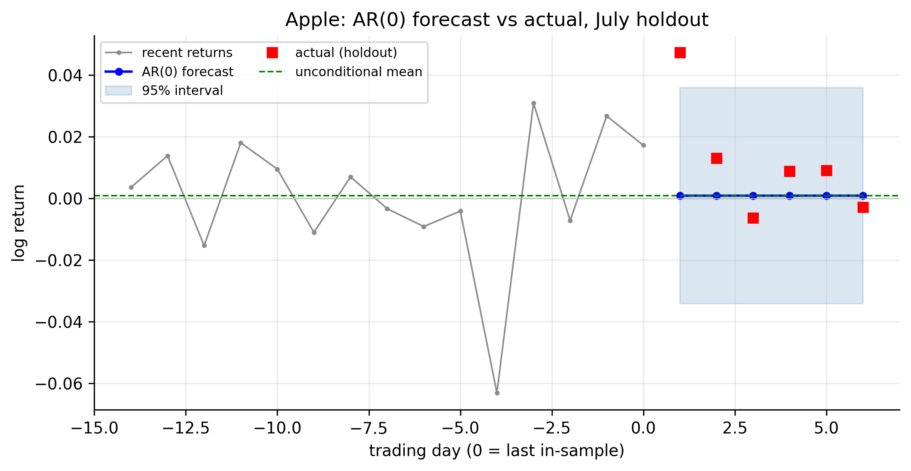
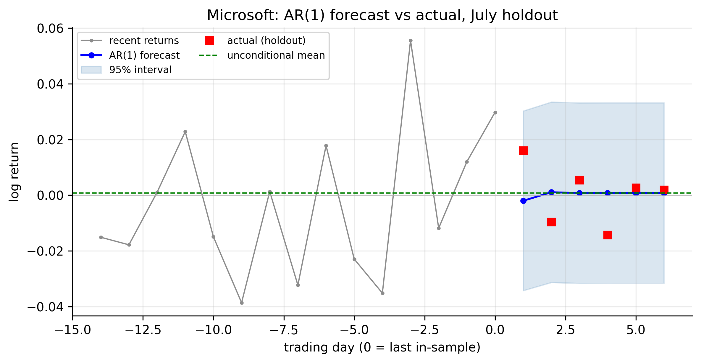
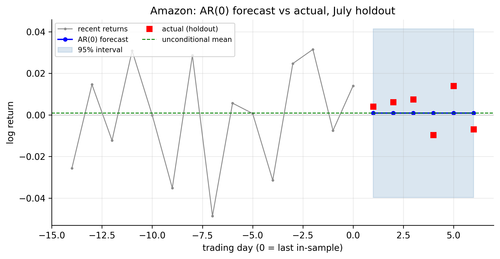
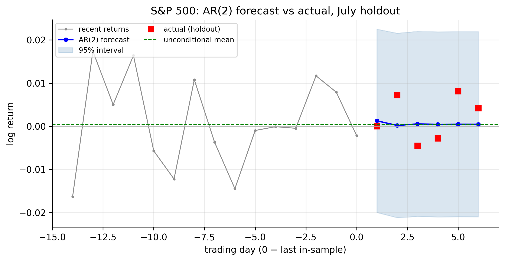
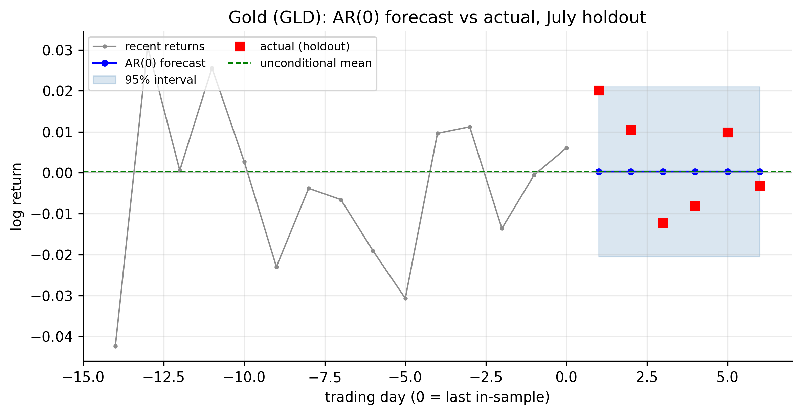
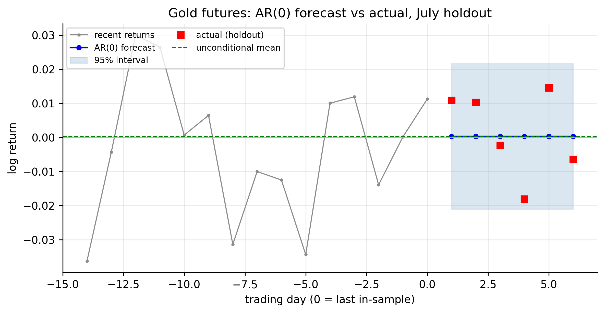

# Linear Time Series Analysis {#sec-linear-ts}

Our objective is concrete: to build **robust models and forecasting tools** for the
returns of the instruments we care about — AAPL, MSFT, AMZN, the S&P 500, and gold.
Before we can forecast, we need a language for describing how a series relates to
its own past. That language is **linear time series analysis**, and its vocabulary
— stationarity, the autocorrelation and partial-autocorrelation functions, white
noise, and the autoregressive model — is what this chapter assembles. By the end we
will fit our first genuine forecasting model, the AR model, to each series and see,
in hard numbers, how far the mean of daily returns can (and cannot) be predicted.

The R code uses base graphics plus `stats`/`forecast`; Python uses `statsmodels`.

## Stationarity {#sec-stationarity}

Every model in our toolkit assumes the series is **weakly stationary**: its mean,
variance, and the correlation between observations $k$ steps apart do not change
over time. Formally, $\{r_t\}$ is weakly stationary if

$$
\begin{aligned}
&E[r_t] = \mu \;\text{(constant)}, \qquad
\operatorname{Var}(r_t) = \sigma^2 \;\text{(constant)}, \\[4pt]
&\operatorname{Cov}(r_t, r_{t-k}) = \gamma_k \;\text{(depends only on the lag } k\text{)}.
\end{aligned}
$$ {#eq-stationary}

The point of stationarity is estimation: only if the correlation structure is
stable through time can we pool the whole sample to estimate *one* set of
parameters and use them to forecast forward. A series whose behaviour drifts gives
us nothing to estimate. We established in @sec-returns that our **log returns are
stationary** while prices are not — which is exactly why every model here is built
on returns. (Strict stationarity, requiring the entire joint distribution to be
time-invariant, is stronger than we need; weak stationarity of the first two
moments is the working assumption.)

## Correlation and the autocorrelation function {#sec-acf}

The engine of linear time series is **serial correlation**: the correlation of a
series with lagged copies of itself. The **autocovariance** at lag $k$ is
$\gamma_k = \operatorname{Cov}(r_t, r_{t-k})$, and dividing by the variance gives
the **autocorrelation function (ACF)**,

$$
\rho_k = \frac{\gamma_k}{\gamma_0}
       = \frac{\operatorname{Cov}(r_t, r_{t-k})}{\operatorname{Var}(r_t)},
\qquad -1 \le \rho_k \le 1 .
$$ {#eq-acf}

The ACF answers "how strongly does today's return move with the return $k$ days
ago?" Its sample estimate from $T$ observations is

$$
\hat\rho_k = \frac{\sum_{t=k+1}^{T} (r_t-\bar r)(r_{t-k}-\bar r)}
                  {\sum_{t=1}^{T} (r_t-\bar r)^2}.
$$ {#eq-sample-acf}

Under the hypothesis that the series is uncorrelated, each $\hat\rho_k$ is
approximately $N(0, 1/T)$, so values outside the band $\pm 1.96/\sqrt{T}$ are
significant at $5\%$. For our sample of $T \approx 3{,}770$ that band is a tight
$\pm 0.032$.

Rather than eyeball $k$ correlations one at a time, the **Ljung–Box** test bundles
the first $m$ into a single portmanteau statistic,

$$
Q(m) = T(T+2) \sum_{k=1}^{m} \frac{\hat\rho_k^2}{T-k}
\;\sim\; \chi^2_m \quad\text{under the white-noise null.}
$$ {#eq-ljungbox}

A large $Q$ rejects the hypothesis of no autocorrelation. Applied to our six return
series (with $m=10$; the $5\%$ critical value is $18.31$), the verdict already
splits the group in two:

::: {.panel-tabset}

## R

```r
symbols <- c("AAPL","MSFT","AMZN","SPX","GLD","GCF")
est_return <- function(sym) {
  d <- read.csv(sprintf("data/%s.csv", sym)); d$Date <- as.Date(d$Date)
  d <- d[d$Date <= as.Date("2026-07-01"), ]
  diff(log(d$Adjusted))
}
for (s in symbols) {
  r <- est_return(s)
  print(c(series = s,
          acf1 = round(acf(r, plot = FALSE)$acf[2], 3),
          LB10 = round(Box.test(r, lag = 10, type = "Ljung-Box")$statistic, 1)))
}
```

## Python

```python
import pandas as pd, numpy as np
from statsmodels.stats.diagnostic import acorr_ljungbox
from statsmodels.tsa.stattools import acf

def est_return(sym):
    d = pd.read_csv(f"data/{sym}.csv", parse_dates=["Date"]).set_index("Date")
    return np.log(d[d.index <= "2026-07-01"]["Adjusted"]).diff().dropna()

for s in ["AAPL","MSFT","AMZN","SPX","GLD","GCF"]:
    r = est_return(s)
    lb = acorr_ljungbox(r, lags=[10]).lb_stat.iloc[0]
    print(s, round(acf(r, nlags=1)[1], 3), round(lb, 1))
```

:::

| Ticker | $\hat\rho_1$ | Ljung–Box $Q(10)$ | White noise? |
|:-------|:------------:|:-----------------:|:-------------|
| AAPL | −0.038 |  48.0 | rejected (faintly) |
| MSFT | −0.097 |  97.4 | **rejected** |
| AMZN | −0.016 |  12.3 | not rejected |
| SPX  | −0.119 | 199.7 | **rejected** |
| GLD  | −0.003 |   4.4 | not rejected |
| GCF  | −0.032 |  16.0 | not rejected |

: Serial correlation in daily returns ($Q(10)$ 5% critical value = 18.31) {#tbl-ljungbox}

@fig-acf-grid shows the ACF of all six series out to 20 lags. The visual message is
unambiguous and central to our whole enterprise: **daily returns are very close to
uncorrelated**. Almost every bar sits inside the significance band; the only
consistent exception is a small *negative* spike at lag 1 for the S&P 500 and
Microsoft.

{#fig-acf-grid}

This is **weak-form market efficiency** made visible, and it sets a sober
expectation for our forecasting goal: if returns barely correlate with their own
past, a linear model of the *mean* return has very little to work with. The three
series that fail to reject white noise — Amazon and both gold series — have, to a
linear model, *no* predictable mean structure at all.

## Partial autocorrelation, and how it differs from the ACF {#sec-pacf}

The ACF has a blind spot. If today correlates with yesterday, and yesterday with
the day before, then today correlates with two days ago *indirectly* — even if
there is no direct link. The ACF cannot separate the direct relationship from the
inherited one. The **partial autocorrelation function (PACF)** fixes this: the
lag-$k$ partial autocorrelation is the correlation between $r_t$ and $r_{t-k}$
**after removing the effect of the intermediate lags** $r_{t-1}, \dots, r_{t-k+1}$.
Operationally, it is the coefficient $\hat\phi_{kk}$ on $r_{t-k}$ when you fit an
autoregression of order $k$.

The distinction is what lets us read a model off the data, because the two
functions have mirror-image signatures:

| Process | ACF | PACF |
|:--------|:----|:-----|
| **AR($p$)** | tails off (decays gradually) | **cuts off after lag $p$** |
| **MA($q$)** | **cuts off after lag $q$** | tails off |
| **ARMA($p,q$)** | tails off | tails off |

: How the ACF and PACF identify a model {#tbl-acf-pacf}

So a sharp PACF cutoff points to an AR model and tells you its order; a sharp ACF
cutoff points to an MA model. @fig-acf-pacf shows both for the S&P 500. The ACF
decays while the PACF has its largest spike at lag 1 (with a couple of smaller
significant lags after) — the fingerprint of a low-order **autoregression**, the
model we develop next.

{#fig-acf-pacf}

::: {.panel-tabset}

## R

```r
r <- est_return("SPX")
op <- par(mfrow = c(1, 2))
acf (r, lag.max = 20, main = "ACF of S&P 500 returns")
pacf(r, lag.max = 20, main = "PACF of S&P 500 returns")
par(op)
```

## Python

```python
from statsmodels.graphics.tsaplots import plot_acf, plot_pacf
import matplotlib.pyplot as plt
r = est_return("SPX")
fig, ax = plt.subplots(1, 2, figsize=(9, 4))
plot_acf (r, lags=20, ax=ax[0]); plot_pacf(r, lags=20, ax=ax[1], method="ywm")
plt.tight_layout(); plt.show()
```

:::

## White noise and linear time series {#sec-white-noise}

::: {.definition}
**White noise** is a sequence of uncorrelated shocks with zero mean and constant
variance — the formal version of "no predictable pattern left."
:::

The benchmark against which all this is measured is **white noise**: a sequence
$\{a_t\}$ with mean zero, constant variance $\sigma^2$, and *no autocorrelation at
any lag* ($\rho_k = 0$ for all $k \neq 0$). White noise is, by construction,
unforecastable from its own past — its best forecast is always its mean.

Our finding in @sec-acf can now be stated sharply: **in the mean, daily returns are
approximately white noise.** But "white noise" carries a subtlety that is decisive
for our objective. Uncorrelated does **not** mean independent. A series can have
zero linear autocorrelation yet be strongly dependent in a *nonlinear* way — and
returns are exactly such a series. @fig-wn-sq makes the point by comparing the ACF
of the S&P 500's returns with the ACF of its *squared* returns.

{#fig-wn-sq}

The returns themselves are uncorrelated, but the *squared* returns are strongly and
persistently correlated (the lag-1 autocorrelation of squared S&P returns is about
$0.44$, and it stays high for many lags). Big days follow big days; calm follows
calm. This is **volatility clustering**, and it means the direction of tomorrow's
return is nearly unpredictable while its *magnitude* is highly predictable. For our
toolkit this is the pivotal fact: it tells us the payoff in forecasting returns
lies not in the mean — where AR models will struggle — but in the **variance**,
which is the target of the GARCH models we build next.

Formally, the class of models we are entering is the **linear time series**, in
which $r_t$ is a linear combination of current and past white-noise shocks (the
Wold representation),

$$
r_t = \mu + \sum_{i=0}^{\infty} \psi_i\, a_{t-i}, \qquad \psi_0 = 1,
$$ {#eq-wold}

where $\{a_t\}$ is white noise and the $\psi_i$ (the **impulse-response weights**)
describe how a shock today echoes into the future. The AR, MA, and ARMA models are
simply parsimonious ways of parameterising these weights. We begin with the AR
model.

## Simple autoregressive (AR) models {#sec-ar}

::: {.definition}
An **autoregressive (AR) model** predicts today's value from a weighted sum of its own
recent past values, plus a random shock.
:::

An **autoregressive model of order $p$**, AR($p$), regresses the series on its own
recent past:

$$
r_t = \phi_0 + \phi_1 r_{t-1} + \phi_2 r_{t-2} + \cdots + \phi_p r_{t-p} + a_t,
$$ {#eq-ar-p}

with $\{a_t\}$ white noise. It is the most natural first forecasting model: to
predict tomorrow, take a weighted combination of the last $p$ days. The AR(1),
$r_t = \phi_0 + \phi_1 r_{t-1} + a_t$, is the workhorse special case.

### Properties of AR models {#sec-ar-properties}

For the **AR(1)**, provided $|\phi_1| < 1$, the process is stationary with

$$
\begin{aligned}
E[r_t] &= \frac{\phi_0}{1-\phi_1}, \qquad
\operatorname{Var}(r_t) = \frac{\sigma^2}{1-\phi_1^2}, \\[4pt]
\rho_k &= \phi_1^{\,k}.
\end{aligned}
$$ {#eq-ar1-props}

Three things to read here. The mean is $\phi_0/(1-\phi_1)$, so the intercept is
*not* the mean unless $\phi_1=0$. The ACF decays geometrically as $\phi_1^k$ — it
**tails off** rather than cutting off, matching @tbl-acf-pacf. And $\phi_1$ is the
persistence: $\phi_1>0$ gives momentum, $\phi_1<0$ gives mean-reversion (a negative
$\phi_1$, which is what our data shows, means an up day tends to be followed by a
down day).

For the general AR($p$), stationarity requires the roots of the characteristic
equation

$$
1 - \phi_1 z - \phi_2 z^2 - \cdots - \phi_p z^p = 0
$$ {#eq-ar-char}

to lie **outside the unit circle**. The mean is
$\mu = \phi_0/(1-\phi_1-\cdots-\phi_p)$, the ACF tails off (following a difference
equation set by the $\phi$'s), and — the identification key — the **PACF cuts off
after lag $p$**.

### Identifying AR models {#sec-ar-identify}

Identification means choosing the order $p$ — how many past lags to include. Two
complementary tools do this: the **PACF** proposes a candidate order from its
*shape*, and an **information criterion** selects one through a formal
fit-versus-complexity trade-off. We then confirm the choice with residual
diagnostics (@sec-ar-gof).

**Reading a candidate order off the PACF.** From @tbl-acf-pacf, an AR($p$) has a
PACF that is significant up to lag $p$ and then **cuts off**. So we count the PACF
spikes poking outside the $\pm 1.96/\sqrt{T}$ band: one spike (lag 1) for Microsoft
suggests AR(1); several early spikes for the S&P 500 suggest a higher order; none
for Amazon or gold suggests AR(0). The PACF is fast and intuitive but *judgmental*
— deciding which borderline spikes are real is subjective — so we back it with a
criterion that attaches a number to the trade-off.

**What an information criterion actually does.** Adding a lag can only *improve*
the in-sample fit: the residual variance $\hat\sigma^2$ falls (weakly) as $p$
grows, because more parameters always fit the sample better. Chasing "best fit"
alone would therefore always pick the biggest model — pure overfitting. An
information criterion stops this by charging a **penalty per parameter**, so a lag
survives only if it improves the fit by *more* than it costs:

$$
\begin{aligned}
\text{AIC} &= \underbrace{T \ln(\hat\sigma^2)}_{\text{fit (smaller is better)}} + \underbrace{2k}_{\text{penalty}}, \\[4pt]
\text{BIC} &= T \ln(\hat\sigma^2) + \underbrace{k \ln T}_{\text{penalty}},
\end{aligned}
$$ {#eq-aic-bic}

where $\hat\sigma^2$ is the residual variance and $k$ the number of estimated
parameters. We fit the model at each order $p = 0, 1, 2, \dots$ and select the
order with the **smallest** criterion.

**Why AIC and BIC disagree.** The only difference is the price per parameter: AIC
charges $2$, BIC charges $\ln T$ — here $\ln(3762) \approx 8.2$, roughly four times
more. A lag must clear a higher bar to be admitted by BIC than by AIC. Concretely,
an AR coefficient of magnitude $\phi$ lowers $T\ln\hat\sigma^2$ by about $T\phi^2$,
so a lag earns its place when $T\phi^2$ beats the penalty — i.e. when

$$
|\phi| \gtrsim \sqrt{\tfrac{2}{T}} \approx 0.023 \;\;(\text{AIC}),
\qquad
|\phi| \gtrsim \sqrt{\tfrac{\ln T}{T}} \approx 0.047 \;\;(\text{BIC}).
$$ {#eq-ic-threshold}

BIC's bar is twice AIC's. This is more than cosmetic: as the sample grows, **BIC
is consistent** — it selects the true order with probability approaching one —
whereas **AIC is not**, keeping a nonzero chance of over-selecting no matter how
large $T$ is. With $T \approx 3{,}800$, AIC will routinely tag tiny,
economically meaningless lags as worth keeping, so we lean on **BIC** for
parsimony and use AIC as a second opinion.

**Watching a criterion pick the order.** The idea becomes concrete when you
tabulate the criterion at each order. @tbl-ic-aapl does this for Apple, reporting
each order as a *difference from the best*, $\Delta = \text{IC} - \min\text{IC}$,
so the chosen order is the one at $\Delta = 0$.

| Order $p$ | 0 | 1 | 2 | 3 | 4 | 5 | 6 | 7 | 8 |
|:----------|:--:|:--:|:--:|:--:|:--:|:--:|:--:|:--:|:--:|
| $\Delta$AIC | 18.6 | 15.2 | 16.8 | 16.4 | 18.3 | 20.2 | 21.2 | 16.5 | **0.0** |
| $\Delta$BIC | **0.0** | 2.8 | 10.7 | 16.5 | 24.6 | 32.8 | 40.0 | 41.6 | 31.3 |

: AIC and BIC by AR order for Apple returns (Δ from each row's minimum; **0.0** marks the choice) {#tbl-ic-aapl}

The two rows disagree sharply. **BIC is smallest at $p=0$** and climbs from there —
every added lag costs more penalty than it repays, so BIC calls Apple **white
noise**. **AIC is smallest at $p=8$**, dragged to the largest order on offer
because its gentler penalty lets a run of individually trivial lags accumulate.
This resolves the puzzle Apple posed back in @tbl-ljungbox: Ljung–Box *did* detect
autocorrelation ($Q=48$, rejected), and it is real — but it is smeared thinly
across many lags, each below BIC's $|\phi|\approx0.047$ bar. AIC chases it into a
spurious AR(8); BIC correctly keeps nothing. **A significant portmanteau test does
not mean a model is worth fitting** — it says *some* dependence exists, not that it
is large enough to exploit.

**The order chosen for each series.** Running both criteria across all six tickers
lays their mean dynamics side by side:

::: {.panel-tabset}

## R

```r
# AIC- and BIC-optimal AR order for each series
for (s in c("AAPL","MSFT","AMZN","SPX","GLD","GCF")) {
  r   <- est_return(s)
  ics <- sapply(0:8, function(p) {
    f <- arima(r, order = c(p, 0, 0), method = "ML")
    c(AIC = AIC(f), BIC = BIC(f))
  })
  cat(s, " AIC-order:", which.min(ics["AIC", ]) - 1,
         " BIC-order:", which.min(ics["BIC", ]) - 1, "\n")
}
```

## Python

```python
from statsmodels.tsa.arima.model import ARIMA
def ic_orders(sym, pmax=8):
    r   = est_return(sym)
    fits = [ARIMA(r, order=(p, 0, 0)).fit() for p in range(pmax + 1)]
    return (int(np.argmin([f.aic for f in fits])),
            int(np.argmin([f.bic for f in fits])))
for s in ["AAPL","MSFT","AMZN","SPX","GLD","GCF"]:
    print(s, "AIC/BIC order:", ic_orders(s))
```

:::

| Ticker | AIC order | BIC order | Chosen model | Reading |
|:-------|:---------:|:---------:|:-------------|:--------|
| AMZN | 0 | 0 | **AR(0)** — white noise | both criteria agree: nothing to model |
| GLD  | 0 | 0 | **AR(0)** — white noise | both agree |
| GCF  | 1 | 0 | **AR(0)** — white noise | AIC keeps a faint lag-1; BIC rejects it |
| AAPL | 8 | 0 | **AR(0)** — white noise | AIC over-selects (@tbl-ic-aapl); BIC and parsimony win |
| MSFT | 8 | 1 | **AR(1)**, $\hat\phi_1 = -0.10$ | BIC keeps exactly one real lag: mild mean-reversion |
| SPX  | 8 | 8 | **higher-order AR** | *both* criteria want many lags — genuine structure |

: AR order chosen by AIC vs BIC across the six series {#tbl-ar-identify}

Now the columns tell a clean story. Where **AIC and BIC agree on 0** (Amazon,
gold) the series is unambiguously white noise. Where they **disagree** (gold
futures, Apple, Microsoft) the gap is exactly AIC's known over-selection, and BIC's
parsimony is the call to trust — white noise for Apple and gold-futures, a tidy
**AR(1)** for Microsoft ($\hat\phi_1 = -0.10$: up days mildly tend to be followed
by down days). The one series where **even BIC wants many lags is the S&P 500** —
its short-horizon structure is real and multi-lag, plausibly a trace of index
microstructure and lead–lag effects among its constituents.

The theme unifying the table: wherever a model *is* warranted, its coefficients are
tiny ($|\hat\phi_1| \le 0.12$). The mean of daily returns carries very little
exploitable structure — which is exactly why, for our forecasting objective, the
leverage is in the variance, not the mean.

### AR models at the monthly frequency {#sec-ar-monthly}

Everything so far used *daily* returns. Do the same tickers behave differently at
the **monthly** frequency? A monthly log return is the sum of about twenty-one
daily ones (@eq-log-additive), and such sums are better-behaved (@sec-aggregation).
Aggregating each series to month-end gives about $180$ observations, on which we
repeat the identification.

::: {.panel-tabset}

## R

```r
monthly_return <- function(sym) {
  d <- read.csv(sprintf("data/%s.csv", sym)); d$Date <- as.Date(d$Date)
  d <- d[d$Date <= as.Date("2026-07-01"), ]
  lp <- log(d$Adjusted)
  last_month <- lp[tapply(seq_along(lp), cut(d$Date, "month"), max)]
  diff(last_month)                                   # monthly log returns
}
library(forecast)
for (s in c("AAPL","MSFT","AMZN","SPX","GLD","GCF")) {
  m <- monthly_return(s)
  cat(s, " n:", length(m),
      " LB(12):", round(Box.test(m, 12, "Ljung-Box")$statistic, 1),
      " BIC-order:",
      auto.arima(m, max.p = 6, max.q = 0, d = 0, seasonal = FALSE, ic = "bic")$arma[1],
      "\n")
}
```

## Python

```python
def monthly_return(sym):
    d = pd.read_csv(f"data/{sym}.csv", parse_dates=["Date"]).set_index("Date")
    d = d[d.index <= "2026-07-01"]
    return np.log(d["Adjusted"]).resample("ME").last().diff().dropna()

for s in ["AAPL","MSFT","AMZN","SPX","GLD","GCF"]:
    m  = monthly_return(s)
    lb = acorr_ljungbox(m, lags=[12]).lb_stat.iloc[0]
    print(s, len(m), round(lb, 1))
```

:::

With only $\sim\!180$ monthly observations the significance band widens to
$\pm 1.96/\sqrt{180} \approx \pm 0.146$ — far looser than the daily $\pm 0.032$.
@tbl-ar-monthly sets the two frequencies side by side.

| Ticker | Daily BIC order | Monthly $\hat\rho_1$ | Monthly LB(12) | Monthly BIC order |
|:-------|:---------------:|:--------------------:|:--------------:|:-----------------:|
| AAPL | 0 | +0.090 | 12.3 | 0 |
| MSFT | 1 | −0.078 |  6.7 | 0 |
| AMZN | 0 | −0.090 |  7.1 | 0 |
| SPX  | 8 | −0.140 | 15.9 | 0 |
| GLD  | 0 | −0.046 | 10.3 | 0 |
| GCF  | 0 | −0.038 | 11.6 | 0 |

: AR structure at the monthly frequency (LB(12) 5% critical value = 21.03; band ±0.146) {#tbl-ar-monthly}

The result is unambiguous: **at the monthly frequency every one of the six series
is white noise.** No lag-1 autocorrelation clears the band, no Ljung–Box statistic
reaches its $21.03$ critical value, and BIC selects AR(0) for all six — even the
S&P 500, whose *daily* returns carried the richest structure of the group.
@fig-daily-vs-monthly shows the disappearance for the S&P directly: the clear
negative lag-1 spike in daily returns is simply gone once we aggregate.

{#fig-daily-vs-monthly}

Two forces drive this, and both matter for our objective. First, **aggregation
washes the structure out**: the negative lag-1 autocorrelation in daily index and
stock returns is a *high-frequency* effect — short-term reversal and microstructure
noise such as the bid–ask bounce — and summing twenty-one days averages it away.
Second, **power falls**: with $180$ observations instead of $3{,}770$, the test
cannot detect correlations as small as those that remain. Either way the message
sharpens rather than contradicts the daily finding: **the mean of returns grows
*more* unforecastable, not less, as the horizon lengthens.** For monthly
forecasting the honest AR model is AR(0) — the best forecast of next month's return
is its long-run average. The predictability our toolkit can exploit is not in the
mean at any frequency; it is in the volatility.

### Goodness of fit {#sec-ar-gof}

A fitted AR model earns its keep only if its **residuals are white noise** — if
$\hat a_t = r_t - \hat r_t$ shows no leftover autocorrelation (checked with
Ljung–Box on the residuals) then the linear structure has been captured. But the
more sobering diagnostic is how *little* structure there was to capture. The
coefficient of determination for these fits is

$$
R^2 \approx 1 - \frac{\hat\sigma_a^2}{\hat\sigma_r^2},
$$ {#eq-r2}

and for the S&P 500's AR model it is about **0.018** — under $2\%$ of the variance
of daily returns is explained by its own past. Microsoft's AR(1) explains about
$1\%$ ($R^2 \approx \hat\phi_1^2$). Fitting the AR does whiten the residuals'
*linear* autocorrelation, but it leaves the squared-residual correlation of
@fig-wn-sq completely intact — the volatility clustering is untouched, waiting for
GARCH.

::: {.panel-tabset}

## R

```r
fit <- arima(est_return("SPX"), order = c(2, 0, 0))
Box.test(residuals(fit), lag = 10, type = "Ljung-Box")   # residuals ~ white noise?
1 - fit$sigma2 / var(est_return("SPX"))                  # approx R^2
```

## Python

```python
from statsmodels.tsa.arima.model import ARIMA
fit = ARIMA(est_return("SPX"), order=(2, 0, 0)).fit()
print(acorr_ljungbox(fit.resid, lags=[10]))              # residual white-noise test
print(1 - fit.resid.var() / est_return("SPX").var())     # approx R^2
```

:::

### Forecasting {#sec-ar-forecast}

Forecasting from an AR model is recursive: to forecast $h$ steps ahead, plug in
earlier forecasts for the unknown future values. For the AR(1) this gives a clean
closed form,

$$
\hat r_t(h) = \mu + \phi_1^{\,h}\,(r_t - \mu),
$$ {#eq-ar1-forecast}

which **decays to the unconditional mean** $\mu$ as the horizon $h$ grows — the
farther out we look, the more the forecast forgets today and reverts to the average
return. Meanwhile the forecast-error variance *grows* with the horizon, from the
one-step $\sigma^2$ up toward the unconditional variance $\sigma^2/(1-\phi_1^2)$.

@fig-ar-forecast applies this to the S&P 500 over our July holdout, forecasting the
six trading days after the estimation window with a parsimonious AR(2).

{#fig-ar-forecast}

::: {.panel-tabset}

## R

```r
fit <- arima(est_return("SPX"), order = c(2, 0, 0))
predict(fit, n.ahead = 6)          # $pred (forecasts) and $se (std errors)
```

## Python

```python
fit = ARIMA(est_return("SPX"), order=(2, 0, 0)).fit()
fc  = fit.get_forecast(steps=6)
print(fc.predicted_mean, fc.conf_int())
```

:::

The figure is the honest verdict on mean forecasting, and it is exactly what the
theory predicts. The point forecast flattens to $\approx 0.05\%$ within two days;
the $95\%$ interval is enormous relative to it (about $\pm 2\%$, i.e. forty times
the forecast); and the realised returns land all over that band with no
directional agreement. **The AR model's most useful output is not the point
forecast but the interval** — an honest statement that tomorrow's return is
$0.05\% \pm 2\%$, dominated by noise.

The S&P 500 is not a special case. The carousel below runs the identical exercise
for all six tickers — each fit with its own identified AR order and forecast across
the same July holdout. Click the arrows (or the dots) to step through them.

```{=html}
<style>
#fcCarousel { max-width: 820px; margin: 1.2rem auto 3rem; }
#fcCarousel .carousel-control-prev-icon,
#fcCarousel .carousel-control-next-icon { filter: invert(1); background-color: rgba(0,0,0,.5); border-radius: 50%; padding: 14px; }
#fcCarousel .carousel-indicators { bottom: -2.4rem; }
#fcCarousel .carousel-indicators [data-bs-target] { background-color: #555; }
</style>
<div id="fcCarousel" class="carousel slide" data-bs-ride="false" data-bs-interval="false">
  <div class="carousel-indicators">
    <button type="button" data-bs-target="#fcCarousel" data-bs-slide-to="0" class="active" aria-current="true" aria-label="Apple"></button>
    <button type="button" data-bs-target="#fcCarousel" data-bs-slide-to="1" aria-label="Microsoft"></button>
    <button type="button" data-bs-target="#fcCarousel" data-bs-slide-to="2" aria-label="Amazon"></button>
    <button type="button" data-bs-target="#fcCarousel" data-bs-slide-to="3" aria-label="S&amp;P 500"></button>
    <button type="button" data-bs-target="#fcCarousel" data-bs-slide-to="4" aria-label="Gold GLD"></button>
    <button type="button" data-bs-target="#fcCarousel" data-bs-slide-to="5" aria-label="Gold futures"></button>
  </div>
  <div class="carousel-inner">
    <div class="carousel-item active"></div>
    <div class="carousel-item"></div>
    <div class="carousel-item"></div>
    <div class="carousel-item"></div>
    <div class="carousel-item"></div>
    <div class="carousel-item"></div>
  </div>
  <button class="carousel-control-prev" type="button" data-bs-target="#fcCarousel" data-bs-slide="prev"><span class="carousel-control-prev-icon" aria-hidden="true"></span><span class="visually-hidden">Previous</span></button>
  <button class="carousel-control-next" type="button" data-bs-target="#fcCarousel" data-bs-slide="next"><span class="carousel-control-next-icon" aria-hidden="true"></span><span class="visually-hidden">Next</span></button>
</div>
```

::: {.content-visible when-format="pdf"}
::: {layout-ncol=2}


:::
:::

Every panel is the same shape. For the **AR(0)** series — Amazon, both gold series,
and Apple — the forecast is *exactly* the historical mean, a flat line inside a flat
$\pm 2$–$4\%$ band; for **Microsoft's AR(1)** and the **S&P's AR(2)** there is a
barely perceptible one-day wiggle before reversion. In every case the realised
holdout returns scatter across the interval with no directional agreement. Across a
mega-cap stock, a broad index, and gold alike, the mean of daily returns is
effectively unforecastable, and the interval — not the point — is the deliverable.

This is not a failure of the model; it is the model correctly reporting weak-form
efficiency. And it sharpens our objective precisely. A robust forecasting toolkit
for these series will not make money predicting the *direction* of daily returns —
the AR model proves there is almost nothing there. Its real leverage is in the
*magnitude*: the volatility clustering of @fig-wn-sq, which we turn into
conditional-variance forecasts and Value-at-Risk in the GARCH stage of the toolkit.

::: {.callout-tip}
## Key takeaways
- **Stationarity** (@eq-stationary) lets us estimate one stable correlation
  structure from the whole sample — our returns have it, prices do not.
- The **ACF** (@eq-acf) measures total serial correlation; the **PACF** measures
  the *direct* correlation at a lag. Their cutoff/tail-off signatures identify the
  model (@tbl-acf-pacf).
- Daily returns are **approximately white noise in the mean** — but *not
  independent*: squared returns are strongly correlated (**volatility
  clustering**), which is where our forecasting leverage really lies.
- **AR($p$)** models the mean from its own past; the **PACF and BIC** identify the
  order. Across our tickers the orders differ sharply — Amazon and gold are white
  noise, Microsoft a clean AR(1), the S&P richer — but every coefficient is tiny.
- AR **forecasts revert to the mean** with widening intervals (@eq-ar1-forecast);
  for daily returns they explain under $2\%$ of variance, so the point forecast is
  near-flat and the **interval is the real deliverable**.
- **Aggregation matters**: at the *monthly* frequency all six series are white
  noise (AR(0)) — the mean grows *more* unforecastable as the horizon lengthens.
:::

## Concept check {#sec-concept-check}

Work through these before moving on. Each answer is collapsed — decide first, then
expand it.

**Q1. Why does our framework model returns rather than prices?**

- **(a)** Returns are always positive, which the models require.
- **(b)** Prices are non-stationary (they carry a unit root) while returns are
  approximately stationary, which is the precondition our models need.
- **(c)** Returns have larger means than prices.
- **(d)** Prices cannot be aggregated across time.

::: {.callout-note collapse="true"}
## Show answer
**(b).** Every model here assumes weak stationarity — a stable mean, variance, and
autocovariance. Prices trend and wander (unit root); differencing the log price
into a return removes that unit root and delivers a stationary series.
:::

**Q2. A series has an ACF that decays gradually and a PACF that cuts off sharply
after lag 1. This is the signature of:**

- **(a)** an MA(1) process.
- **(b)** white noise.
- **(c)** an AR(1) process.
- **(d)** a random walk.

::: {.callout-note collapse="true"}
## Show answer
**(c).** AR($p$): ACF tails off, PACF cuts off after lag $p$. A single PACF spike
with a decaying ACF is AR(1). (An MA(1) shows the mirror image — ACF cuts off,
PACF tails off.)
:::

**Q3. The S&P 500's return ACF is near zero, but the ACF of its *squared* returns is
large and persistent. Daily returns are therefore:**

- **(a)** independent and identically distributed.
- **(b)** uncorrelated but *not* independent — dependent in their variance.
- **(c)** strongly autocorrelated in the mean.
- **(d)** non-stationary.

::: {.callout-note collapse="true"}
## Show answer
**(b).** White noise means *uncorrelated*, not independent. Zero autocorrelation in
returns with strong autocorrelation in squared returns is **volatility clustering**
— nonlinear dependence in the variance, the target of the GARCH stage.
:::

**Q4. With ≈3,800 observations, AIC selects AR(8) for Apple while BIC selects AR(0).
The best interpretation is:**

- **(a)** Apple has strong eight-lag structure that BIC misses.
- **(b)** AIC is always more accurate than BIC.
- **(c)** AIC's lighter per-parameter penalty ($2$ vs $\ln T \approx 8.2$) makes it
  over-select trivial lags in large samples; BIC's parsimony is more trustworthy here.
- **(d)** The data are corrupted.

::: {.callout-note collapse="true"}
## Show answer
**(c).** BIC is consistent (it finds the true order as $T\to\infty$); AIC is not and
tends to over-select in large samples. Here BIC's AR(0) — white noise — is the
honest call.
:::

**Q5. Apple's Ljung–Box test rejects white noise ($Q=48$), yet its chosen model is
AR(0). Why is that not a contradiction?**

- **(a)** The Ljung–Box test is simply wrong.
- **(b)** A significant portmanteau test means *some* autocorrelation exists, but
  here it is too small and diffuse to justify fitting any model.
- **(c)** AR(0) means the series is non-stationary.
- **(d)** BIC ignores autocorrelation.

::: {.callout-note collapse="true"}
## Show answer
**(b).** Significance ≠ magnitude. With 3,800 observations even trivial correlations
are detectable; the Ljung–Box rejects, but no single lag clears BIC's threshold, so
the practical model is white noise.
:::

**Q6. For a stationary AR(1) with $\phi_1 = -0.10$, as the horizon $h$ grows the
point forecast:**

- **(a)** explodes to infinity.
- **(b)** oscillates with growing amplitude.
- **(c)** converges to the unconditional mean, with a widening forecast interval.
- **(d)** stays equal to the last observed value forever.

::: {.callout-note collapse="true"}
## Show answer
**(c).** $\hat r_t(h) = \mu + \phi_1^{\,h}(r_t-\mu)$; since $|\phi_1|<1$, $\phi_1^h
\to 0$, so the forecast decays to $\mu$ while the error variance grows toward the
unconditional variance. (Answer (d) describes a *random walk*, not a stationary AR.)
:::

**Q7. Moving from daily to monthly returns, the S&P 500's AR structure disappears
(BIC picks AR(0)). The main reason is:**

- **(a)** monthly returns are non-stationary.
- **(b)** temporal aggregation averages out high-frequency microstructure effects,
  and the far smaller sample has less power to detect tiny correlations.
- **(c)** monthly returns have no mean.
- **(d)** the monthly data contain errors.

::: {.callout-note collapse="true"}
## Show answer
**(b).** The daily negative lag-1 correlation is a high-frequency artifact (reversal
/ bid–ask bounce) that summing ~21 days washes out; and with ~180 monthly points the
significance band widens to ±0.146, so small correlations become undetectable.
:::
