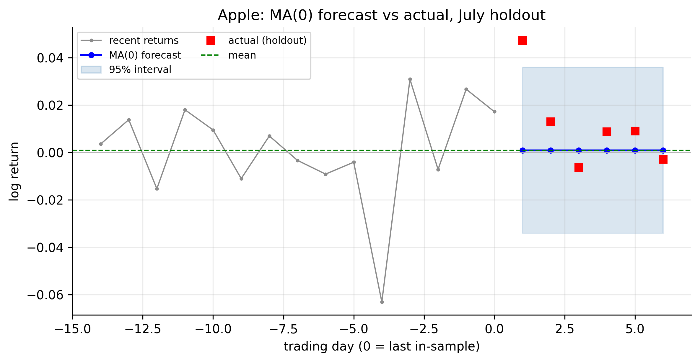
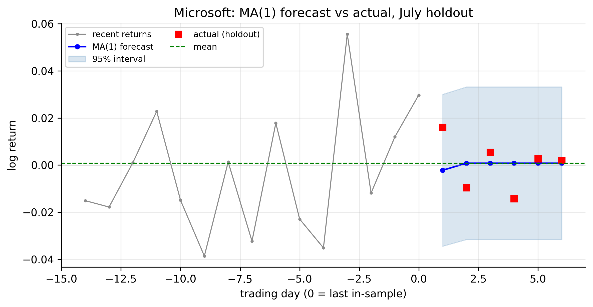
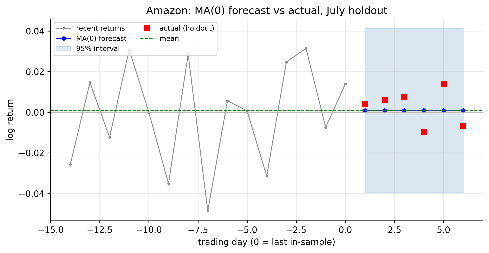
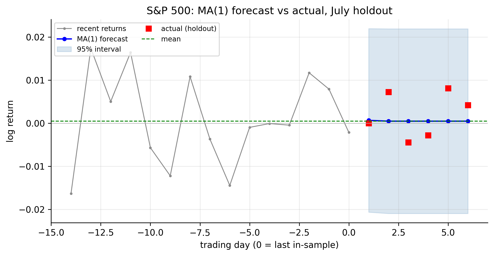
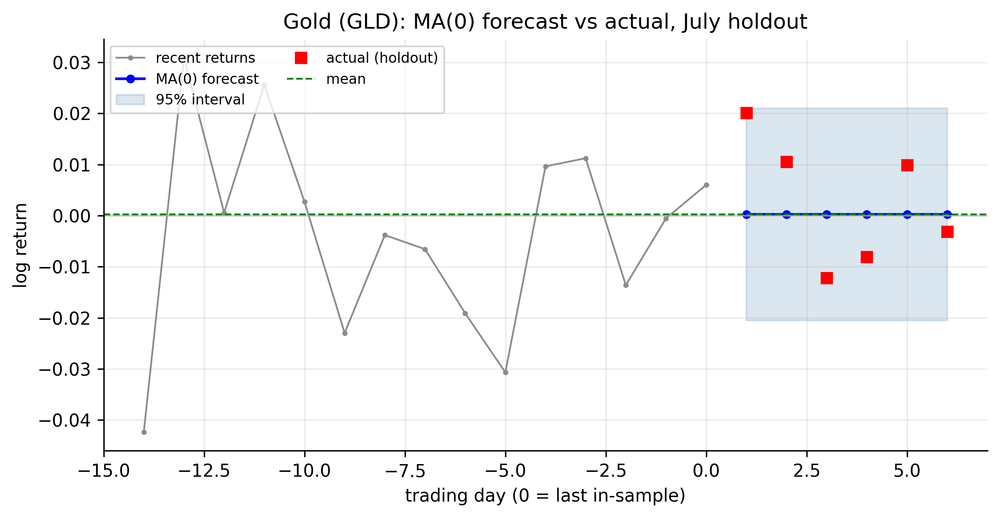
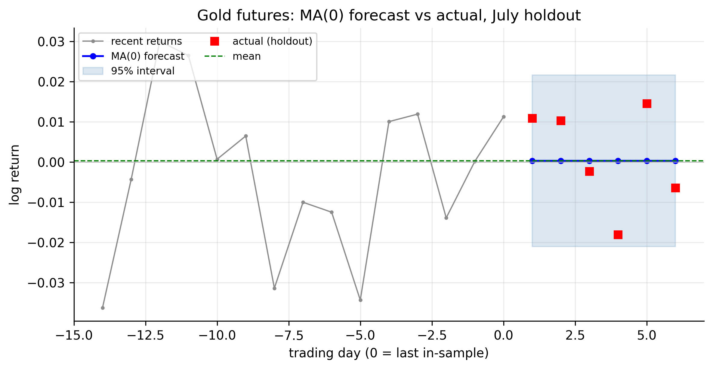

# Moving-Average Models {#sec-ma}

The AR model of @sec-ar builds the mean from the series' own past *values*. The
**moving-average (MA)** model builds it instead from the past *shocks* — the
white-noise innovations that hit the series. It is the natural counterpart to the
AR model, and it comes with a lesson that our data will make vivid: for a series
whose only serial correlation is a single lag, the AR and MA descriptions are
nearly interchangeable. We follow the same path as before — definition,
properties, identification, goodness of fit, forecasting — and apply each step to
the six tickers.

The R code uses `stats`/`forecast`; Python uses `statsmodels`.

## Simple MA models {#sec-ma-def}

::: {.definition}
A **moving-average (MA) model** builds today's value from the current and most recent
random *shocks*, rather than from past values.
:::

A **moving-average model of order $q$**, MA($q$), expresses today's return as a
weighted average of the current and most recent $q$ shocks:

$$
r_t = \mu + a_t + \theta_1 a_{t-1} + \theta_2 a_{t-2} + \cdots + \theta_q a_{t-q},
$$ {#eq-ma-q}

with $\{a_t\}$ white noise. The name is literal: $r_t$ is a moving average of the
innovation stream. It is the special case of the linear (Wold) representation
@eq-wold in which only finitely many weights are nonzero — $\psi_0 = 1$, $\psi_i =
\theta_i$ for $i \le q$, and $\psi_i = 0$ afterward. The **MA(1)**, $r_t = \mu +
a_t + \theta_1 a_{t-1}$, is the workhorse: today's return is this period's shock
plus a fraction of last period's.

## Properties of MA models {#sec-ma-properties}

MA models differ from AR models in three ways worth stating clearly.

**They are always stationary.** An MA($q$) is a *finite* sum of white-noise terms,
so its mean and variance are constant for *any* values of the $\theta$'s — there is
no stationarity condition to check. This is the opposite of the AR case, where
$|\phi|<1$ (roots outside the unit circle) was required. Concretely,

$$
E[r_t] = \mu, \qquad
\operatorname{Var}(r_t) = \sigma^2\bigl(1 + \theta_1^2 + \cdots + \theta_q^2\bigr).
$$ {#eq-ma-moments}

Note the mean *is* the constant $\mu$ — unlike the AR model, where the intercept
had to be rescaled by $1/(1-\sum\phi)$.

**The ACF cuts off after lag $q$.** This is the identification signature. Because
$r_t$ and $r_{t-k}$ share no common shocks once $k > q$, their correlation is
exactly zero beyond lag $q$. For the MA(1),

$$
\rho_1 = \frac{\theta_1}{1 + \theta_1^2}, \qquad \rho_k = 0 \;\text{ for } k \ge 2,
$$ {#eq-ma1-acf}

while the **PACF tails off** gradually. This is the exact mirror image of the AR
model (@tbl-acf-pacf), whose PACF cuts off and ACF tails off.

**Invertibility.** Different $\theta$ values can produce the same ACF (for MA(1),
$\theta_1$ and $1/\theta_1$ give identical $\rho_1$). To make the model unique — and
to let it be rewritten as an infinite-order AR — we require the roots of $1 +
\theta_1 z + \cdots + \theta_q z^q = 0$ to lie **outside the unit circle** (for the
MA(1), $|\theta_1| < 1$). We always report the invertible solution.

## Identifying MA models {#sec-ma-identify}

Identification mirrors the AR procedure with the roles of the ACF and PACF swapped:
the **ACF** now supplies the order (it cuts off after lag $q$), and an information
criterion confirms it. Looking back at the ACF grid in @fig-acf-grid, our returns'
autocorrelations are essentially zero beyond lag 1, and lag 1 itself is significant
only for Microsoft and the S&P 500 (marginally Apple). So the ACF points to an
**MA(1)** for Microsoft and the S&P and **MA(0)** — white noise — for the rest,
exactly mirroring the AR verdict. AIC/BIC agree:

::: {.panel-tabset}

## R

```r
est_return <- function(sym) {
  d <- read.csv(sprintf("data/%s.csv", sym)); d$Date <- as.Date(d$Date)
  diff(log(d$Adjusted[d$Date <= as.Date("2026-07-01")]))
}
# MA order by BIC (fit q = 0,1,2 and compare)
for (s in c("AAPL","MSFT","AMZN","SPX","GLD","GCF")) {
  r   <- est_return(s)
  bic <- sapply(0:2, function(q) BIC(arima(r, order = c(0, 0, q), method = "ML")))
  cat(s, " MA-order (BIC):", which.min(bic) - 1, "\n")
}
arima(est_return("SPX"), order = c(0, 0, 1))     # SPX MA(1): estimate theta
```

## Python

```python
import pandas as pd, numpy as np
from statsmodels.tsa.arima.model import ARIMA

def est_return(sym):
    d = pd.read_csv(f"data/{sym}.csv", parse_dates=["Date"]).set_index("Date")
    return np.log(d[d.index <= "2026-07-01"]["Adjusted"]).diff().dropna()

for s in ["AAPL","MSFT","AMZN","SPX","GLD","GCF"]:
    bic = [ARIMA(est_return(s), order=(0, 0, q)).fit().bic for q in range(3)]
    print(s, "MA-order (BIC):", int(np.argmin(bic)))
```

:::

| Ticker | $\hat\rho_1$ | MA order (BIC) | $\hat\theta_1$ | AR order (BIC) |
|:-------|:------------:|:--------------:|:--------------:|:--------------:|
| AAPL | −0.038 | 0 | — | 0 |
| MSFT | −0.097 | 1 | −0.10 | 1 |
| AMZN | −0.016 | 0 | — | 0 |
| SPX  | −0.119 | 1 | −0.11 | 8 |
| GLD  | −0.003 | 0 | — | 0 |
| GCF  | −0.032 | 0 | — | 0 |

: MA identification across the six series, next to the AR order {#tbl-ma-identify}

### AR(1) and MA(1) are nearly the same model here {#sec-ar-ma-equiv}

@tbl-ma-identify contains the chapter's key insight. For a series whose *only*
serial correlation is a single small $\rho_1$, both descriptions fit it: the AR(1)
produces one PACF spike, the MA(1) produces one ACF spike, and with correlation
only at lag 1 those are the *same* spike. The data cannot tell the two models
apart. Fitting both to Microsoft and the S&P makes the point numerically:

| Series | AR(1) $\hat\phi_1$ | AR(1) resid. SD | MA(1) $\hat\theta_1$ | MA(1) resid. SD |
|:-------|:------------------:|:---------------:|:--------------------:|:---------------:|
| MSFT | −0.097 | 1.6453% | −0.100 | 1.6449% |
| SPX  | −0.119 | 1.0858% | −0.110 | 1.0866% |

: The same series fit as AR(1) and as MA(1) {#tbl-ar-ma-equiv}

The estimated coefficients nearly coincide ($\hat\theta_1 \approx \hat\phi_1
\approx \hat\rho_1$) and the residual standard deviations match to four decimal
places. The reason is visible in the algebra: for a small parameter, the MA(1)
autocorrelation $\rho_1 = \theta_1/(1+\theta_1^2) \approx \theta_1$, while the
AR(1) has $\rho_1 = \phi_1$ — so both parameters just equal the lone lag-1
correlation. **For these series the choice between AR(1) and MA(1) is immaterial.**
The distinction only bites when a series has richer structure — which points to the
one asymmetry in @tbl-ma-identify: the S&P's AR order was $8$ but its MA order is
$1$. The S&P's ACF is (weakly) significant at lag 2 as well as lag 1, so neither a
low-order AR nor a low-order MA fully captures it; a mixed **ARMA** model, next,
does the job more parsimoniously.

At the **monthly** frequency the story collapses entirely: as we saw for AR
(@tbl-ar-monthly), every series is white noise, so the MA order is $0$ for all six.
Aggregation erases what little short-horizon structure the daily data held.

## Goodness of fit {#sec-ma-gof}

The diagnostics are the same as for AR, with the same sobering conclusion. A fitted
MA model should leave **white-noise residuals** (Ljung–Box on $\hat a_t$ should not
reject), and its explanatory power is tiny: because the MA(1) and AR(1) residual
variances coincide (@tbl-ar-ma-equiv), Microsoft's MA(1) explains about $1\%$ of
return variance, the S&P's about $1.4\%$. And exactly as before, whitening the
*linear* dependence leaves the **squared**-residual correlation of @fig-wn-sq
untouched — the volatility clustering is still there, still waiting for GARCH.

::: {.panel-tabset}

## R

```r
fit <- arima(est_return("SPX"), order = c(0, 0, 1))       # MA(1)
Box.test(residuals(fit), lag = 10, type = "Ljung-Box")    # residuals white noise?
1 - fit$sigma2 / var(est_return("SPX"))                   # approx R^2
```

## Python

```python
from statsmodels.stats.diagnostic import acorr_ljungbox
fit = ARIMA(est_return("SPX"), order=(0, 0, 1)).fit()
print(acorr_ljungbox(fit.resid, lags=[10]))
print(1 - fit.resid.var() / est_return("SPX").var())
```

:::

## Forecasting {#sec-ma-forecast}

MA forecasting has a defining feature: **finite memory.** An MA($q$) remembers only
the last $q$ shocks, so its forecast reverts to the mean *abruptly* once the
horizon passes $q$:

$$
\hat r_t(h) =
\begin{cases}
\mu + \sum_{j=h}^{q} \theta_j\, a_{t+h-j}, & h \le q,\\[4pt]
\mu, & h > q.
\end{cases}
$$ {#eq-ma-forecast}

For an MA(1) this means the one-step forecast is $\mu + \theta_1 a_t$ — a single
adjustment based on the last observed shock — and **every forecast from two steps
out is exactly the mean**. The forecast-error variance jumps from $\sigma^2$ at
$h=1$ to the full unconditional variance $\sigma^2(1+\theta_1^2)$ for $h \ge 2$ and
stays there. This is a sharp contrast with the AR(1), whose forecast decays to the
mean *gradually* (as $\phi_1^h$); the MA(1) snaps to it after one step.

The carousel below runs the MA forecast across all six tickers over the July
holdout. Step through with the arrows or dots.

```{=html}
<style>
#maCarousel { max-width: 820px; margin: 1.2rem auto 3rem; }
#maCarousel .carousel-control-prev-icon,
#maCarousel .carousel-control-next-icon { filter: invert(1); background-color: rgba(0,0,0,.5); border-radius: 50%; padding: 14px; }
#maCarousel .carousel-indicators { bottom: -2.4rem; }
#maCarousel .carousel-indicators [data-bs-target] { background-color: #555; }
</style>
<div id="maCarousel" class="carousel slide" data-bs-ride="false" data-bs-interval="false">
  <div class="carousel-indicators">
    <button type="button" data-bs-target="#maCarousel" data-bs-slide-to="0" class="active" aria-current="true" aria-label="Apple"></button>
    <button type="button" data-bs-target="#maCarousel" data-bs-slide-to="1" aria-label="Microsoft"></button>
    <button type="button" data-bs-target="#maCarousel" data-bs-slide-to="2" aria-label="Amazon"></button>
    <button type="button" data-bs-target="#maCarousel" data-bs-slide-to="3" aria-label="S&amp;P 500"></button>
    <button type="button" data-bs-target="#maCarousel" data-bs-slide-to="4" aria-label="Gold GLD"></button>
    <button type="button" data-bs-target="#maCarousel" data-bs-slide-to="5" aria-label="Gold futures"></button>
  </div>
  <div class="carousel-inner">
    <div class="carousel-item active"></div>
    <div class="carousel-item"></div>
    <div class="carousel-item"></div>
    <div class="carousel-item"></div>
    <div class="carousel-item"></div>
    <div class="carousel-item"></div>
  </div>
  <button class="carousel-control-prev" type="button" data-bs-target="#maCarousel" data-bs-slide="prev"><span class="carousel-control-prev-icon" aria-hidden="true"></span><span class="visually-hidden">Previous</span></button>
  <button class="carousel-control-next" type="button" data-bs-target="#maCarousel" data-bs-slide="next"><span class="carousel-control-next-icon" aria-hidden="true"></span><span class="visually-hidden">Next</span></button>
</div>
```

::: {.content-visible when-format="pdf"}
::: {layout-ncol=2}


:::
:::

The panels tell the by-now-familiar story, with one MA-specific twist. The four
**MA(0)** series (Apple, Amazon, both gold) forecast a flat line at the mean from
day one. **Microsoft** and the **S&P** — the MA(1) fits — show a single one-step
blip (the $\theta_1 a_t$ term: for Microsoft it dips to $-0.22\%$, pulled down
because the last shock was positive and $\theta_1<0$) and then **snap exactly to
the mean** at day two, where an AR(1) would have eased toward it. Either way the
verdict is unchanged: the interval dwarfs the point forecast, the realised returns
scatter across it, and the mean of daily returns stays unforecastable.

## Concept check {#sec-ma-concept}

Decide first, then expand each answer.

**Q1. Which condition must an MA($q$) model satisfy to be stationary?**

- **(a)** The roots of its characteristic polynomial must lie outside the unit circle.
- **(b)** $|\theta_1| < 1$.
- **(c)** None — a finite MA is always stationary.
- **(d)** Its mean must be zero.

::: {.callout-note collapse="true"}
## Show answer
**(c).** An MA($q$) is a finite sum of white-noise terms, so its mean and variance
are constant for any $\theta$'s. (The $|\theta|<1$ condition is *invertibility*,
not stationarity — a different requirement.)
:::

**Q2. A series has an ACF that is significant at lag 1 and essentially zero
afterward, with a PACF that decays gradually. This is the signature of:**

- **(a)** an AR(1).
- **(b)** an MA(1).
- **(c)** white noise.
- **(d)** a random walk.

::: {.callout-note collapse="true"}
## Show answer
**(b).** MA($q$): ACF cuts off after lag $q$, PACF tails off. A single ACF spike
with a decaying PACF is MA(1) — the mirror image of the AR(1) signature.
:::

**Q3. We fit both an AR(1) and an MA(1) to the S&P 500 and get virtually identical
residuals ($\hat\phi_1 \approx \hat\theta_1 \approx -0.11$). Why?**

- **(a)** A coding error.
- **(b)** With correlation only at lag 1, both models capture the same single
  autocorrelation, so they are observationally near-equivalent.
- **(c)** AR and MA models are always identical.
- **(d)** The S&P is a random walk.

::: {.callout-note collapse="true"}
## Show answer
**(b).** For a small lag-1 correlation, $\rho_1 = \theta_1/(1+\theta_1^2) \approx
\theta_1$ (MA) and $\rho_1 = \phi_1$ (AR), so both parameters equal the lone lag-1
correlation. The choice is immaterial here; the models diverge only with richer
structure.
:::

**Q4. In an MA(1) model $r_t = \mu + a_t + \theta_1 a_{t-1}$, the unconditional mean
of $r_t$ is:**

- **(a)** $\mu/(1-\theta_1)$.
- **(b)** $\mu$.
- **(c)** $\theta_1$.
- **(d)** zero.

::: {.callout-note collapse="true"}
## Show answer
**(b).** Since $E[a_t]=0$, the mean is just the constant $\mu$. (Contrast the AR(1),
whose mean is $\phi_0/(1-\phi_1)$ — the intercept is *not* the mean there.)
:::

**Q5. For an MA(1) with $\theta_1 = -0.10$, the forecast three steps ahead equals:**

- **(a)** $\mu + \theta_1^3(r_t - \mu)$.
- **(b)** the last observed value.
- **(c)** exactly the mean $\mu$.
- **(d)** zero.

::: {.callout-note collapse="true"}
## Show answer
**(c).** An MA(1) has one-period memory: only the one-step forecast uses the last
shock ($\mu + \theta_1 a_t$); every forecast from two steps out is exactly $\mu$.
Answer (a) is the *AR(1)* forecast, which reverts gradually instead.
:::

::: {.callout-tip}
## Key takeaways
- An **MA($q$)** (@eq-ma-q) builds the return from the last $q$ **shocks**; it is
  **always stationary**, and its mean is simply the constant $\mu$ (@eq-ma-moments).
- Its **ACF cuts off after lag $q$** while the **PACF tails off** — the mirror
  image of the AR model, and the tool for identifying the order.
- On our data the MA order matches the AR order (MA(1) for Microsoft and the S&P,
  MA(0) for the rest), and for a single lag-1 correlation **AR(1) and MA(1) are
  observationally near-equivalent** (@tbl-ar-ma-equiv).
- MA forecasts have **finite memory**: they revert to the mean *exactly* after $q$
  steps, and — like the AR forecasts — carry so little signal that the interval is
  the real deliverable.
- The S&P's mismatch (AR order 8 vs MA order 1) flags structure that neither pure
  model captures parsimoniously — the motivation for **ARMA** next.
:::
