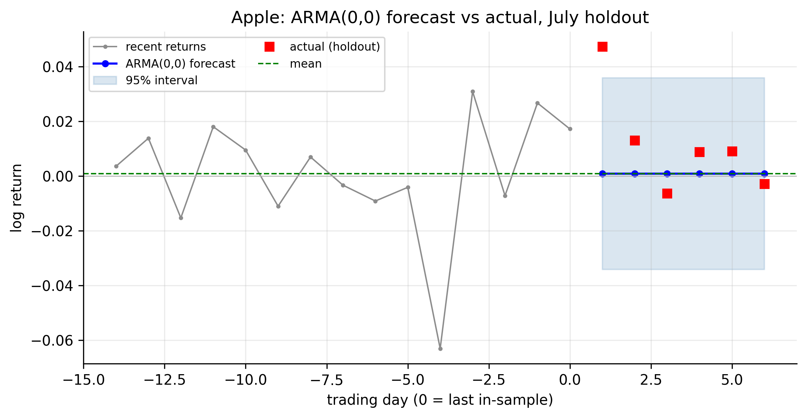
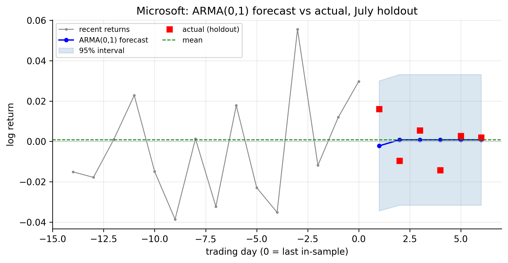
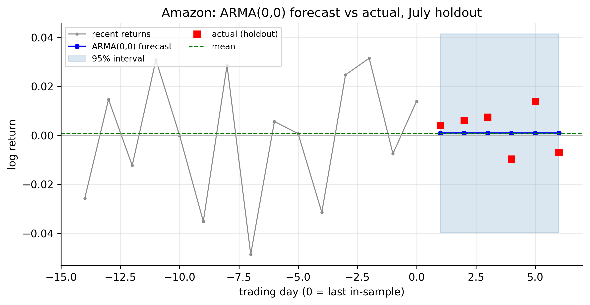
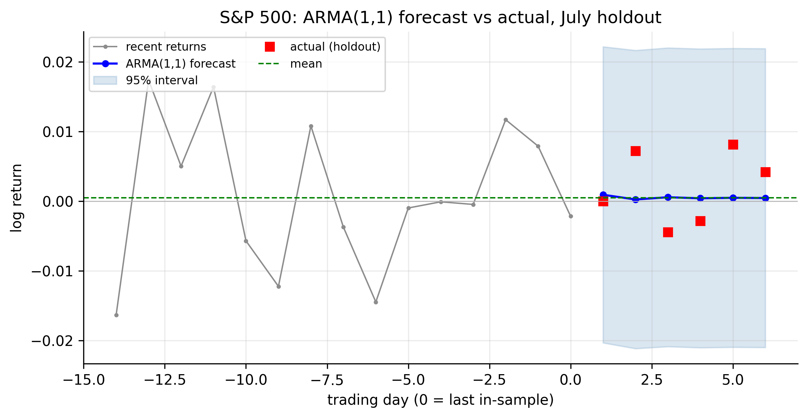
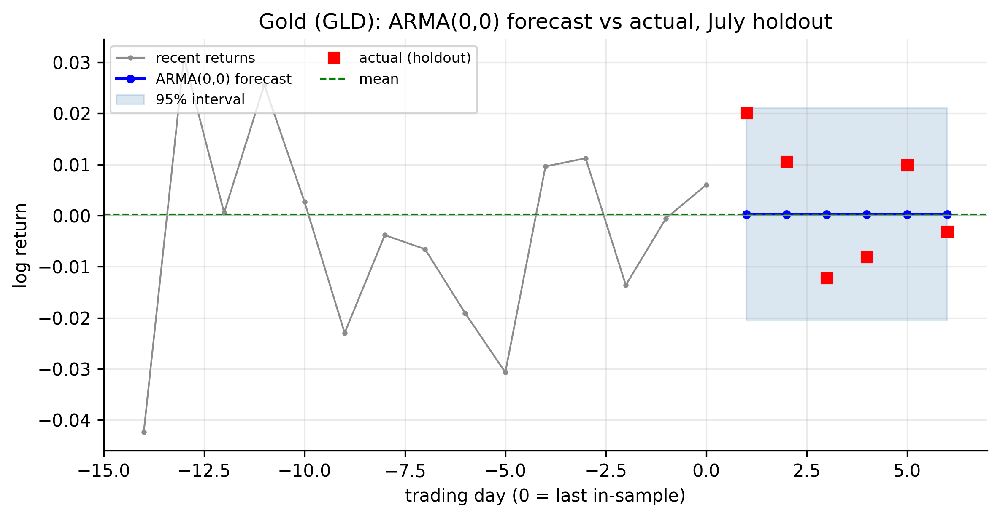
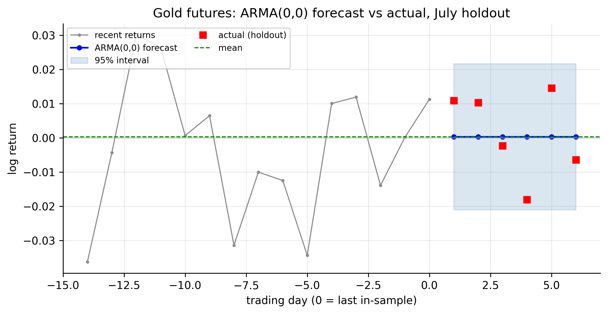

# ARMA Models {#sec-arma}

The AR model built the mean from past *values*; the MA model built it from past
*shocks*. The **ARMA** model uses both. For most of our series this changes
nothing — they are white noise, and no combination of terms helps. But for the one
series with genuinely richer structure, the S&P 500, ARMA delivers the payoff the
previous two chapters kept pointing toward: it captures with **two** parameters
what the pure AR model needed **eight** to describe. That is the whole case for
ARMA — parsimony.

We follow the same path a final time: definition, properties, identification,
goodness of fit, forecasting, across the six tickers.

## Simple ARMA models {#sec-arma-def}

::: {.definition}
An **ARMA model** combines an autoregressive part (past *values*) and a moving-average
part (past *shocks*) in a single model.
:::

An **ARMA($p,q$)** model combines an order-$p$ autoregression with an order-$q$
moving average:

$$
r_t = \phi_0 + \sum_{i=1}^{p}\phi_i\, r_{t-i}
       + a_t + \sum_{j=1}^{q}\theta_j\, a_{t-j},
$$ {#eq-arma}

with $\{a_t\}$ white noise. The AR part links today's return to recent returns; the
MA part links it to recent shocks. AR($p$) is the special case $q=0$, MA($q$) is
$p=0$, and white noise is ARMA($0,0$). The **ARMA(1,1)** — one of each — is the
smallest genuinely mixed model and the one our data will actually use:
$r_t = \phi_0 + \phi_1 r_{t-1} + a_t + \theta_1 a_{t-1}$.

## Properties of ARMA models {#sec-arma-properties}

ARMA inherits one condition from each parent. It is **stationary** when the roots
of the AR polynomial $1 - \phi_1 z - \cdots - \phi_p z^p$ lie outside the unit
circle (the AR condition), and **invertible** when the roots of the MA polynomial
$1 + \theta_1 z + \cdots + \theta_q z^q$ do (the MA condition). When stationary, its
mean is $\mu = \phi_0/(1 - \phi_1 - \cdots - \phi_p)$, exactly as in the AR case.

The property that matters most for practice concerns identification. In a mixed
model, **both the ACF and the PACF tail off** — neither cuts off cleanly:

| Process | ACF | PACF |
|:--------|:----|:-----|
| AR($p$) | tails off | **cuts off after $p$** |
| MA($q$) | **cuts off after $q$** | tails off |
| **ARMA($p,q$)** | **tails off** | **tails off** |

: ACF/PACF signatures — ARMA has neither cutoff {#tbl-arma-signature}

This is inconvenient: the clean order-reading trick that worked for pure AR and MA
fails for ARMA, because there is no cutoff to count. We need other tools, which is
the subject of the next section.

One caution belongs here too — **parameter redundancy**. If an ARMA(1,1) has
$\phi_1 \approx -\theta_1$, the AR and MA factors nearly cancel (a "common factor"),
leaving a model that is effectively white noise but described by two large,
unstable, offsetting coefficients. Over-fitting ARMA invites exactly this pathology,
which is why parsimony — and a criterion like BIC that enforces it — is essential.

## Identifying ARMA models {#sec-arma-identify}

Because @tbl-arma-signature offers no cutoff, ARMA identification uses different
tools. Tsay's preferred device is the **Extended Autocorrelation Function (EACF)**,
a table of significance markers whose triangular pattern of zeros has its top-left
corner at the true $(p,q)$. In practice — and here — it is at least as common to
**search a grid of $(p,q)$ orders and let an information criterion choose**, exactly
as we did for the pure models but now over a two-dimensional grid. We fit every
ARMA($p,q$) for $p,q \in \{0,1,2\}$ and pick the smallest BIC.

::: {.panel-tabset}

## R

```r
est_return <- function(sym) {
  d <- read.csv(sprintf("data/%s.csv", sym)); d$Date <- as.Date(d$Date)
  diff(log(d$Adjusted[d$Date <= as.Date("2026-07-01")]))
}
# grid search over (p, q); BIC selects
for (p in 0:2) for (q in 0:2) {
  f <- arima(est_return("SPX"), order = c(p, 0, q), method = "ML")
  cat(sprintf("ARMA(%d,%d)  BIC = %.1f\n", p, q, BIC(f)))
}
# Tsay's EACF is the alternative order-identification tool:
# TSA::eacf(est_return("SPX"))
```

## Python

```python
import pandas as pd, numpy as np, itertools
from statsmodels.tsa.arima.model import ARIMA

def est_return(sym):
    d = pd.read_csv(f"data/{sym}.csv", parse_dates=["Date"]).set_index("Date")
    return np.log(d[d.index <= "2026-07-01"]["Adjusted"]).diff().dropna()

for p, q in itertools.product(range(3), range(3)):
    bic = ARIMA(est_return("SPX"), order=(p, 0, q)).fit().bic
    print(f"ARMA({p},{q}) BIC = {bic:.1f}")
```

:::

The BIC over the low-order grid (shown as a difference from each series' best,
$\Delta\text{BIC}$, so the selected model is at $0.00$):

| Ticker | ARMA(0,0) | ARMA(1,0) | ARMA(0,1) | ARMA(1,1) | Selected |
|:-------|:---------:|:---------:|:---------:|:---------:|:--------:|
| AAPL |  **0.00** |  2.85 |  2.96 | 10.05 | white noise |
| MSFT | 27.84 |  0.59 |  **0.00** |  8.09 | single lag (MA/AR 1) |
| AMZN |  **0.00** |  7.31 |  7.30 | 11.95 | white noise |
| SPX  | 52.42 |  6.71 | 13.42 |  **0.00** | **ARMA(1,1)** |
| GLD  |  **0.00** |  8.20 |  8.19 | 15.37 | white noise |
| GCF  |  **0.00** |  4.47 |  4.37 | 12.34 | white noise |

: ARMA order by BIC grid search (Δ from each row's minimum) {#tbl-arma-identify}

@tbl-arma-identify closes the arc of the last three chapters. Four series — Apple,
Amazon, and both gold contracts — are **white noise**: ARMA(0,0) wins, and every
added AR or MA term only raises BIC. Microsoft's lone lag-1 correlation is captured
equally by ARMA(1,0) or ARMA(0,1) — the AR(1)≈MA(1) equivalence from @sec-ar-ma-equiv
— and the mixed ARMA(1,1) is a wasted parameter (BIC worse by $8$). The exception,
once again, is the **S&P 500**: here **ARMA(1,1) is the clear winner**, beating
white noise by $52$ BIC points, the pure AR(1) by $6.7$, and the pure MA(1) by
$13.4$.

Why does the mix succeed where neither pure model did? The S&P's ACF changes sign —
negative at lag 1 ($-0.119$), positive at lag 2 ($+0.082$) — an **oscillating**
pattern that a single AR or MA term cannot produce but an ARMA(1,1) with
$\hat\phi_1 = -0.475$ and $\hat\theta_1 = +0.355$ reproduces naturally (the negative
$\phi_1$ drives the alternation). Crucially, this ARMA(1,1) achieves the *same* fit
as the AR(8) that BIC chose back in @tbl-ar-identify — its $R^2$ is about the same
$0.018$ — but with **two parameters instead of eight**. That is parsimony in
action, and it is the reason ARMA exists.

::: {.callout-note}
## A word on those coefficients
$\hat\phi_1 = -0.475$ and $\hat\theta_1 = +0.355$ are much larger than the $\approx
-0.11$ we saw fitting pure AR(1)/MA(1). They are not redundant — $\phi_1 \neq
-\theta_1$, so the factors do not cancel — and together they imply exactly the small
$\rho_1 = -0.12$ and sign-flipped $\rho_2 = +0.06$ we observe. Large offsetting
coefficients that *do* nearly cancel would be the redundancy warning of
@sec-arma-properties; these do not.
:::

## Goodness of fit {#sec-arma-gof}

The fitted S&P ARMA(1,1) passes the diagnostic that matters: its residuals are
**white noise** (Ljung–Box on $\hat a_t$ no longer rejects — the oscillating
structure has been absorbed), and it does so with a residual standard deviation of
$1.0835\%$, essentially the AR(8) value. But the familiar ceiling still holds: an
$R^2$ of $1.8\%$ means the model explains under one-fiftieth of the variance of
daily S&P returns, and — as in every chapter so far — the **squared** residuals
remain strongly autocorrelated (@fig-wn-sq). ARMA has wrung out the last of the
*linear* mean structure; the volatility clustering is entirely untouched.

::: {.panel-tabset}

## R

```r
fit <- arima(est_return("SPX"), order = c(1, 0, 1))       # ARMA(1,1)
fit                                                        # coefficients & SE
Box.test(residuals(fit), lag = 10, type = "Ljung-Box")    # residuals white noise?
1 - fit$sigma2 / var(est_return("SPX"))                   # approx R^2
```

## Python

```python
from statsmodels.stats.diagnostic import acorr_ljungbox
fit = ARIMA(est_return("SPX"), order=(1, 0, 1)).fit()
print(fit.summary())
print(acorr_ljungbox(fit.resid, lags=[10]))
print(1 - fit.resid.var() / est_return("SPX").var())
```

:::

## Forecasting {#sec-arma-forecast}

The ARMA forecast blends the two behaviours we have already seen. The **MA part
contributes only for the first $q$ steps** (its finite memory of past shocks), after
which the forecast follows the **AR part's geometric decay** toward the mean. For an
ARMA(1,1):

$$
\hat r_t(1) = \phi_0 + \phi_1 r_t + \theta_1 a_t, \qquad
\hat r_t(h) = \phi_0 + \phi_1\, \hat r_t(h-1) \;\; (h \ge 2),
$$ {#eq-arma-forecast}

so the last shock $a_t$ enters the one-step forecast, and from step two on it is
pure AR(1) reversion. The carousel below runs the selected ARMA forecast for each
ticker over the July holdout.

```{=html}
<style>
#armaCarousel { max-width: 820px; margin: 1.2rem auto 3rem; }
#armaCarousel .carousel-control-prev-icon,
#armaCarousel .carousel-control-next-icon { filter: invert(1); background-color: rgba(0,0,0,.5); border-radius: 50%; padding: 14px; }
#armaCarousel .carousel-indicators { bottom: -2.4rem; }
#armaCarousel .carousel-indicators [data-bs-target] { background-color: #555; }
</style>
<div id="armaCarousel" class="carousel slide" data-bs-ride="false" data-bs-interval="false">
  <div class="carousel-indicators">
    <button type="button" data-bs-target="#armaCarousel" data-bs-slide-to="0" class="active" aria-current="true" aria-label="Apple"></button>
    <button type="button" data-bs-target="#armaCarousel" data-bs-slide-to="1" aria-label="Microsoft"></button>
    <button type="button" data-bs-target="#armaCarousel" data-bs-slide-to="2" aria-label="Amazon"></button>
    <button type="button" data-bs-target="#armaCarousel" data-bs-slide-to="3" aria-label="S&amp;P 500"></button>
    <button type="button" data-bs-target="#armaCarousel" data-bs-slide-to="4" aria-label="Gold GLD"></button>
    <button type="button" data-bs-target="#armaCarousel" data-bs-slide-to="5" aria-label="Gold futures"></button>
  </div>
  <div class="carousel-inner">
    <div class="carousel-item active"></div>
    <div class="carousel-item"></div>
    <div class="carousel-item"></div>
    <div class="carousel-item"></div>
    <div class="carousel-item"></div>
    <div class="carousel-item"></div>
  </div>
  <button class="carousel-control-prev" type="button" data-bs-target="#armaCarousel" data-bs-slide="prev"><span class="carousel-control-prev-icon" aria-hidden="true"></span><span class="visually-hidden">Previous</span></button>
  <button class="carousel-control-next" type="button" data-bs-target="#armaCarousel" data-bs-slide="next"><span class="carousel-control-next-icon" aria-hidden="true"></span><span class="visually-hidden">Next</span></button>
</div>
```

::: {.content-visible when-format="pdf"}
::: {layout-ncol=2}


:::
:::

Even the S&P's ARMA(1,1) — the most elaborate mean model in the entire analysis —
produces a forecast that reverts to the mean within a few days inside an interval of
about $\pm 2\%$, with the realised returns scattered across it. The extra structure
that made ARMA(1,1) the right model is real and worth capturing, but it is a
one-to-two-percent refinement on an essentially unforecastable mean. The conclusion
of the whole linear-modelling arc is now firm: **for daily returns, the best mean
model is close to the historical average, and the honest deliverable is the
interval.** The predictable part of these series lives in the variance — the next
stage of the toolkit.

## Concept check {#sec-arma-concept}

Decide first, then expand each answer.

**Q1. Why can't you identify an ARMA($p,q$) order by reading the ACF and PACF the
way you do for a pure AR or MA?**

- **(a)** ARMA models have no ACF.
- **(b)** For a mixed model *both* the ACF and the PACF tail off — neither cuts off,
  so there is no order to count.
- **(c)** The ACF and PACF are identical for ARMA.
- **(d)** ARMA models are never stationary.

::: {.callout-note collapse="true"}
## Show answer
**(b).** AR cuts off in the PACF, MA in the ACF; a mix cuts off in neither. That is
why we use the EACF or an information-criterion grid search instead.
:::

**Q2. An ARMA($p,q$) model is *stationary* provided:**

- **(a)** the MA polynomial's roots are outside the unit circle.
- **(b)** the AR polynomial's roots are outside the unit circle.
- **(c)** $p = q$.
- **(d)** all coefficients are positive.

::: {.callout-note collapse="true"}
## Show answer
**(b).** Stationarity is an AR-part property (roots of $1-\phi_1z-\cdots$ outside the
unit circle). The MA-part roots govern *invertibility*, a separate condition.
:::

**Q3. A fitted ARMA(1,1) returns $\hat\phi_1 = 0.60$ and $\hat\theta_1 = -0.59$. What
should you suspect?**

- **(a)** A strong, genuine ARMA signal.
- **(b)** Parameter redundancy — the AR and MA factors nearly cancel, so the series
  is effectively white noise and the model is over-parameterised.
- **(c)** The series has a unit root.
- **(d)** Nothing; the fit is fine.

::: {.callout-note collapse="true"}
## Show answer
**(b).** With $\phi_1 \approx -\theta_1$ the common factors nearly cancel, leaving a
near-white-noise process fitted by two large, unstable, offsetting coefficients.
Prefer the simpler model. (Our S&P fit, $\phi_1=-0.475$, $\theta_1=+0.355$, does
*not* cancel, so it is legitimate.)
:::

**Q4. For the S&P 500, ARMA(1,1) and AR(8) achieve almost the same fit ($R^2 \approx
0.018$). Why prefer the ARMA(1,1)?**

- **(a)** It fits much better.
- **(b)** Parsimony — it captures the same structure with two parameters instead of
  eight, so it generalises better and BIC prefers it.
- **(c)** AR models are never valid for indices.
- **(d)** It has a higher $R^2$.

::: {.callout-note collapse="true"}
## Show answer
**(b).** Same fit, far fewer parameters. The S&P's sign-changing ACF needs many AR
lags but only one AR + one MA term, and BIC rewards the parsimonious model.
:::

**Q5. In an ARMA(1,1) forecast, the moving-average term $\theta_1 a_t$ affects:**

- **(a)** every forecast horizon equally.
- **(b)** only the one-step-ahead forecast; from two steps out the forecast follows
  pure AR(1) reversion to the mean.
- **(c)** nothing — MA terms don't affect forecasts.
- **(d)** only horizons beyond $q$.

::: {.callout-note collapse="true"}
## Show answer
**(b).** The MA memory lasts $q=1$ step, so the last shock enters only the one-step
forecast; thereafter the AR part carries the forecast geometrically back to $\mu$.
:::

::: {.callout-tip}
## Key takeaways
- **ARMA($p,q$)** (@eq-arma) combines AR and MA terms; it is **stationary** via the
  AR roots and **invertible** via the MA roots, with mean $\phi_0/(1-\sum\phi_i)$.
- Its **ACF and PACF both tail off** (@tbl-arma-signature), so order is chosen by
  the **EACF or an information-criterion grid**, not by reading a cutoff.
- On our data, four series are **white noise**, Microsoft is a **single lag**, and
  the **S&P 500 is a genuine ARMA(1,1)** — capturing with two parameters what AR
  needed eight for (@tbl-arma-identify). That parsimony is the point of ARMA.
- Beware **parameter redundancy** ($\phi_1 \approx -\theta_1$): near-cancelling
  factors signal an over-fit model.
- Even the best ARMA mean forecast **reverts to the mean** inside a wide interval;
  the linear-modelling arc ends where it began — the mean of daily returns is
  barely forecastable, and the predictability lives in the **variance**, next.
:::
