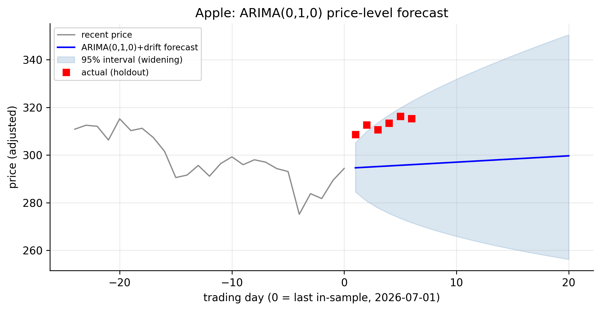
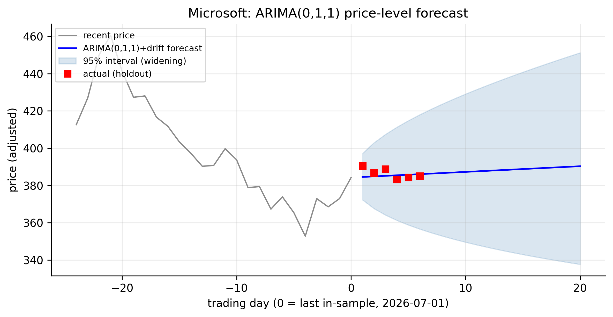
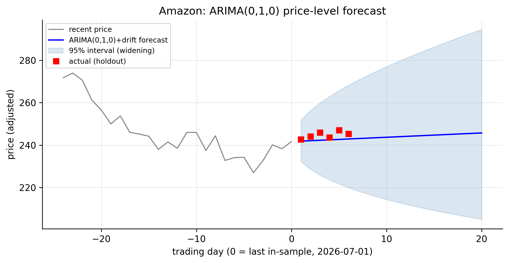
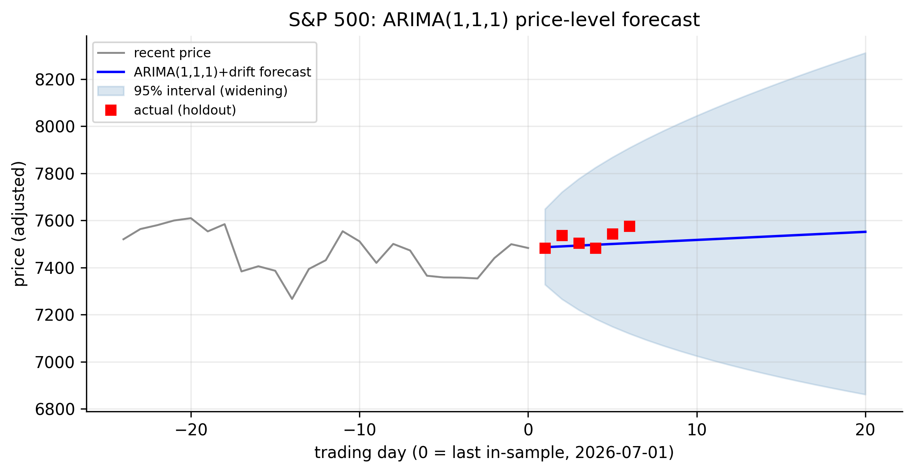
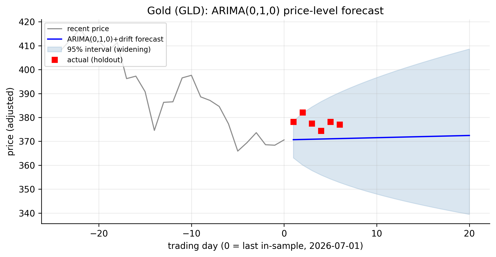
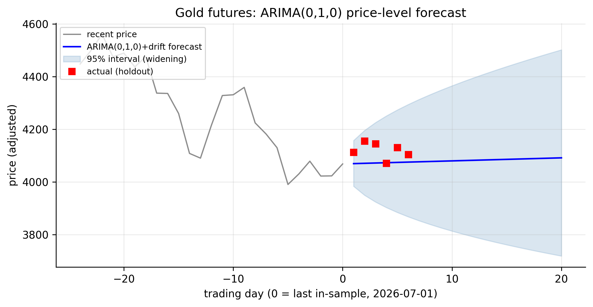

# ARIMA Models {#sec-arima}

The ARMA models of @sec-arma require a **stationary** series, which is why we fit
them to returns, not prices. The **ARIMA** model removes that restriction. The "I"
stands for **integrated**: an ARIMA model first *differences* the series enough
times to make it stationary, then fits an ARMA to the result. This is the bridge
between the non-stationarity of @sec-unitroot and the ARMA machinery of
@sec-arma — and, for our objective, it is what lets us model and forecast the
**price level itself**, not just its returns.

There is an equivalence at the heart of this chapter that makes it short: because a
log price is $I(1)$ and its first difference is the log return, fitting an
**ARIMA($p,1,q$) to the log price is exactly the same as fitting an ARMA($p,q$) to
the log return.** Everything we learned in Chapters 3–5 therefore transfers
directly; what is genuinely new is the *price-level forecast*.

## Simple ARIMA models {#sec-arima-def}

::: {.definition}
An **ARIMA model** differences a non-stationary series $d$ times to make it stationary,
then fits an ARMA to the result — the "I" stands for *integrated*.
:::

Write $B$ for the backshift operator ($B y_t = y_{t-1}$) and $\nabla = 1 - B$ for
the first-difference operator, so $\nabla y_t = y_t - y_{t-1}$. A series $y_t$
follows an **ARIMA($p,d,q$)** model if its $d$-th difference,
$w_t = \nabla^d y_t$, is a stationary ARMA($p,q$):

$$
\underbrace{\phi(B)}_{\text{AR}(p)}\, \underbrace{(1-B)^d}_{\text{difference } d\text{ times}}\, y_t
= \phi_0 + \underbrace{\theta(B)}_{\text{MA}(q)}\, a_t,
$$ {#eq-arima}

where $\phi(B) = 1 - \phi_1 B - \cdots - \phi_p B^p$ and $\theta(B) = 1 + \theta_1 B
+ \cdots + \theta_q B^q$. In words: difference $d$ times to reach stationarity, then
model what remains as ARMA($p,q$). The three orders are the AR order $p$, the
**degree of differencing** $d$, and the MA order $q$.

For our data $d = 1$: a log price is $I(1)$ (@sec-unitroot), so one difference — the
log return — is stationary. Thus **ARIMA($p,1,q$) on the log price = ARMA($p,q$) on
the log return**, and the special cases we already met reappear with new names:

- **ARIMA(0,1,0)** — $\nabla y_t = a_t$ — is the **random walk**.
- **ARIMA(0,1,0) with a constant** is the **random walk with drift**, the log-price
  model of @sec-rw-drift.

## Properties of ARIMA models {#sec-arima-properties}

Two of the three orders are chosen by machinery we have already built, and the
third property is what makes ARIMA forecasts distinctive.

**The differencing order $d$ is a unit-root question.** You do not read $d$ off the
ACF; you determine it with the ADF and KPSS tests of @sec-unitroot. If the level is
$I(1)$, take $d=1$; if the *difference* were still non-stationary you would take
$d=2$, and so on. Over-differencing is a real cost (it injects a non-invertible MA
unit root), so we difference the minimum number of times — for our log prices,
once.

**Once differenced, it is just ARMA.** The stationary series $w_t = \nabla^d y_t$
obeys all the ARMA properties of @sec-arma: stationarity via the AR roots,
invertibility via the MA roots, ACF/PACF identification of $p$ and $q$.

**Forecasts of an integrated series fan out.** This is the property that sets ARIMA
apart. Because differencing was needed, the level $y_t$ carries a unit root, and the
variance of its $h$-step forecast **grows without bound** with the horizon — for the
random walk with drift, $\operatorname{Var}[\hat y_T(h)] = h\sigma^2$, so the
forecast interval widens like $\sqrt{h}$. The point forecast is a straight line at
the drift slope; the interval around it is a **widening cone**. Contrast this with
the *return* forecasts of Chapters 3–5, whose intervals were essentially flat: the
return is stationary, so its uncertainty does not accumulate, but the *price* is its
running sum, so uncertainty piles up.

## Identifying ARIMA models {#sec-arima-identify}

Identification is a clean three-step recipe that reuses everything so far:

1. **Choose $d$** with unit-root tests (@sec-unitroot). Our log prices are $I(1)$
   $\Rightarrow d = 1$.
2. **Difference** the series $d$ times. Here $\nabla(\log \text{price}) = \log
   \text{return}$.
3. **Identify $p$ and $q$** on the differenced series using the ACF/PACF, EACF, or an
   information criterion (@sec-ar-identify, @sec-ma-identify, @sec-arma-identify).

Step 3 is work we have already done — the ARMA orders of the returns *are* the
$(p,q)$ of the log-price ARIMA. In practice `auto.arima` performs all three steps
automatically, running the unit-root test for $d$ and a stepwise BIC search for
$p,q$.

::: {.panel-tabset}

## R

```r
library(forecast)
logprice <- function(sym) {
  d <- read.csv(sprintf("data/%s.csv", sym)); d$Date <- as.Date(d$Date)
  log(d$Adjusted[d$Date <= as.Date("2026-07-01")])
}
# auto.arima picks d (via unit-root tests) and p,q (via BIC) on the log PRICE
for (s in c("AAPL","MSFT","AMZN","SPX","GLD","GCF"))
  cat(s, ":", forecast::arimaorder(auto.arima(logprice(s), ic = "bic")), "\n")

# equivalently, ARIMA(1,1,1) on the log price == ARMA(1,1) on the return:
Arima(logprice("SPX"), order = c(1, 1, 1), include.drift = TRUE)
```

## Python

```python
import pandas as pd, numpy as np
from statsmodels.tsa.arima.model import ARIMA

def logprice(sym):
    d = pd.read_csv(f"data/{sym}.csv", parse_dates=["Date"]).set_index("Date")
    return np.log(d[d.index <= "2026-07-01"]["Adjusted"])

# ARIMA(1,1,1) with drift on the log price  ==  ARMA(1,1) on the return
fit = ARIMA(logprice("SPX"), order=(1, 1, 1), trend="t").fit()
print(fit.summary())
```

:::

The log-price ARIMA orders are just the return ARMA orders from @tbl-arma-identify
with $d=1$ inserted:

| Ticker | $d$ (unit-root tests) | ARMA order on returns | ARIMA on log price |
|:-------|:---------------------:|:---------------------:|:------------------:|
| AAPL | 1 | (0,0) | **ARIMA(0,1,0) + drift** |
| MSFT | 1 | (0,1) | ARIMA(0,1,1) + drift |
| AMZN | 1 | (0,0) | **ARIMA(0,1,0) + drift** |
| SPX  | 1 | (1,1) | ARIMA(1,1,1) + drift |
| GLD  | 1 | (0,0) | **ARIMA(0,1,0) + drift** |
| GCF  | 1 | (0,0) | **ARIMA(0,1,0) + drift** |

: ARIMA models for the log prices {#tbl-arima-identify}

@tbl-arima-identify carries a sharp message. For **four of the six series** the best
model for the log price is **ARIMA(0,1,0) with drift — the random walk with drift.**
That is not a modelling failure; it is the formal statement that these prices are
unforecastable beyond their average drift, so the naive "tomorrow's price = today's
price + average daily move" is the best you can do. Only Microsoft (a lone MA term)
and the S&P (the ARMA(1,1) structure of @sec-arma) add anything, and — as we saw —
what they add is worth well under $2\%$ of return variance. Fitting the S&P's
ARIMA(1,1,1) recovers exactly the $\hat\phi_1 = -0.475$, $\hat\theta_1 = +0.355$ we
estimated on the returns; the "I" simply lets us state the model, and forecast, in
the units of the price.

## Goodness of fit {#sec-arima-gof}

Because ARIMA($p,1,q$) on the log price *is* ARMA($p,q$) on the return, the fit
diagnostics are identical to @sec-arma-gof: the residuals should be white noise
(Ljung–Box on $\hat a_t$), and the model explains the same tiny fraction of return
variance ($R^2 \approx 0.018$ for the S&P). The one thing that changes is what a
"good fit" buys you — a coherent model of the **price**, with the correct
unit-root-driven uncertainty, rather than of the return alone. And, as in every
chapter, the squared residuals remain autocorrelated: ARIMA has captured all the
linear structure there is, and the volatility clustering is still untouched.

## Forecasting the price level {#sec-arima-forecast}

Here is what ARIMA adds that ARMA-on-returns could not: a forecast of the **price**,
with an honestly widening interval. For the random-walk-with-drift case the forecast
is simply

$$
\hat y_T(h) = y_T + h\,\mu, \qquad
\operatorname{Var}[\hat y_T(h)] = h\,\sigma^2,
$$ {#eq-arima-forecast}

where $y_T$ is the last log price, $\mu$ the drift (mean log return), and $\sigma^2$
the return variance. The point forecast is a straight line rising at the drift rate;
the $95\%$ interval, $\hat y_T(h) \pm 1.96\,\sigma\sqrt{h}$, widens as $\sqrt{h}$.
Exponentiating gives the price and its (asymmetric, lognormal) band. The carousel
below shows this for all six tickers over — and beyond — the July holdout.

```{=html}
<style>
#arimaCarousel { max-width: 820px; margin: 1.2rem auto 3rem; }
#arimaCarousel .carousel-control-prev-icon,
#arimaCarousel .carousel-control-next-icon { filter: invert(1); background-color: rgba(0,0,0,.5); border-radius: 50%; padding: 14px; }
#arimaCarousel .carousel-indicators { bottom: -2.4rem; }
#arimaCarousel .carousel-indicators [data-bs-target] { background-color: #555; }
</style>
<div id="arimaCarousel" class="carousel slide" data-bs-ride="false" data-bs-interval="false">
  <div class="carousel-indicators">
    <button type="button" data-bs-target="#arimaCarousel" data-bs-slide-to="0" class="active" aria-current="true" aria-label="Apple"></button>
    <button type="button" data-bs-target="#arimaCarousel" data-bs-slide-to="1" aria-label="Microsoft"></button>
    <button type="button" data-bs-target="#arimaCarousel" data-bs-slide-to="2" aria-label="Amazon"></button>
    <button type="button" data-bs-target="#arimaCarousel" data-bs-slide-to="3" aria-label="S&amp;P 500"></button>
    <button type="button" data-bs-target="#arimaCarousel" data-bs-slide-to="4" aria-label="Gold GLD"></button>
    <button type="button" data-bs-target="#arimaCarousel" data-bs-slide-to="5" aria-label="Gold futures"></button>
  </div>
  <div class="carousel-inner">
    <div class="carousel-item active"></div>
    <div class="carousel-item"></div>
    <div class="carousel-item"></div>
    <div class="carousel-item"></div>
    <div class="carousel-item"></div>
    <div class="carousel-item"></div>
  </div>
  <button class="carousel-control-prev" type="button" data-bs-target="#arimaCarousel" data-bs-slide="prev"><span class="carousel-control-prev-icon" aria-hidden="true"></span><span class="visually-hidden">Previous</span></button>
  <button class="carousel-control-next" type="button" data-bs-target="#arimaCarousel" data-bs-slide="next"><span class="carousel-control-next-icon" aria-hidden="true"></span><span class="visually-hidden">Next</span></button>
</div>
```

::: {.content-visible when-format="pdf"}
::: {layout-ncol=2}


:::
:::

Every panel has the same anatomy: a nearly straight forecast line rising at the
series' drift, wrapped in a cone that widens with the horizon, with the realised
holdout prices scattered inside it. The cone is the honest part. Ten trading days
out, the S&P's $95\%$ price interval already spans roughly $\pm 3\%$; twenty days
out, more. This is the unit root made visible: uncertainty about the *price*
compounds with time even though uncertainty about each day's *return* does not. It
is also the practical limit of linear forecasting for these series — the point
forecast is only ever the drift line, and the value the model provides is a
correctly-sized measure of how wrong that line could be.

## Concept check {#sec-arima-concept}

Decide first, then expand each answer.

**Q1. In ARIMA($p,d,q$), what does the middle term $d$ do?**

- **(a)** Sets the number of AR lags.
- **(b)** Specifies how many times the series is differenced to make it stationary.
- **(c)** Sets the number of MA lags.
- **(d)** Is the forecast horizon.

::: {.callout-note collapse="true"}
## Show answer
**(b).** $d$ is the degree of differencing — the "I" for *integrated*. Difference
$d$ times to reach stationarity, then fit ARMA($p,q$) to the result.
:::

**Q2. An ARIMA(0,1,0) model is:**

- **(a)** white noise.
- **(b)** a random walk (a random walk with drift if a constant is included).
- **(c)** an AR(1).
- **(d)** always non-invertible.

::: {.callout-note collapse="true"}
## Show answer
**(b).** $(1-B)y_t = a_t$ is the random walk; adding a constant gives the random walk
with drift — the log-price benchmark of @sec-rw-drift.
:::

**Q3. Fitting an ARIMA(1,1,1) to the log *price* is equivalent to fitting what to the
log *return*?**

- **(a)** an ARIMA(1,1,1).
- **(b)** an ARMA(1,1).
- **(c)** an AR(1).
- **(d)** nothing — they are unrelated.

::: {.callout-note collapse="true"}
## Show answer
**(b).** The first difference of the log price *is* the log return, so ARIMA($p,1,q$)
on the price equals ARMA($p,q$) on the return. Our S&P fit recovers the same
$\phi_1=-0.475$, $\theta_1=+0.355$.
:::

**Q4. Why does an ARIMA price-forecast interval widen with the horizon while the
return-forecast interval stays roughly flat?**

- **(a)** A plotting artifact.
- **(b)** The price carries a unit root, so forecast variance accumulates
  ($\approx h\sigma^2$); the return is stationary, so its variance does not.
- **(c)** The drift grows over time.
- **(d)** The model is misspecified.

::: {.callout-note collapse="true"}
## Show answer
**(b).** The price is the running sum of returns; uncertainty compounds, giving a
$\sqrt{h}$-widening cone. Stationary returns have bounded, non-accumulating variance.
:::

**Q5. How is the differencing order $d$ determined?**

- **(a)** From the PACF cutoff.
- **(b)** From unit-root tests (ADF/KPSS) — you difference until the series is
  stationary.
- **(c)** It is always 1.
- **(d)** By maximising $R^2$.

::: {.callout-note collapse="true"}
## Show answer
**(b).** $d$ is a stationarity question, settled by the unit-root tests of
@sec-unitroot (here $d=1$), *not* by the ACF/PACF, which identify $p$ and $q$ on the
*already-differenced* series.
:::

::: {.callout-tip}
## Key takeaways
- **ARIMA($p,d,q$)** (@eq-arima) differences a series $d$ times to reach
  stationarity, then fits ARMA($p,q$); the "I" is for *integrated*.
- For our data $d=1$, so **ARIMA($p,1,q$) on the log price = ARMA($p,q$) on the log
  return** — the Chapters 3–5 results transfer unchanged.
- Identify in three steps: **choose $d$ by unit-root tests**, difference, then
  identify $p,q$ as before (`auto.arima` automates all three).
- Four of our six log prices are **ARIMA(0,1,0) + drift — a random walk with drift**;
  only Microsoft and the S&P add (tiny) structure (@tbl-arima-identify).
- ARIMA's distinctive gift is the **price-level forecast**: a drift line inside a
  **cone that widens like $\sqrt{h}$** — the unit root made visible, and the honest
  limit of linear forecasting for these series.
:::
