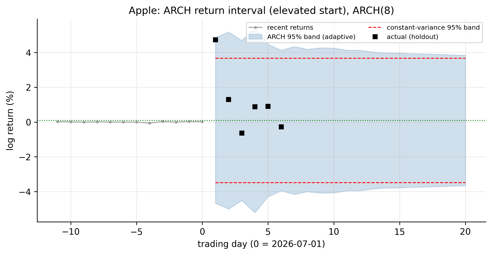
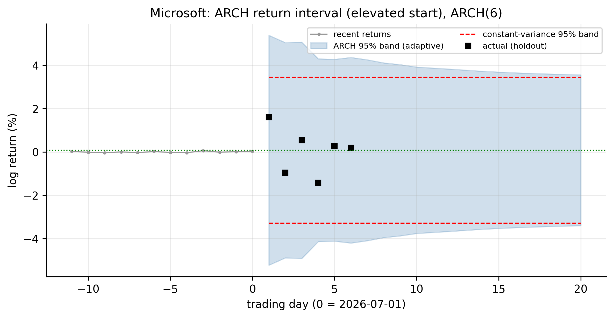
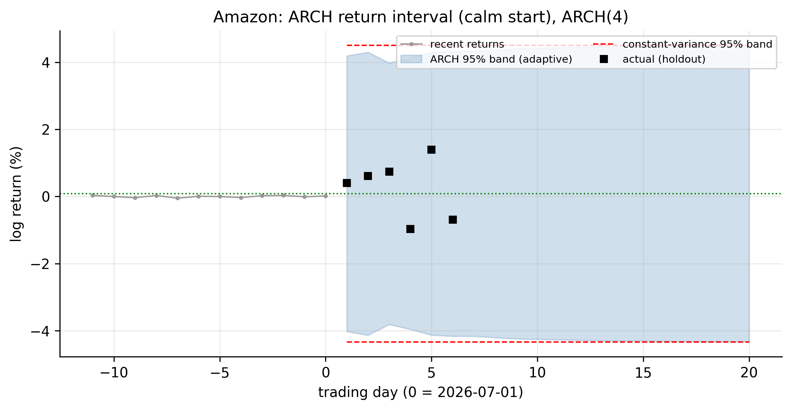
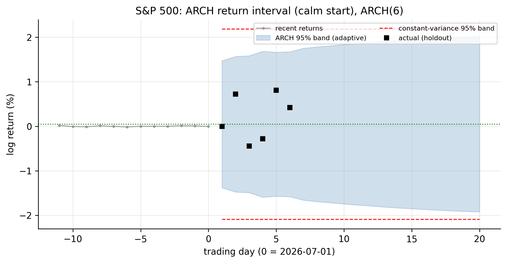
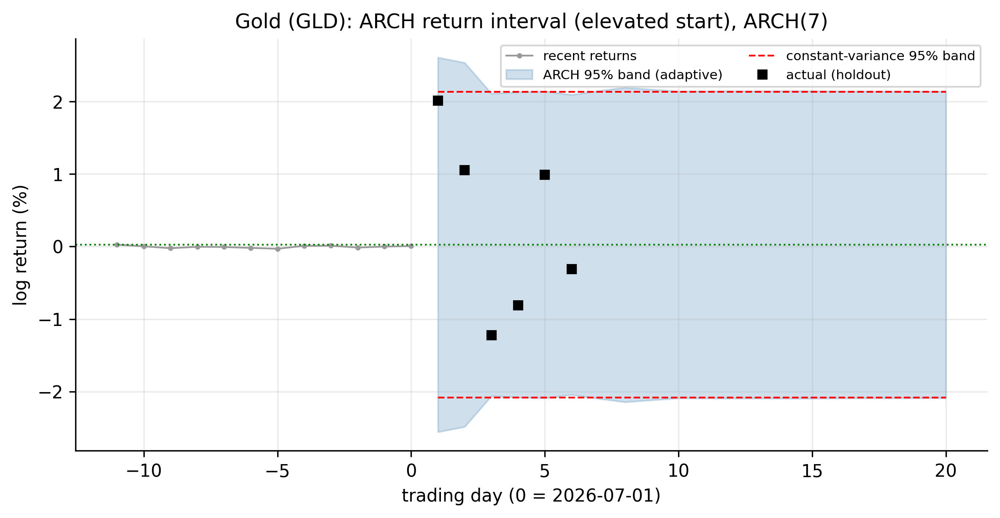
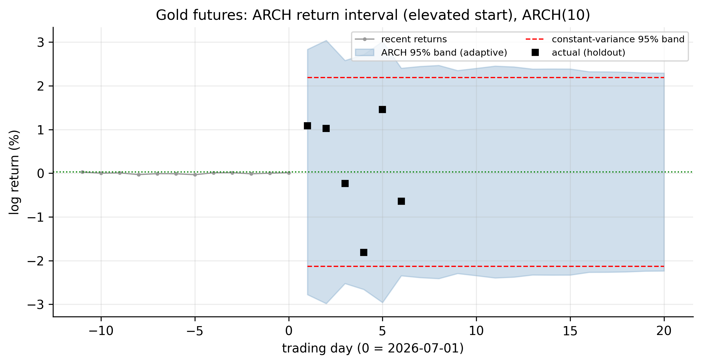

# ARCH Models {#sec-arch}

Every model so far — AR, MA, ARMA, ARIMA — has modelled the **conditional mean** of
returns, and every one has reached the same verdict: the mean of daily returns is
barely forecastable. But those models all share a hidden assumption we never
questioned, and it is **wrong**. They assume the shocks $a_t$ have **constant
variance**. This chapter shows, on our own data, that they do not — the variance of
returns changes over time in a predictable way — and introduces the first model
built to capture it: Engle's **ARCH** model. This is the turn the whole book has
been pointing toward: the predictability of these series lives not in the mean but
in the **variance**.

## How the linear models fail {#sec-arch-fail}

A linear model leaves behind residuals $\hat a_t = r_t - \hat\mu_t$. If the model
were complete, those residuals would be **white noise in every respect** — not just
uncorrelated, but independent. They are not. We already saw the tell in
@fig-wn-sq: for the S&P 500 the residuals themselves are uncorrelated (the ACF is
flat, so the *mean* model is adequate), yet their **squares are strongly and
persistently autocorrelated** — the lag-1 autocorrelation of squared S&P returns is
about $0.44$ and stays high for many lags.

That single fact breaks the constant-variance assumption. Autocorrelation in
$\hat a_t^2$ means that a large shock today makes a large shock *more likely
tomorrow* — the size of returns is predictable even though their sign is not. This
is **volatility clustering**, and its formal name is **conditional
heteroskedasticity**: the conditional variance is not constant. A model that
assumes it is has failed to describe the data, no matter how well it fits the mean.

The failure is not subtle, and it is universal across our series. **Engle's ARCH-LM
test** makes it precise: regress the squared residuals on their own lags and test
whether those lags matter (details in @sec-arch-test). The statistic is $\chi^2_m$
under the null of *no* ARCH effect (constant variance); the $5\%$ critical value
for $m=5$ lags is $11.07$.

| Ticker | ARCH-LM statistic ($m=5$) | Constant variance? |
|:-------|:-------------------------:|:-------------------|
| AAPL |   345 | **rejected** |
| MSFT |   529 | **rejected** |
| AMZN |    80 | **rejected** |
| SPX  | 1,125 | **rejected** |
| GLD  |   246 | **rejected** |
| GCF  |   160 | **rejected** |

: Engle's ARCH-LM test — every series has conditional heteroskedasticity {#tbl-arch-lm}

Every statistic in @tbl-arch-lm dwarfs the $11.07$ threshold, most by one to two
orders of magnitude. **There is no series in our data for which the constant-variance
assumption survives.** The linear models are not wrong about the mean; they are
simply silent about the variance, and the variance is where the structure is.

## The conditional variance {#sec-arch-cond-var}

To model this we separate the two things a linear model conflated. Write the return
as its conditional mean plus a shock, and the shock as a time-varying volatility
times a standardised innovation:

$$
r_t = \mu_t + a_t, \qquad
a_t = \sigma_t\, \varepsilon_t, \qquad
\varepsilon_t \sim \text{iid}(0, 1),
$$ {#eq-cond-decomp}

where $\mu_t = E[r_t \mid \mathcal{F}_{t-1}]$ is the **conditional mean** (the ARMA
part, which we now know is nearly constant) and $\sigma_t^2 = \operatorname{Var}[r_t
\mid \mathcal{F}_{t-1}]$ is the **conditional variance** — the object the ARCH model
will specify. The innovation $\varepsilon_t$ is iid with unit variance (standard
normal, or later Student-$t$); all the time-variation lives in $\sigma_t$, the
**conditional volatility**.

The linear models of the previous chapters are exactly the special case
$\sigma_t = \sigma$ (constant). @fig-arch-vol shows how far from constant $\sigma_t$
actually is for the S&P 500 — the fitted conditional volatility ranges from a calm
$\sim\!12\%$ annualised to a COVID-crash peak near $130\%$, while the linear models'
single flat assumption sits at about $17\%$.

{#fig-arch-vol}

## Testing for ARCH effects {#sec-arch-test}

Two standard tests detect conditional heteroskedasticity before you model it. The
simplest is a **Ljung–Box test on the squared residuals** (@eq-ljungbox applied to
$\hat a_t^2$): a large statistic signals clustering. The purpose-built tool is
**Engle's ARCH-LM test**, which runs the auxiliary regression

$$
\hat a_t^2 = \alpha_0 + \alpha_1 \hat a_{t-1}^2 + \cdots + \alpha_m \hat a_{t-m}^2 + u_t,
$$ {#eq-arch-lm-reg}

and forms $\text{LM} = T\!\cdot\!R^2$, which is $\chi^2_m$ under the null of no ARCH
effect. Rejecting means the squared shocks are predictable from their past — the
defining feature of an ARCH process, and (as @tbl-arch-lm showed) a certainty for
our data.

::: {.panel-tabset}

## R

```r
library(FinTS)      # Engle's ARCH-LM test
est_return <- function(sym) {
  d <- read.csv(sprintf("data/%s.csv", sym)); d$Date <- as.Date(d$Date)
  diff(log(d$Adjusted[d$Date <= as.Date("2026-07-01")]))
}
for (s in c("AAPL","MSFT","AMZN","SPX","GLD","GCF")) {
  a <- est_return(s) - mean(est_return(s))
  cat(s, " ARCH-LM:", round(ArchTest(a, lags = 5)$statistic, 0), "\n")
}
Box.test(est_return("SPX")^2, lag = 10, type = "Ljung-Box")   # squared returns
```

## Python

```python
import pandas as pd, numpy as np
from statsmodels.stats.diagnostic import het_arch

def est_return(sym):
    d = pd.read_csv(f"data/{sym}.csv", parse_dates=["Date"]).set_index("Date")
    return np.log(d[d.index <= "2026-07-01"]["Adjusted"]).diff().dropna()

for s in ["AAPL","MSFT","AMZN","SPX","GLD","GCF"]:
    a = est_return(s) - est_return(s).mean()
    print(s, "ARCH-LM:", round(het_arch(a, nlags=5)[0], 0))
```

:::

## The ARCH model {#sec-arch-model}

::: {.definition}
An **ARCH model** makes today's variance a function of recent squared shocks: a big
move makes the next variance large, so it reproduces **volatility clustering**.
:::

Engle's insight (1982) was to make the conditional variance an **autoregression in
the squared shocks**. An **ARCH($m$)** model specifies

$$
\sigma_t^2 = \alpha_0 + \alpha_1 a_{t-1}^2 + \alpha_2 a_{t-2}^2 + \cdots + \alpha_m a_{t-m}^2,
$$ {#eq-arch}

with $\alpha_0 > 0$ and $\alpha_i \ge 0$ (so the variance stays positive). The
mechanism is exactly the volatility clustering we observed: a large shock $a_{t-1}$
makes $\sigma_t^2$ large, which tends to produce another large shock, and so on —
storms beget storms, calm begets calm. The **ARCH(1)**, $\sigma_t^2 = \alpha_0 +
\alpha_1 a_{t-1}^2$, is the building block.

Three properties matter.

**Variance stationarity.** The unconditional variance is finite and equal to

$$
\operatorname{Var}(a_t) = \frac{\alpha_0}{1 - (\alpha_1 + \cdots + \alpha_m)},
$$ {#eq-arch-uncond}

provided $\sum_i \alpha_i < 1$. The sum $\sum_i \alpha_i$ is the **persistence** of
volatility — how long a shock's effect lingers.

**Fat tails, for free.** Here is a payoff that reaches back to @sec-distribution.
Even when the innovations $\varepsilon_t$ are perfectly **normal**, an ARCH process
has **excess kurtosis** — fatter tails than a normal — because it *mixes* periods of
low and high variance. For an ARCH(1) with Gaussian innovations the kurtosis is
$3(1-\alpha_1^2)/(1-3\alpha_1^2) > 3$. This is the resolution of the puzzle from
Chapter 2: the unconditional fat tails we measured are *partly* an artefact of
time-varying volatility, not evidence that each day's innovation is heavy-tailed.
ARCH generates fat tails from Gaussian parts.

**It captures clustering, not the mean.** ARCH says nothing about the direction of
returns; it models only their magnitude. The conditional mean is still the (nearly
constant) ARMA part — ARCH is bolted onto the *variance* of the residuals.

### Fitting ARCH to the S&P 500 {#sec-arch-fit}

We estimate the ARCH(1) by maximum likelihood on the S&P residuals. The fit is

$$
\sigma_t^2 = 7.1\times 10^{-5} + 0.40\, a_{t-1}^2,
$$ {#eq-arch-spx}

so $\hat\alpha_1 = 0.40$: about $40\%$ of yesterday's squared shock carries into
today's variance. The implied unconditional volatility, $\sqrt{\alpha_0/(1-\alpha_1)}
= 1.09\%$ per day, matches the sample standard deviation of $1.09\%$ almost exactly —
the model is well calibrated.

::: {.panel-tabset}

## R

```r
library(rugarch)
spec <- ugarchspec(variance.model = list(model = "sGARCH", garchOrder = c(1, 0)),
                   mean.model     = list(armaOrder = c(0, 0)),
                   distribution.model = "norm")            # ARCH(1) = GARCH(1,0)
fit  <- ugarchfit(spec, est_return("SPX"))
fit                                                        # alpha0, alpha1
# check: standardized residuals should have no ARCH left
Box.test(residuals(fit, standardize = TRUE)^2, lag = 10, type = "Ljung-Box")
```

## Python

```python
from arch import arch_model
r = est_return("SPX") * 100                                # arch package likes % returns
am = arch_model(r, mean="Constant", vol="ARCH", p=1, dist="normal")
res = am.fit(disp="off")
print(res.summary())
print((res.std_resid**2).autocorr(1))                      # ~0: clustering removed
```

:::

The proof that it works is in the **standardised residuals** $\hat\varepsilon_t =
\hat a_t / \hat\sigma_t$. If the ARCH model has captured the time-varying variance,
these should be iid — in particular, their squares should no longer be
autocorrelated. They are not: the lag-1 autocorrelation of the *squared* residuals
falls from **$0.437$** (before, in the raw returns) to **$-0.029$** (after, in the
standardised residuals) — essentially zero. The clustering that broke the linear
models has been absorbed into $\sigma_t$.

## Choosing the ARCH order, and all six series {#sec-arch-order}

The ARCH(1) above was a deliberately simple illustration. In general we must choose
the order $m$, and we do it with tools that mirror AR identification (@sec-ar-identify)
— but applied to the **squared** residuals, because that is where the structure
lives.

**Read a candidate order from the squared-residual PACF.** Under an ARCH($m$), the
squared shocks $a_t^2$ behave like an AR($m$): their PACF should be significant up to
lag $m$ and then cut off. So we look at the PACF of $\hat a_t^2$ and count the spikes
outside the $\pm 1.96/\sqrt{T}$ band. **Confirm with a criterion and a residual
check.** Fit ARCH($m$) for a range of $m$, pick the smallest BIC, then verify that no
ARCH remains — the ARCH-LM test and the Ljung–Box test on the *standardised*
squared residuals should both be insignificant. If they still reject, raise $m$.

Here the data delivers a pointed message. The squared-return PACF does **not** cut
off cleanly — it stays significant for five to eight lags in every series — and BIC
keeps preferring higher orders (four to ten). The reason is **persistence**: a
volatility shock lingers for *weeks*, and a model whose variance depends only on
individual past squared shocks needs one term per week of memory. Fitting each
series at its BIC-selected order:

::: {.panel-tabset}

## R

```r
library(rugarch)
fit_arch <- function(sym, m) {
  spec <- ugarchspec(variance.model = list(model = "sGARCH", garchOrder = c(m, 0)),
                     mean.model = list(armaOrder = c(0, 0)), distribution.model = "norm")
  ugarchfit(spec, est_return(sym))
}
# choose m by BIC, then read persistence sum(alpha) and check leftover ARCH
for (s in c("AAPL","MSFT","AMZN","SPX","GLD","GCF")) {
  bic <- sapply(1:10, function(m) infocriteria(fit_arch(s, m))[2])
  cat(s, " ARCH order (BIC):", which.min(bic), "\n")
}
```

## Python

```python
from arch import arch_model
def fit_arch(sym, m):
    return arch_model(est_return(sym)*100, mean="Constant", vol="ARCH", p=m,
                      dist="normal").fit(disp="off")
for s in ["AAPL","MSFT","AMZN","SPX","GLD","GCF"]:
    bic = [fit_arch(s, m).bic for m in range(1, 11)]
    print(s, "ARCH order (BIC):", int(np.argmin(bic)) + 1)
```

:::

| Ticker | ARCH order (BIC) | $\hat\alpha_1$ | persistence $\sum\hat\alpha_i$ | uncond. vol | sample SD |
|:-------|:----------------:|:--------------:|:------------------------------:|:-----------:|:---------:|
| AAPL |  8 | 0.15 | 0.61 | 1.83% | 1.79% |
| MSFT |  6 | 0.13 | 0.61 | 1.72% | 1.65% |
| AMZN |  4 | 0.23 | 0.59 | 2.25% | 2.07% |
| SPX  |  6 | 0.14 | 0.79 | 1.09% | 1.09% |
| GLD  |  7 | 0.09 | 0.63 | 1.08% | 1.06% |
| GCF  | 10 | 0.04 | 0.62 | 1.10% | 1.09% |

: ARCH models fitted to each series (order by BIC) {#tbl-arch-fits}

Three things stand out in @tbl-arch-fits. First, **the orders are high** — four to
ten — and gold-futures wants the full ten, meaning it would take even more. That is
the empirical case against pure ARCH: it *works*, but only by spending many
parameters to mimic persistence. Second, the **implied unconditional volatilities
match the sample standard deviations** closely, so every fit is well calibrated.
Third, the **persistence differs by series**: the S&P is the most persistent
($\sum\hat\alpha_i = 0.79$) — its volatility shocks decay slowest — while the single
big $\hat\alpha_1$ of the simple ARCH(1) has, in the full model, spread across many
lags (for the S&P, $\hat\alpha_1$ drops from $0.40$ to $0.14$ as the $0.79$ total is
shared out). Capturing that persistence with *one* extra parameter instead of ten is
the whole motivation for GARCH.

## Forecasting the variance {#sec-arch-forecast}

A volatility model earns its keep by forecasting volatility. The one-step-ahead
variance forecast is known exactly from the data,
$\sigma_T^2(1) = \alpha_0 + \sum_{i} \alpha_i a_{T+1-i}^2$, and for longer horizons
we replace each unknown future squared shock by its own forecast (since
$E[a_{T+\ell}^2 \mid \mathcal{F}_T] = \sigma_T^2(\ell)$):

$$
\sigma_T^2(\ell) = \alpha_0 + \sum_{i=1}^{m} \alpha_i\, \widehat{a^2}_{T+\ell-i},
\qquad
\widehat{a^2}_{T+k} =
\begin{cases} a_{T+k}^2, & k \le 0,\\ \sigma_T^2(k), & k > 0.\end{cases}
$$ {#eq-arch-varfc}

As the horizon grows, this recursion **mean-reverts to the unconditional variance**
$\alpha_0/(1-\sum\alpha_i)$ (@eq-arch-uncond). The forecast is therefore
*state-dependent*: from a calm starting point it climbs toward the long-run level;
from a turbulent one it decays back down. @fig-arch-volfc shows both cases from our
July 1 origin — the S&P began calm, so its forecast volatility rises toward its
$17\%$ long-run level; Apple began elevated, so its forecast decays toward $29\%$.

{#fig-arch-volfc}

::: {.panel-tabset}

## R

```r
fit <- fit_arch("SPX", 6)
fc  <- ugarchforecast(fit, n.ahead = 20)
sigma(fc)                      # forecast conditional volatility, 20 days ahead
```

## Python

```python
res = fit_arch("SPX", 6)
fc  = res.forecast(horizon=20, reindex=False)
print(np.sqrt(fc.variance.values[-1]))     # forecast conditional volatility
```

:::

### What the variance forecast means for returns {#sec-arch-interpret}

A variance forecast is only useful once translated back into the language of
returns. Because the conditional mean is essentially flat (Chapters 3–5), the
$h$-step return forecast stays at the mean $\mu$, but its **prediction interval now
breathes with the forecast volatility**:

$$
r_{T+h} \;\in\; \mu \pm 1.96\,\sigma_T(h) \quad (95\%),
$$ {#eq-arch-interval}

a band that is **narrow when the market is calm and wide when it is turbulent**,
reverting to the constant-variance width as $\sigma_T(h)$ reverts to the long-run
level. This is the practical difference the whole chapter was for: the linear
models' interval was a single fixed width regardless of conditions; the ARCH
interval *adapts to today*. It is also exactly the machinery behind **Value-at-Risk**
— the one-day $95\%$ VaR is $\mu - 1.645\,\sigma_T(1)$, a number that changes every
day as the volatility forecast updates.

The carousel makes the point across all six series. Each panel shows the return
forecast with its **adaptive ARCH 95% band** (shaded) against the **constant-variance
band** (red dashed), with the realised holdout returns.

```{=html}
<style>
#archretCarousel { max-width: 820px; margin: 1.2rem auto 3rem; }
#archretCarousel .carousel-control-prev-icon,
#archretCarousel .carousel-control-next-icon { filter: invert(1); background-color: rgba(0,0,0,.5); border-radius: 50%; padding: 14px; }
#archretCarousel .carousel-indicators { bottom: -2.4rem; }
#archretCarousel .carousel-indicators [data-bs-target] { background-color: #555; }
</style>
<div id="archretCarousel" class="carousel slide" data-bs-ride="false" data-bs-interval="false">
  <div class="carousel-indicators">
    <button type="button" data-bs-target="#archretCarousel" data-bs-slide-to="0" class="active" aria-current="true" aria-label="Apple"></button>
    <button type="button" data-bs-target="#archretCarousel" data-bs-slide-to="1" aria-label="Microsoft"></button>
    <button type="button" data-bs-target="#archretCarousel" data-bs-slide-to="2" aria-label="Amazon"></button>
    <button type="button" data-bs-target="#archretCarousel" data-bs-slide-to="3" aria-label="S&amp;P 500"></button>
    <button type="button" data-bs-target="#archretCarousel" data-bs-slide-to="4" aria-label="Gold GLD"></button>
    <button type="button" data-bs-target="#archretCarousel" data-bs-slide-to="5" aria-label="Gold futures"></button>
  </div>
  <div class="carousel-inner">
    <div class="carousel-item active"></div>
    <div class="carousel-item"></div>
    <div class="carousel-item"></div>
    <div class="carousel-item"></div>
    <div class="carousel-item"></div>
    <div class="carousel-item"></div>
  </div>
  <button class="carousel-control-prev" type="button" data-bs-target="#archretCarousel" data-bs-slide="prev"><span class="carousel-control-prev-icon" aria-hidden="true"></span><span class="visually-hidden">Previous</span></button>
  <button class="carousel-control-next" type="button" data-bs-target="#archretCarousel" data-bs-slide="next"><span class="carousel-control-next-icon" aria-hidden="true"></span><span class="visually-hidden">Next</span></button>
</div>
```

::: {.content-visible when-format="pdf"}
::: {layout-ncol=2}


:::
:::

The contrast is the message. On July 1 the **S&P and Amazon were calm**, so their
ARCH bands start *inside* the constant-variance band — the model says "quiet
conditions, tighter risk today" — then widen back toward it. **Apple, Microsoft, and
gold were elevated**, so their ARCH bands start *wider* than the constant band —
"recent turbulence, more risk today" — then narrow toward it. The realised holdout
returns land inside the adaptive bands throughout. Where the linear models offered
one fixed interval blind to conditions, ARCH delivers a **conditional, self-updating
measure of risk** — the genuine payoff of modelling the variance, and the foundation
for the Value-at-Risk work still ahead.

## Limitations, and the road to GARCH {#sec-arch-limits}

ARCH works, but @fig-arch-vol reveals its weakness: the fitted volatility is
**spiky**. Because $\sigma_t^2$ depends only on a few recent *squared shocks*, it
jumps up the day after a big move and falls back almost as fast — whereas real
volatility rises and then decays *slowly* over weeks. To capture that persistence,
a pure ARCH model needs **many** lags — exactly what @tbl-arch-fits showed, where
BIC demanded orders of four to ten (and gold-futures wanted still more). Many lags
mean many parameters and a fragile fit. This is precisely the problem the **GARCH** model
solves in the next chapter, by letting today's variance depend on *yesterday's
variance* as well as yesterday's shock — buying long, smooth persistence with just
one extra parameter. ARCH is the idea; GARCH is the idea made practical.

## Concept check {#sec-arch-concept}

Decide first, then expand each answer.

**Q1. An ARMA model fits the S&P returns well, but the ARCH-LM test on its residuals
is strongly significant. What does this mean?**

- **(a)** The ARMA model is wrong about the mean.
- **(b)** The residuals are uncorrelated but their *variance* changes over time
  (conditional heteroskedasticity) — the mean model is fine, the constant-variance
  assumption is not.
- **(c)** The returns are non-stationary.
- **(d)** The residuals are normally distributed.

::: {.callout-note collapse="true"}
## Show answer
**(b).** A significant ARCH-LM on residuals says the *squared* residuals are
autocorrelated — volatility clustering — even though the residuals themselves are
uncorrelated. The mean model succeeded; the variance needs its own model.
:::

**Q2. In the decomposition $a_t = \sigma_t\varepsilon_t$ with $\varepsilon_t \sim
\text{iid}(0,1)$, what does the ARCH model specify?**

- **(a)** The conditional mean $\mu_t$.
- **(b)** The conditional variance $\sigma_t^2$ as a function of past squared shocks.
- **(c)** The distribution of the returns' sign.
- **(d)** The trend.

::: {.callout-note collapse="true"}
## Show answer
**(b).** ARCH models $\sigma_t^2 = \alpha_0 + \sum_i \alpha_i a_{t-i}^2$. The mean is
handled separately (by the ARMA part); ARCH governs the size of shocks, not their
direction.
:::

**Q3. An ARCH(1) has $\hat\alpha_1 = 0.40$. What does a large shock yesterday imply
for today?**

- **(a)** Today's return will be large and positive.
- **(b)** Today's *variance* is elevated (so a large move, in either direction, is
  more likely) — volatility clustering.
- **(c)** Nothing; ARCH ignores past shocks.
- **(d)** Today's return will be large and negative.

::: {.callout-note collapse="true"}
## Show answer
**(b).** $\sigma_t^2 = \alpha_0 + 0.40\,a_{t-1}^2$: a big $|a_{t-1}|$ raises today's
variance, making a big move *of either sign* more likely. ARCH predicts magnitude,
not direction.
:::

**Q4. An ARCH(1) is driven by perfectly *normal* innovations. Its unconditional
return distribution is:**

- **(a)** exactly normal.
- **(b)** fat-tailed (excess kurtosis $>0$), because it mixes low- and high-variance
  periods.
- **(c)** uniform.
- **(d)** thin-tailed.

::: {.callout-note collapse="true"}
## Show answer
**(b).** Mixing variances produces excess kurtosis even from Gaussian parts — which
is why the fat tails of @sec-distribution are *partly* a volatility-clustering
artefact, not proof of heavy innovations.
:::

**Q5. Why does a pure ARCH model often need many lags to fit real volatility well?**

- **(a)** Because volatility is constant.
- **(b)** Because $\sigma_t^2$ depends only on recent *squared shocks*, so it reacts
  sharply but decays fast; capturing slow, persistent volatility needs many lags —
  the problem GARCH fixes.
- **(c)** Because the mean is hard to fit.
- **(d)** Because returns are normal.

::: {.callout-note collapse="true"}
## Show answer
**(b).** ARCH volatility is spiky; real volatility persists for weeks. Many ARCH lags
can approximate that but at a heavy parameter cost — GARCH adds a lagged-variance
term to get smooth persistence cheaply.
:::

**Q6. From a calm starting day, an ARCH variance forecast several weeks ahead will:**

- **(a)** stay at today's (low) level forever.
- **(b)** rise and mean-revert toward the series' long-run (unconditional) variance.
- **(c)** fall to zero.
- **(d)** grow without bound.

::: {.callout-note collapse="true"}
## Show answer
**(b).** The forecast recursion (@eq-arch-varfc) reverts to $\alpha_0/(1-\sum\alpha_i)$.
From a calm start it rises toward the long-run level; from a turbulent start it
decays toward it. That is why the ARCH return interval is *narrow* today when calm
and widens back to the constant-variance width.
:::

::: {.callout-tip}
## Key takeaways
- Linear (ARMA/ARIMA) models capture the **conditional mean** but assume **constant
  variance** — an assumption the data rejects: squared residuals are strongly
  autocorrelated, and **ARCH-LM rejects for every series** (@tbl-arch-lm).
- **Order** is chosen from the **squared-residual PACF** and **BIC**, checking no
  ARCH remains; here it lands high (4–10) because volatility is persistent
  (@tbl-arch-fits).
- The **variance forecast mean-reverts** to the long-run level (@eq-arch-varfc), so
  it is *state-dependent* — rising from calm, decaying from turbulence.
- Translated to returns, this gives an **adaptive prediction interval** (@eq-arch-interval)
  — narrow when calm, wide when turbulent — the basis of **Value-at-Risk**.
- Model the shock as $a_t = \sigma_t\varepsilon_t$ (@eq-cond-decomp), separating the
  (near-constant) **conditional mean** from the time-varying **conditional
  variance** $\sigma_t^2$.
- **ARCH($m$)** (@eq-arch) makes $\sigma_t^2$ an autoregression in past squared
  shocks, reproducing **volatility clustering**; it is variance-stationary when
  $\sum\alpha_i<1$ and generates **fat tails even from Gaussian innovations**.
- Fitted to the S&P, ARCH(1) has $\hat\alpha_1=0.40$ and removes the clustering
  (squared-residual autocorrelation $0.44 \to -0.03$).
- ARCH volatility is **spiky**; capturing real, persistent volatility parsimoniously
  is the job of **GARCH**, next.
:::
