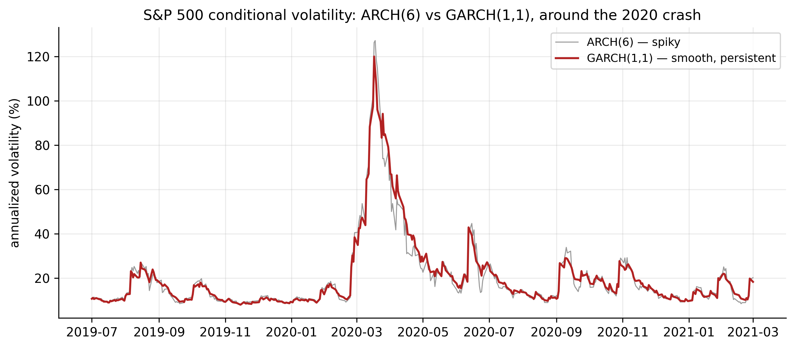
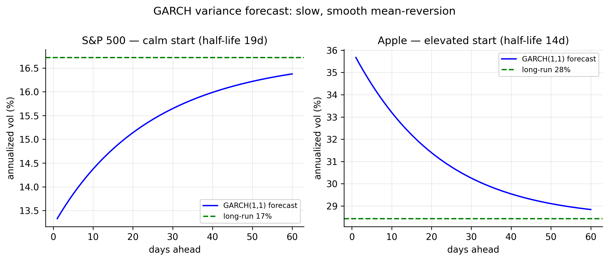
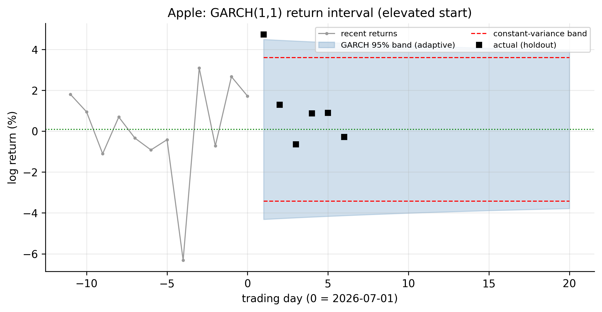
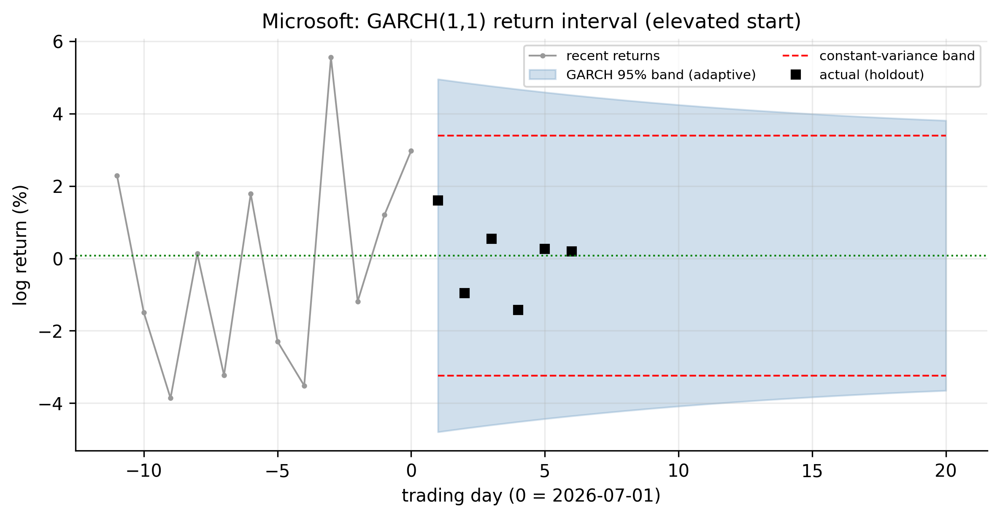
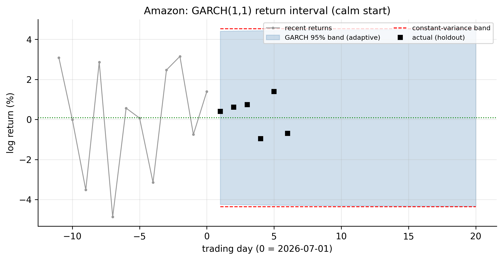
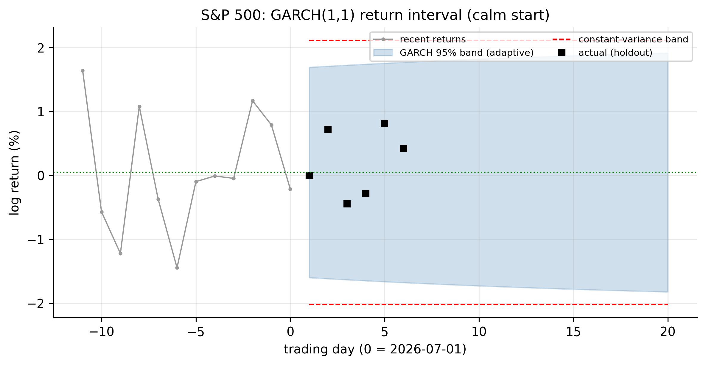
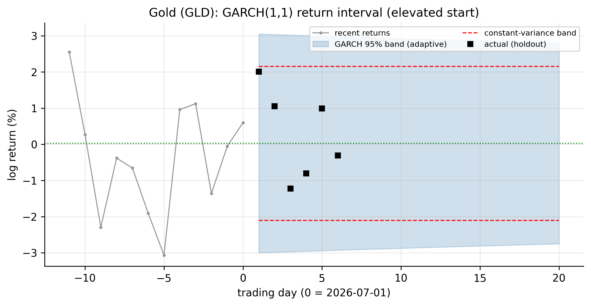
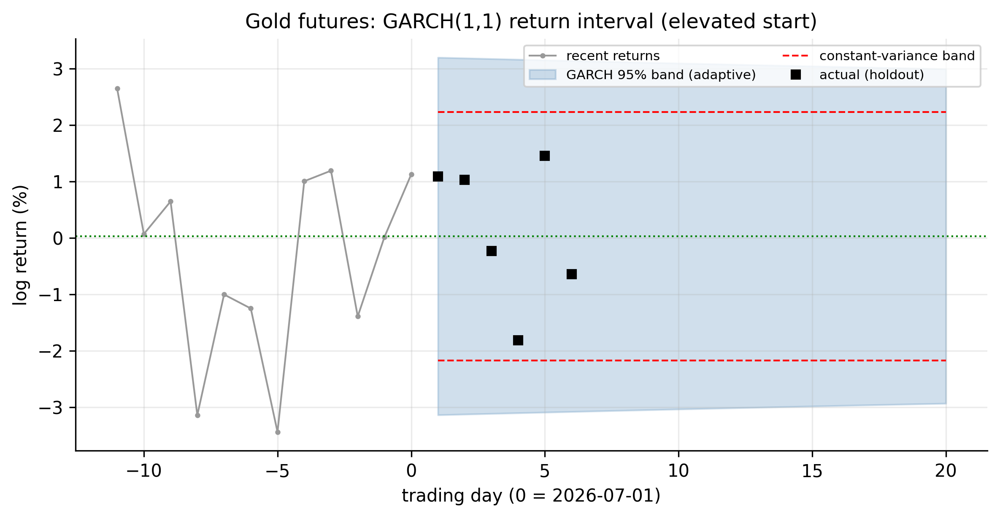

# GARCH Models {#sec-garch}

The ARCH model of @sec-arch captured volatility clustering, but @tbl-arch-fits
exposed its cost: to represent the *persistence* of volatility — the fact that a
shock lingers for weeks — a pure ARCH needed four to ten lagged squared shocks, and
gold-futures wanted more still. Bollerslev's **GARCH** model fixes this with one
idea: let today's variance depend on **yesterday's variance** as well as
yesterday's shock. That single extra term captures long, smooth persistence with a
handful of parameters. GARCH is ARCH made practical, and it is the workhorse
volatility model in all of finance.

We give it the same full treatment: definition, properties, fitting, order choice
across all six series, variance forecasting, and the interpretation in terms of
returns.

## The GARCH model {#sec-garch-def}

::: {.definition}
A **GARCH model** makes today's variance depend on both recent squared shocks *and*
recent variances — capturing long, smooth volatility persistence with few parameters.
:::

A **GARCH($p,q$)** model keeps the ARCH terms in the squared shocks and adds
autoregressive terms in the conditional variance itself:

$$
\sigma_t^2 = \alpha_0
           + \sum_{i=1}^{q}\alpha_i\, a_{t-i}^2
           + \sum_{j=1}^{p}\beta_j\, \sigma_{t-j}^2,
$$ {#eq-garch}

with $\alpha_0>0$, $\alpha_i,\beta_j \ge 0$. The mean model is unchanged
(@eq-cond-decomp): $a_t = \sigma_t\varepsilon_t$ with $\varepsilon_t \sim
\text{iid}(0,1)$. By far the most used member — and the one our data will select —
is the **GARCH(1,1)**:

$$
\sigma_t^2 = \alpha_0 + \alpha_1 a_{t-1}^2 + \beta_1 \sigma_{t-1}^2 .
$$ {#eq-garch11}

Read it as a recipe for tomorrow's variance: a baseline $\alpha_0$, plus a
**reaction** to the latest shock ($\alpha_1 a_{t-1}^2$), plus a **memory** of where
volatility already was ($\beta_1 \sigma_{t-1}^2$). The memory term is what ARCH
lacked.

## Properties of GARCH models {#sec-garch-properties}

**Persistence and stationarity.** Substituting repeatedly shows a GARCH(1,1) is an
**ARCH($\infty$)** whose weights decay geometrically at rate $\beta_1$ — which is
exactly how it mimics many ARCH lags with two parameters. The variance is
stationary when

$$
\alpha_1 + \beta_1 < 1,
$$ {#eq-garch-persist}

and $\alpha_1 + \beta_1$ is the **persistence**: how much of today's variance
carries into tomorrow. The unconditional variance is $\alpha_0/(1-\alpha_1-\beta_1)$.
For daily returns the persistence is typically very close to $1$, which is why
volatility drifts in long, slow swings rather than snapping back.

**Half-life.** The speed of mean-reversion is summarised by the **half-life** — the
number of days for a volatility shock to decay halfway back to the long-run level:

$$
\text{half-life} = \frac{\ln 0.5}{\ln(\alpha_1 + \beta_1)}.
$$ {#eq-garch-halflife}

A persistence of $0.99$ is a half-life of about $69$ days; $0.95$ is about $14$.

**Reaction vs memory.** The split between $\alpha_1$ and $\beta_1$ matters: $\alpha_1$
governs how sharply volatility jumps on news, $\beta_1$ how long it then lingers.
Typically $\beta_1 \gg \alpha_1$ — volatility mostly *remembers*, and only nudges on
each new shock. This is what makes GARCH volatility **smooth** where ARCH was spiky.

**What it still misses.** Standard GARCH is **symmetric**: $\sigma_t^2$ depends on
$a_{t-1}^2$, so a big *up* day and a big *down* day of the same size raise tomorrow's
volatility equally. Real equities show a **leverage effect** — bad news raises
volatility more than good news — which symmetric GARCH cannot capture. That, and the
role of gold as the counter-example, is the subject of the asymmetric models that
follow.

## Fitting GARCH(1,1) to the S&P 500 {#sec-garch-fit}

Estimated by maximum likelihood on the S&P residuals, the fit is

$$
\sigma_t^2 = 4.0\times 10^{-6} + 0.165\,a_{t-1}^2 + 0.799\,\sigma_{t-1}^2,
$$ {#eq-garch-spx}

so $\hat\alpha_1 = 0.165$, $\hat\beta_1 = 0.799$, and persistence
$\hat\alpha_1 + \hat\beta_1 = 0.96$ — a volatility half-life of about **19 trading
days**. The implied unconditional volatility, $16.7\%$ annualised, matches the
sample. Compared with the ARCH(1)'s single $\hat\alpha_1 = 0.40$, GARCH puts most of
the weight on *memory* ($\hat\beta_1 = 0.80$), which is why its fitted volatility is
so much smoother.

@fig-garch-compare makes the improvement visible. Around the 2020 crash the ARCH(6)
volatility (grey) is jagged — it jerks up and down as individual squared shocks
enter and leave its window — while the GARCH(1,1) volatility (red) rises and decays
in one smooth, persistent arc. GARCH does with three parameters, and more
realistically, what ARCH needed seven for.

{#fig-garch-compare}

::: {.panel-tabset}

## R

```r
library(rugarch)
est_return <- function(sym) {
  d <- read.csv(sprintf("data/%s.csv", sym)); d$Date <- as.Date(d$Date)
  diff(log(d$Adjusted[d$Date <= as.Date("2026-07-01")]))
}
spec <- ugarchspec(variance.model = list(model = "sGARCH", garchOrder = c(1, 1)),
                   mean.model = list(armaOrder = c(0, 0)), distribution.model = "norm")
fit  <- ugarchfit(spec, est_return("SPX"))
fit                                                         # alpha1, beta1, persistence
Box.test(residuals(fit, standardize = TRUE)^2, lag = 10, type = "Ljung-Box")
```

## Python

```python
import pandas as pd, numpy as np
from arch import arch_model
def est_return(sym):
    d = pd.read_csv(f"data/{sym}.csv", parse_dates=["Date"]).set_index("Date")
    return np.log(d[d.index <= "2026-07-01"]["Adjusted"]).diff().dropna()
res = arch_model(est_return("SPX")*100, mean="Constant", vol="GARCH",
                 p=1, q=1, dist="normal").fit(disp="off")
print(res.summary())
print((res.std_resid**2).autocorr(1))      # ~0: clustering absorbed
```

:::

As with ARCH, the check is in the standardised residuals: after fitting GARCH(1,1)
the squared standardised residuals show no remaining autocorrelation, and the
Ljung–Box and ARCH-LM tests no longer reject — the clustering is fully absorbed.

## Choosing the order, and all six series {#sec-garch-order}

For GARCH the order question has an unusually clean answer: **GARCH(1,1) is almost
always enough.** Higher orders $(p,q)$ rarely lower BIC on daily return data, and
the profession treats GARCH(1,1) as the default. We confirm it by a small grid
search and then fit GARCH(1,1) to every series.

::: {.panel-tabset}

## R

```r
# BIC over a small (p,q) grid — GARCH(1,1) is the usual winner
for (p in 1:2) for (q in 1:2) {
  spec <- ugarchspec(variance.model = list(model = "sGARCH", garchOrder = c(q, p)),
                     mean.model = list(armaOrder = c(0, 0)))
  cat(sprintf("GARCH(%d,%d) BIC=%.3f\n", p, q, infocriteria(ugarchfit(spec, est_return("SPX")))[2]))
}
```

## Python

```python
import itertools
for p, q in itertools.product([1, 2], [1, 2]):
    res = arch_model(est_return("SPX")*100, vol="GARCH", p=q, q=p).fit(disp="off")
    print(f"GARCH({p},{q}) BIC = {res.bic:.1f}")
```

:::

| Ticker | $\hat\alpha_1$ | $\hat\beta_1$ | persistence $\alpha_1+\beta_1$ | half-life | uncond. vol |
|:-------|:--------------:|:-------------:|:------------------------------:|:---------:|:-----------:|
| AAPL | 0.096 | 0.854 | 0.951 | 14 d | 1.79% |
| MSFT | 0.134 | 0.791 | 0.925 |  9 d | 1.69% |
| AMZN | 0.171 | 0.746 | 0.917 |  8 d | 2.27% |
| SPX  | 0.165 | 0.799 | 0.964 | 19 d | 1.05% |
| GLD  | 0.074 | 0.906 | 0.981 | 35 d | 1.09% |
| GCF  | 0.054 | 0.932 | 0.986 | 48 d | 1.12% |

: GARCH(1,1) fitted to each series {#tbl-garch-fits}

@tbl-garch-fits is the whole case for GARCH, in six rows. Every series is captured
by **three parameters**, versus the four-to-ten ARCH terms of @tbl-arch-fits, and
every persistence is **high — $0.92$ to $0.99$** — against ARCH's mere $0.49$ to
$0.79$. GARCH is not just more parsimonious; it captures *much more* of the true
persistence, because the memory term does the work that many ARCH lags did only
approximately. In every case $\hat\beta_1 \gg \hat\alpha_1$: volatility mostly
carries forward. And the differences across assets are economically sensible — the
two **gold** series are the most persistent (half-lives of $35$–$48$ days: gold's
volatility regimes last a long time), while the individual stocks mean-revert faster
($8$–$14$ days). The S&P sits in between at $19$ days.

## Forecasting the variance {#sec-garch-forecast}

The GARCH(1,1) variance forecast has a simple closed form. One step ahead is known
from the data, and beyond that the shock and variance terms merge into the
persistence:

$$
\sigma_T^2(\ell) = \alpha_0 + (\alpha_1 + \beta_1)\,\sigma_T^2(\ell-1),
\qquad \ell \ge 2,
$$ {#eq-garch-varfc}

a smooth geometric reversion to the unconditional variance
$\alpha_0/(1-\alpha_1-\beta_1)$ at the rate set by the persistence. Because that rate
is close to $1$, the reversion is **slow** — the half-lives of @tbl-garch-fits — so
today's volatility state matters for weeks, not days. @fig-garch-volfc shows the two
cases from our July 1 origin: the S&P began calm and its forecast drifts *up* toward
its long-run level over many weeks; Apple began elevated and drifts *down*. Both are
smoother and far more gradual than the ARCH forecasts of the previous chapter.

{#fig-garch-volfc}

::: {.panel-tabset}

## R

```r
fit <- ugarchfit(spec, est_return("SPX"))
fc  <- ugarchforecast(fit, n.ahead = 20)
sigma(fc)                              # forecast conditional volatility, 20 days
```

## Python

```python
res = arch_model(est_return("SPX")*100, vol="GARCH", p=1, q=1).fit(disp="off")
fc  = res.forecast(horizon=20, reindex=False)
print(np.sqrt(fc.variance.values[-1]))
```

:::

### What the variance forecast means for returns {#sec-garch-interpret}

The interpretation is exactly as in @sec-arch-interpret, but now built on a smoother,
more persistent, more realistic volatility. The conditional mean stays at $\mu$; the
prediction interval breathes with the forecast volatility,

$$
r_{T+h} \in \mu \pm 1.96\,\sigma_T(h) \quad (95\%),
$$ {#eq-garch-interval}

and because GARCH volatility mean-reverts *slowly*, the interval stays narrow (or
wide) for far longer than the ARCH interval did — a calm market is forecast to stay
calm for weeks. This is the model behind the volatility forecasts and Value-at-Risk
numbers used across the industry. The carousel shows the adaptive GARCH band against
the constant-variance band for all six series.

```{=html}
<style>
#garchretCarousel { max-width: 820px; margin: 1.2rem auto 3rem; }
#garchretCarousel .carousel-control-prev-icon,
#garchretCarousel .carousel-control-next-icon { filter: invert(1); background-color: rgba(0,0,0,.5); border-radius: 50%; padding: 14px; }
#garchretCarousel .carousel-indicators { bottom: -2.4rem; }
#garchretCarousel .carousel-indicators [data-bs-target] { background-color: #555; }
</style>
<div id="garchretCarousel" class="carousel slide" data-bs-ride="false" data-bs-interval="false">
  <div class="carousel-indicators">
    <button type="button" data-bs-target="#garchretCarousel" data-bs-slide-to="0" class="active" aria-current="true" aria-label="Apple"></button>
    <button type="button" data-bs-target="#garchretCarousel" data-bs-slide-to="1" aria-label="Microsoft"></button>
    <button type="button" data-bs-target="#garchretCarousel" data-bs-slide-to="2" aria-label="Amazon"></button>
    <button type="button" data-bs-target="#garchretCarousel" data-bs-slide-to="3" aria-label="S&amp;P 500"></button>
    <button type="button" data-bs-target="#garchretCarousel" data-bs-slide-to="4" aria-label="Gold GLD"></button>
    <button type="button" data-bs-target="#garchretCarousel" data-bs-slide-to="5" aria-label="Gold futures"></button>
  </div>
  <div class="carousel-inner">
    <div class="carousel-item active"></div>
    <div class="carousel-item"></div>
    <div class="carousel-item"></div>
    <div class="carousel-item"></div>
    <div class="carousel-item"></div>
    <div class="carousel-item"></div>
  </div>
  <button class="carousel-control-prev" type="button" data-bs-target="#garchretCarousel" data-bs-slide="prev"><span class="carousel-control-prev-icon" aria-hidden="true"></span><span class="visually-hidden">Previous</span></button>
  <button class="carousel-control-next" type="button" data-bs-target="#garchretCarousel" data-bs-slide="next"><span class="carousel-control-next-icon" aria-hidden="true"></span><span class="visually-hidden">Next</span></button>
</div>
```

::: {.content-visible when-format="pdf"}
::: {layout-ncol=2}


:::
:::

The story matches the ARCH chapter — calm starts (S&P, Amazon) give bands tighter
than the constant-variance band, elevated starts (Apple, Microsoft, gold) give wider
ones — but the GARCH bands revert to the constant width **much more slowly**, holding
their conditional shape for weeks. That slow, persistent adaptivity is why GARCH, not
ARCH, is the volatility model used in practice for risk and option pricing.

## Concept check {#sec-garch-concept}

Decide first, then expand each answer.

**Q1. What does GARCH add to the ARCH model, and why does it matter?**

- **(a)** A term for the conditional mean.
- **(b)** A lagged *conditional variance* term ($\beta\sigma_{t-1}^2$), which captures
  long, smooth persistence with far fewer parameters than a high-order ARCH.
- **(c)** A deterministic trend.
- **(d)** Nothing new.

::: {.callout-note collapse="true"}
## Show answer
**(b).** The memory term makes GARCH(1,1) an ARCH($\infty$) with geometrically
decaying weights, so it captures with three parameters what ARCH needed many lags to
approximate.
:::

**Q2. A GARCH(1,1) has $\hat\alpha_1 = 0.16$, $\hat\beta_1 = 0.80$. Its volatility
persistence is:**

- **(a)** 0.16.
- **(b)** 0.80.
- **(c)** 0.96 — and it is variance-stationary because that is below 1.
- **(d)** 0.128.

::: {.callout-note collapse="true"}
## Show answer
**(c).** Persistence is $\alpha_1+\beta_1 = 0.96 < 1$ (stationary). It implies a
half-life of $\ln 0.5/\ln 0.96 \approx 17$ days.
:::

**Q3. In most fitted GARCH(1,1) models $\hat\beta_1 \gg \hat\alpha_1$. This means
volatility:**

- **(a)** reacts violently to each new shock and forgets instantly.
- **(b)** mostly *carries forward* (long memory), nudged only a little by each new
  shock — hence its smooth path.
- **(c)** is constant.
- **(d)** is negative.

::: {.callout-note collapse="true"}
## Show answer
**(b).** $\beta_1$ is the memory weight, $\alpha_1$ the reaction. A large $\beta_1$
means today's variance is mostly yesterday's, giving the smooth, persistent series.
:::

**Q4. Standard GARCH(1,1) cannot capture the *leverage effect* (bad news raising
volatility more than good news) because:**

- **(a)** it has too few parameters.
- **(b)** it depends on $a_{t-1}^2$, which is symmetric in the sign of the shock — up
  and down moves of equal size have identical effect.
- **(c)** it is non-stationary.
- **(d)** it ignores past shocks.

::: {.callout-note collapse="true"}
## Show answer
**(b).** Squaring the shock discards its sign, so symmetric GARCH treats gains and
losses alike. Asymmetric models (EGARCH, GJR-GARCH) fix this — and gold, which shows
little leverage effect, is the instructive counter-example.
:::

**Q5. Why does a calm GARCH forecast stay calm much longer than a calm ARCH
forecast?**

- **(a)** GARCH has no mean-reversion.
- **(b)** GARCH persistence ($\alpha_1+\beta_1 \approx 0.96$) is far higher than
  ARCH's, giving a long half-life, so the current state decays only slowly.
- **(c)** GARCH ignores the current state.
- **(d)** They revert at the same speed.

::: {.callout-note collapse="true"}
## Show answer
**(b).** High persistence means slow reversion (long half-life), so the conditional
volatility — and therefore the return interval — holds its shape for weeks.
:::

::: {.callout-tip}
## Key takeaways
- **GARCH($p,q$)** (@eq-garch) adds lagged **conditional variance** to ARCH; the
  memory term makes GARCH(1,1) an **ARCH($\infty$)**, capturing persistence with
  three parameters.
- **Persistence** is $\alpha_1+\beta_1<1$ (@eq-garch-persist); on our data it is
  $0.92$–$0.99$ (vs ARCH's $0.49$–$0.79$), with $\hat\beta_1\gg\hat\alpha_1$ giving
  **smooth** volatility (@fig-garch-compare) and half-lives of $8$–$48$ days
  (@tbl-garch-fits).
- **GARCH(1,1) is the default** — higher orders rarely help — and it fits all six
  series with three parameters each.
- The variance forecast **mean-reverts slowly** (@eq-garch-varfc), giving an
  **adaptive return interval** (@eq-garch-interval) that holds its conditional shape
  for weeks — the industry-standard basis for volatility forecasting and
  Value-at-Risk.
- Standard GARCH is **symmetric** and misses the **leverage effect**; asymmetric
  models (EGARCH, GJR), with **gold as the counter-example**, come next.
:::
