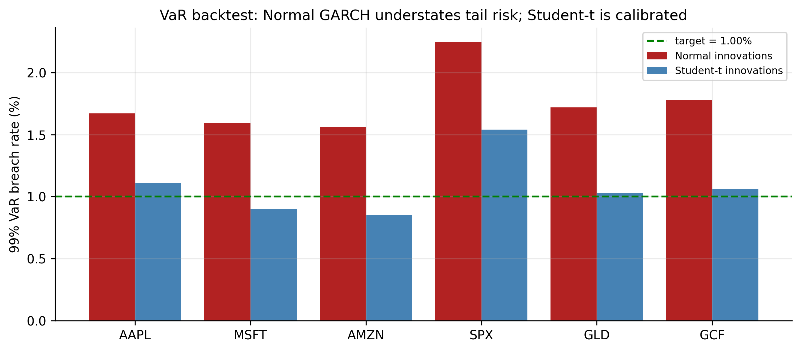

# Estimating and Evaluating Volatility Models {#sec-garch-est}

So far we have fitted GARCH models by, in effect, pressing a button: choose an
order, run the estimator, read off the numbers. This chapter slows down and answers
the four practical questions that turn button-pressing into real modelling:

1. **How do you build a volatility model properly, step by step?**
2. **What is the computer actually doing when it "estimates" one?**
3. **Why is the usual bell-curve assumption wrong, and what do we use instead?**
4. **How do you know whether your model is any good?**

We answer each in plain terms and carry the **S&P 500** through as a running
example. Nothing here is new mathematics; it is the discipline that makes the models
of the last two chapters trustworthy.

::: {.callout-note appearance="simple"}
## The big picture
A volatility model has two halves: a **mean** part (what return do we expect
tomorrow?) and a **variance** part (how big a swing around that expectation?). The
mean part we already know is nearly a flat line. This chapter is almost entirely
about getting the variance part — and the *shape of the surprises* around it —
right, and then **checking** it with a risk number a practitioner can actually use.
:::

## A recipe for building a volatility model {#sec-garch-build}

Building a volatility model is a four-step recipe, and the steps are the same
whether the variance equation is ARCH or GARCH.

**Step 1 — Model the average, then check whether volatility clusters.**
First fit a simple mean model to the returns (for us, just their average, because
Chapters 3–5 showed daily returns are almost unforecastable). Subtract it to get the
"surprises" $\hat a_t$ — the part of each day's return the mean did not predict. Then
test those surprises for **volatility clustering** with the ARCH-LM test
(@sec-arch-test). *If there is no clustering, you are done — no volatility model is
needed.* For every one of our series there is a lot of it (@tbl-arch-lm), so we
continue.

**Step 2 — Choose the volatility equation and how big it should be.**
Decide between ARCH and GARCH and pick the order. For ARCH you count the significant
lags in the squared surprises (it is usually many — four to ten). For GARCH the
answer is easy: **GARCH(1,1) almost always works**, and bigger versions rarely help.

**Step 3 — Let the computer find the best-fitting numbers.**
This is *estimation* — the computer searches for the parameter values that best
explain the data (@sec-garch-mle explains exactly how).

**Step 4 — Check the leftovers.**
Divide each surprise by the volatility the model assigned to that day:
$\hat\varepsilon_t = \hat a_t / \hat\sigma_t$. These **standardised residuals** are
what should be left if the model captured everything — pure, structureless noise. We
check that with two Ljung–Box tests: one on $\hat\varepsilon_t$ (is there leftover
*direction* the mean missed?) and one on $\hat\varepsilon_t^2$ (is there leftover
*clustering* the variance missed?). Both should come back insignificant. A picture
of $\hat\varepsilon_t$ (a QQ plot) then tells us whether we picked the right *shape*
for the surprises — and, as we will see, it usually says we did not.

::: {.panel-tabset}

## R

```r
library(rugarch)
est_return <- function(sym) {
  d <- read.csv(sprintf("data/%s.csv", sym)); d$Date <- as.Date(d$Date)
  diff(log(d$Adjusted[d$Date <= as.Date("2026-07-01")]))
}
# Steps 1-3: constant mean + GARCH(1,1), fitted together
spec <- ugarchspec(mean.model     = list(armaOrder = c(0, 0)),
                   variance.model = list(model = "sGARCH", garchOrder = c(1, 1)),
                   distribution.model = "norm")
fit  <- ugarchfit(spec, est_return("SPX"))
# Step 4: the leftovers should be structureless
z <- residuals(fit, standardize = TRUE)
Box.test(z,   lag = 10, type = "Ljung-Box")   # leftover direction?
Box.test(z^2, lag = 10, type = "Ljung-Box")   # leftover clustering?
```

## Python

```python
import pandas as pd, numpy as np
from arch import arch_model
from statsmodels.stats.diagnostic import acorr_ljungbox
def est_return(sym):
    d = pd.read_csv(f"data/{sym}.csv", parse_dates=["Date"]).set_index("Date")
    return np.log(d[d.index <= "2026-07-01"]["Adjusted"]).diff().dropna()
res = arch_model(est_return("SPX")*100, mean="Constant",
                 vol="GARCH", p=1, q=1, dist="normal").fit(disp="off")
z = res.std_resid
print(acorr_ljungbox(z,    lags=[10]))   # leftover direction?
print(acorr_ljungbox(z**2, lags=[10]))   # leftover clustering?
```

:::

Run this on the S&P and Steps 1–3 go through cleanly, but Step 4 raises a flag: the
leftovers pass the *clustering* check (the GARCH did its job) yet fail a *shape*
check — they are too extreme too often for a bell curve. Holding that thought, let
us first make Step 3 concrete.

## What "estimating" the model means {#sec-garch-mle}

Estimation sounds mysterious but the idea is simple. We have a model with a few
unknown dials — for GARCH(1,1) they are $\alpha_0$, $\alpha_1$, $\beta_1$. Different
dial settings imply a different volatility path $\sigma_t$ for every day, and
therefore say the returns we actually observed were more or less *likely*. **Maximum
likelihood** just turns the dials to the setting that makes the observed returns as
likely as possible.

::: {.callout-note appearance="simple"}
## Maximum likelihood in one sentence
Of all the parameter settings we could choose, pick the one under which the data we
*actually saw* would have been the least surprising.
:::

Concretely, once the dials are fixed we can compute the volatility $\sigma_t$ for
every day (it is just the GARCH recursion), and then score how well each day's return
fits. Under a bell curve the total score — the **log-likelihood** — is

$$
\ell(\theta) = -\frac{1}{2}\sum_{t=1}^{T}
\left[\ln(2\pi) + \underbrace{\ln\sigma_t^2}_{\text{penalty for claiming big risk}} + \underbrace{\frac{a_t^2}{\sigma_t^2}}_{\text{penalty for being surprised}}\right].
$$ {#eq-garch-loglik}

The two penalty terms pull against each other, and that tension is the whole trick.
If the model sets $\sigma_t$ too *small* on a day with a big move, the second term
($a_t^2/\sigma_t^2$) blows up — it was caught off guard. If it sets $\sigma_t$ too
*large* everywhere to stay safe, the first term ($\ln\sigma_t^2$) piles up — it is
crying wolf. The best fit threads between them: small volatility on calm days, large
on turbulent ones — exactly the clustering GARCH is built for. There is no formula
that solves this in one step, so the software searches numerically, keeping the dials
in the sensible range ($\alpha_0>0$, weights $\ge 0$, persistence below 1).

## A simpler shortcut: two-pass estimation {#sec-garch-twopass}

Step 3 estimates the mean and variance dials *together*. A simpler, sturdier
alternative estimates them **in two passes**:

- **Pass 1** — fit the mean model on its own and keep the surprises $\hat a_t$.
- **Pass 2** — fit the GARCH to those surprises.

Think of it as doing the easy half first (find the average) and then the hard half
(model the swings) using what the first pass left behind. It is easier for the
computer and less likely to get stuck, giving up only a little accuracy because it
does not let the two halves talk to each other.

For our data the two approaches give essentially the same answer, and it is worth
seeing why: the mean of daily returns is basically a **constant** (returns are near
white noise), so "Pass 1" is nothing more than subtracting the average. That is
precisely what we have been doing — fitting GARCH to demeaned returns — so we have
been using the two-pass method all along without naming it. The distinction only
starts to matter when the mean has genuine ARMA structure.

::: {.panel-tabset}

## R

```r
mean_fit <- arima(est_return("SPX"), order = c(0, 0, 0))   # Pass 1: the mean
a_hat    <- residuals(mean_fit)                            #         the surprises
ugarchfit(                                                 # Pass 2: GARCH on surprises
  ugarchspec(mean.model = list(armaOrder = c(0, 0), include.mean = FALSE),
             variance.model = list(model = "sGARCH", garchOrder = c(1, 1))),
  a_hat)
```

## Python

```python
from statsmodels.tsa.arima.model import ARIMA
a_hat = ARIMA(est_return("SPX"), order=(0, 0, 0)).fit().resid          # Pass 1
res2  = arch_model(a_hat*100, mean="Zero", vol="GARCH", p=1, q=1).fit(disp="off")  # Pass 2
```

:::

## Fixing the shape of the surprises: Student-$t$ innovations {#sec-garch-t}

Now back to the flag Step 4 raised. After a Gaussian GARCH fit, the leftovers
$\hat\varepsilon_t$ *should* look like draws from a standard bell curve. They do not.
They are **fat-tailed** — extreme values show up far more often than a bell curve
allows. @fig-garch-t-qq (left) shows it plainly: if the leftovers were normal, the
grey dots would lie on the straight line, but in the tails they peel sharply away.

{#fig-garch-t-qq}

This is the other half of a story we started in Chapter 2. Back then the *raw*
returns looked fat-tailed, and we said the fatness had two causes: volatility that
comes and goes, and genuinely extreme surprises. GARCH has now handled the first
cause — the varying volatility. What is left over in $\hat\varepsilon_t$ is the
second: the surprises themselves are heavier-tailed than a bell curve.

The fix is to stop assuming a bell curve and instead assume the surprises follow a
**Student-$t$** distribution, which is bell-shaped in the middle but with fatter
tails. It has one extra dial, the **degrees of freedom** $\nu$, which controls tail
fatness:

$$
\varepsilon_t \sim t_\nu \;(\text{scaled to unit variance}), \qquad
\text{excess kurtosis} = \frac{6}{\nu - 4}.
$$ {#eq-garch-t}

A **small $\nu$ means very fat tails**; as $\nu$ grows the $t$ becomes the ordinary
bell curve. We simply add $\nu$ to the list of dials and re-estimate. The improvement
is dramatic:

| Ticker | fitted $\nu$ | how fat the leftovers still are (excess kurtosis) | model improvement ($\Delta$BIC, $t$ vs bell curve) |
|:-------|:---:|:---:|:---:|
| AAPL | 4.4 | 3.45 | −388 |
| MSFT | 4.4 | 5.80 | −482 |
| AMZN | 4.4 | 6.85 | −552 |
| SPX  | 5.6 | 2.15 | −222 |
| GLD  | 5.0 | 2.68 | −284 |
| GCF  | 4.2 | 3.83 | −411 |

: Bell-curve vs Student-$t$ surprises in GARCH(1,1) {#tbl-garch-t}

Read the table left to right. The fitted $\nu$ is between **4 and 6** for every
series — very fat tails (a bell curve is $\nu=\infty$). The middle column shows that
even *after* GARCH, the leftovers carry excess kurtosis of 2 to 7, confirming the
bell curve was wrong. And the last column is the verdict: switching to $t$ lowers BIC
by **220 to 550 points** — an enormous margin (a difference of 10 is already
decisive). @fig-garch-t-qq (right) seals it: against the fitted $t$, the dots line up.
For daily returns, Student-$t$ surprises are not a nicety; they are the correct
choice.

::: {.panel-tabset}

## R

```r
spec_t <- ugarchspec(mean.model = list(armaOrder = c(0, 0)),
                     variance.model = list(model = "sGARCH", garchOrder = c(1, 1)),
                     distribution.model = "std")           # "std" = Student-t surprises
fit_t  <- ugarchfit(spec_t, est_return("SPX"))
fit_t                                                      # reports the shape parameter (nu)
```

## Python

```python
res_t = arch_model(est_return("SPX")*100, mean="Constant",
                   vol="GARCH", p=1, q=1, dist="t").fit(disp="off")
print(res_t.summary())          # 'nu' is the fitted degrees of freedom
```

:::

## Is the model any good? Backtesting Value-at-Risk {#sec-garch-eval}

::: {.definition}
**Value-at-Risk (VaR)** is a loss line for a given confidence level: the 99% VaR is a
loss you should exceed only about 1 day in 100. Backtesting counts how often you
actually breach it.
:::

A model is only as good as its forecasts, and for a risk model the sharpest test is
**Value-at-Risk (VaR)**. In plain words, the one-day 99% VaR is a loss line you
should only cross about **1 day in 100**:

$$
\text{VaR}_t(1\%) = \mu + \sigma_t\, q_{1\%},
$$ {#eq-garch-var}

where $q_{1\%}$ is the 1%-point of the surprise distribution — a modest number under
the bell curve, a bigger (more negative) one under the fatter $t$. Each day the model
draws this line using that day's forecast volatility $\sigma_t$, so the line moves:
tight in calm times, wide in turbulent ones.

Testing it is refreshingly concrete. Draw the line every day, then simply **count how
often the actual return fell below it**. If the model is honest, that should happen
about 1% of the time. This count is called a **backtest**, and it is where the choice
of surprise distribution shows its teeth.

{#fig-garch-var}

| Ticker | crossings under bell curve | crossings under Student-$t$ | promised |
|:-------|:---:|:---:|:---:|
| AAPL | 1.67% | 1.11% | 1.00% |
| MSFT | 1.59% | 0.90% | 1.00% |
| AMZN | 1.56% | 0.85% | 1.00% |
| SPX  | 2.25% | 1.54% | 1.00% |
| GLD  | 1.72% | 1.03% | 1.00% |
| GCF  | 1.78% | 1.06% | 1.00% |

: How often the 99% VaR loss line was actually crossed {#tbl-garch-var}

The message of @tbl-garch-var is blunt and it costs money. The **bell-curve VaR is
crossed far too often** — 1.6% to 2.25% of days instead of 1%, more than *double* for
the S&P. That means it draws its loss line too close to zero, and reality punches
through it far more than the model claims: a desk trusting it would be running about
twice the tail risk it thinks it is. Switching to **Student-$t$ surprises pulls every
crossing rate back toward the promised 1%**. This is the concrete, dollars-and-cents
reason the whole volatility exercise matters, and the reason $t$ is standard in
practice: it converts a comfortable-looking but dangerously optimistic risk number
into an honest one.

::: {.callout-note appearance="simple"}
## Other ways to grade a model
The VaR count is the most intuitive check, but not the only one. You can also compare
the model's variance forecasts to the *realised* variance (using squared or intraday
returns) with error scores like **MSE** or **QLIKE**, decide between two models with a
**Diebold–Mariano** test, and test VaR coverage formally with **Kupiec's** test. The
backtest above is the one a practitioner reaches for first.
:::

## Concept check {#sec-garch-est-concept}

Decide first, then expand each answer.

**Q1. What is the very first step in building a volatility model?**

- **(a)** Estimate $\alpha_1$ and $\beta_1$.
- **(b)** Fit a mean model and test its surprises for volatility clustering — if there
  is none, no volatility model is needed.
- **(c)** Compute Value-at-Risk.
- **(d)** Difference the series.

::: {.callout-note collapse="true"}
## Show answer
**(b).** Model the average first, then test the leftovers for an ARCH effect. Only if
volatility clusters do you go on to a variance model.
:::

**Q2. In plain terms, what does maximum-likelihood estimation do?**

- **(a)** Picks the parameters that make the data we actually observed as likely as
  possible.
- **(b)** Minimises the mean of the returns.
- **(c)** Guarantees a normal distribution.
- **(d)** Removes the trend.

::: {.callout-note collapse="true"}
## Show answer
**(a).** It turns the model's dials to the setting under which the observed returns
would have been least surprising. The GARCH recursion makes this a numerical search,
not a one-step formula.
:::

**Q3. The "two-pass" method estimates the model by:**

- **(a)** running the data through twice for accuracy.
- **(b)** fitting the mean first, then fitting GARCH to the leftovers — simpler and
  sturdier, and identical to joint estimation when the mean is just a constant.
- **(c)** estimating the variance two different ways.
- **(d)** using two datasets.

::: {.callout-note collapse="true"}
## Show answer
**(b).** Pass 1 finds the average; Pass 2 models the swings in what is left. For our
near-constant mean it matches joint estimation exactly.
:::

**Q4. After a Gaussian GARCH fit, the leftovers still have fat tails. The fix is to:**

- **(a)** add more GARCH lags.
- **(b)** assume the surprises follow a fatter-tailed **Student-$t$** instead of a
  bell curve.
- **(c)** difference the returns.
- **(d)** drop the mean model.

::: {.callout-note collapse="true"}
## Show answer
**(b).** GARCH fixed the *changing* volatility; the leftover fatness is in the
surprises themselves. A Student-$t$ (small $\nu$ = fat tails) matches them.
:::

**Q5. A 99% VaR is crossed on 2.25% of days. What does that say about the model?**

- **(a)** It is too cautious.
- **(b)** It **understates risk** — reality crosses the loss line more than twice as
  often as promised, because the assumed tails are too thin.
- **(c)** It is perfectly calibrated.
- **(d)** Its mean is wrong.

::: {.callout-note collapse="true"}
## Show answer
**(b).** A crossing rate above the target means the loss line sits too close to zero.
Fatter ($t$) tails widen it and restore ~1% coverage.
:::

::: {.callout-tip}
## Key takeaways
- Build a volatility model in **four plain steps**: model the average and test for
  clustering → choose the variance equation and order → let the computer estimate it
  → check that the leftovers are structureless.
- **Estimation = maximum likelihood**: pick the dials that make the observed returns
  most likely (@eq-garch-loglik), balancing "don't claim big risk" against "don't get
  caught out." The **two-pass** shortcut (mean, then variance) matches it when the
  mean is near-constant, as ours is.
- The surprises are **fat-tailed even after GARCH**, so use **Student-$t$** ones
  (@eq-garch-t): $\hat\nu\approx 4$–$6$ here, improving BIC by $220$–$550$
  (@tbl-garch-t).
- **Backtest the VaR** to grade the model: the bell curve crosses its 99% line
  $1.6$–$2.25\%$ of days (understating risk); Student-$t$ restores ~1% (@tbl-garch-var).
- Standard GARCH is still **symmetric** — up and down shocks count the same. Relaxing
  that, plus other extensions, comes next.
:::
