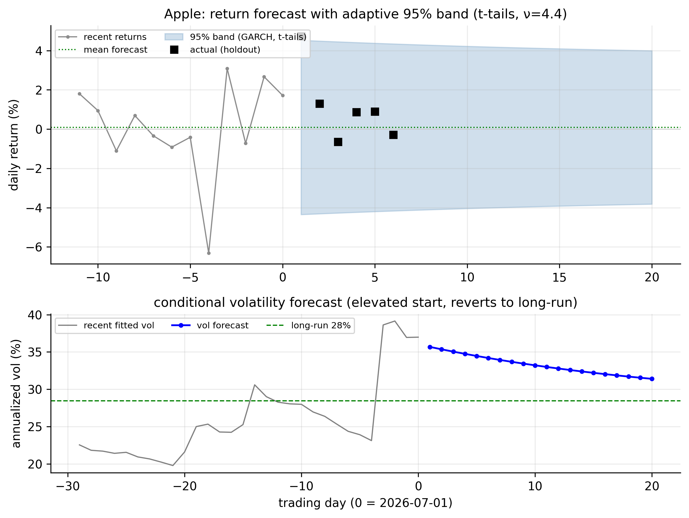
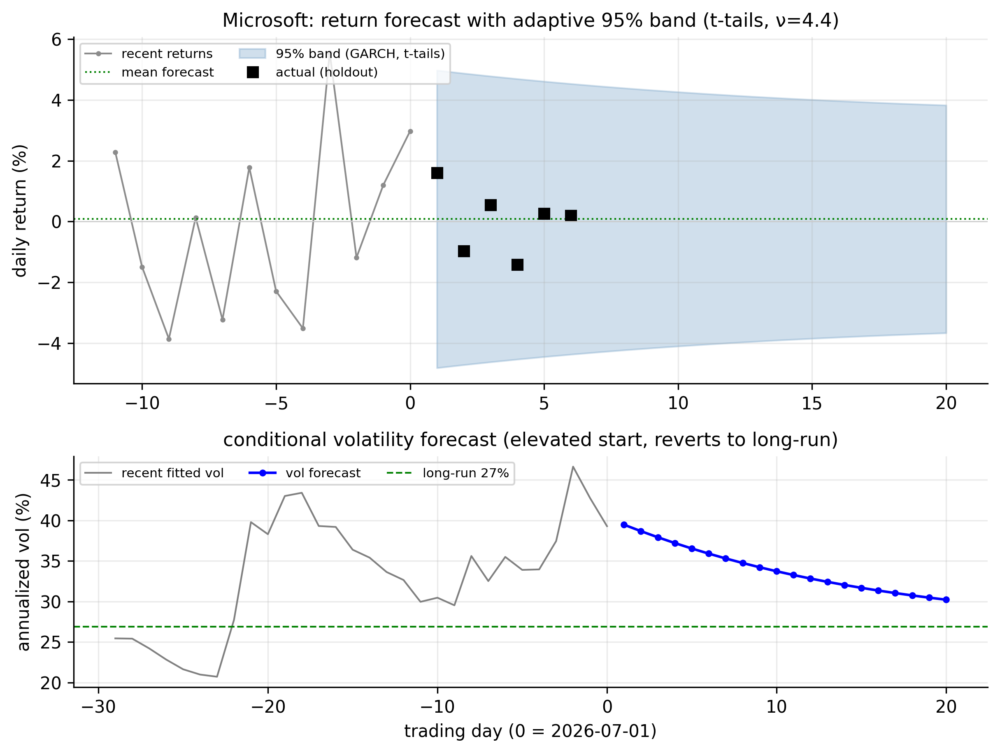
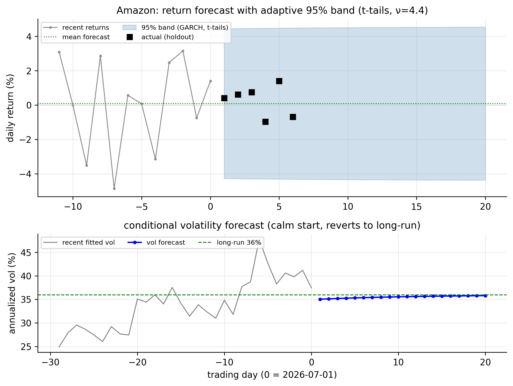
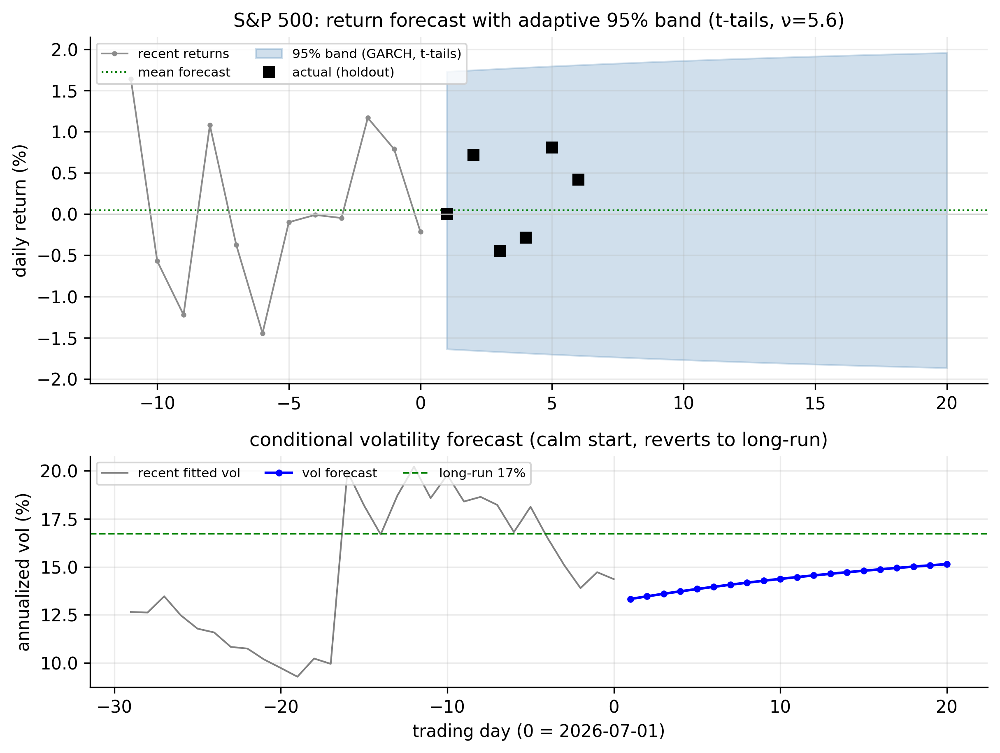
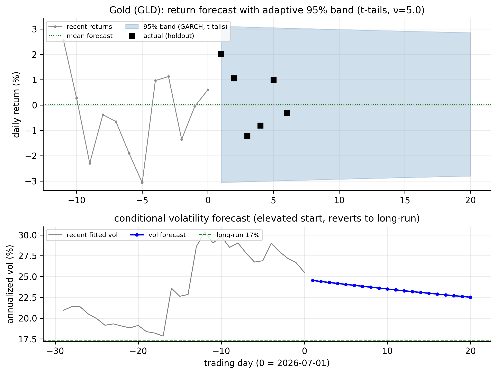
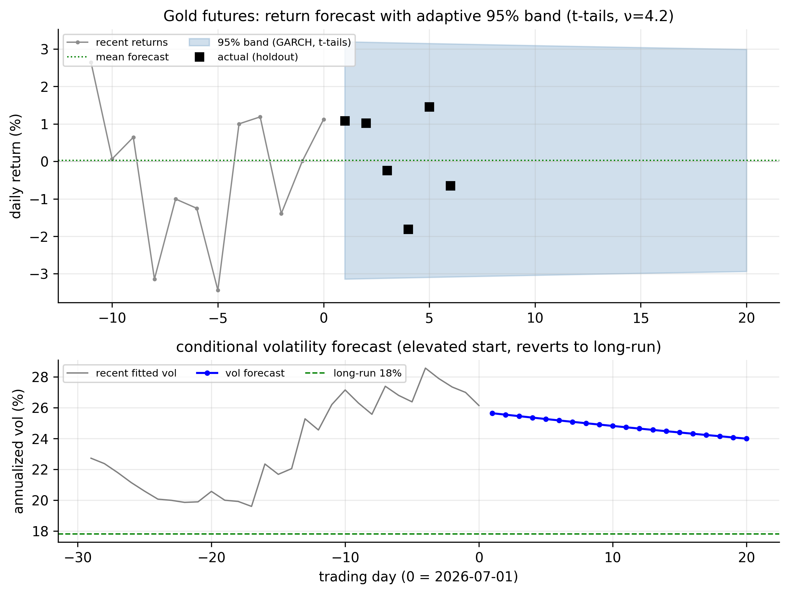

# Nonlinear Models {#sec-nonlinear}

Every mean model so far has been **linear**: the same rule maps the past into a
forecast, no matter what the market is doing. **Nonlinear** models drop that
assumption — they let the dynamics *change with the state of the world*. Two ideas
dominate: **threshold** models, where the rule switches when an observed variable
crosses a line, and **Markov-switching** models, where the rule switches between
hidden "regimes" the market moves among on its own.

Before diving in, an honest word about what to expect on our data, because it shapes
everything. We already know daily returns are almost unforecastable in the *mean*.
So we should not expect a nonlinear *mean* model to find much either. What our
returns have in abundance is nonlinearity in the **variance** — the volatility
clustering GARCH captured. The most valuable nonlinear model here will therefore be
the one that speaks to regimes of volatility: Markov switching. Let us test for
nonlinearity first, then meet both models honestly.

## Are returns nonlinear? Testing first {#sec-nl-tests}

A linear model with a fixed variance implies the residuals are pure noise — not just
uncorrelated, but with no structure of any kind. Nonlinearity shows up when some
*function* of the past predicts the present even though the past itself does not. The
simplest and most telling test is **McLeod–Li**: a Ljung–Box test applied to the
**squared** returns. Squares carry no information about direction, so if they are
autocorrelated, the series is nonlinear.

The key is to run it twice — once on the raw returns, and once on the GARCH
**standardised residuals** — because the difference tells us *where* the nonlinearity
lives.

::: {.panel-tabset}

## R

```r
library(tseries)   # bds.test; FinTS::ArchTest for the ARCH-LM form
est_return <- function(sym) {
  d <- read.csv(sprintf("data/%s.csv", sym)); d$Date <- as.Date(d$Date)
  diff(log(d$Adjusted[d$Date <= as.Date("2026-07-01")]))
}
r <- est_return("SPX")
Box.test(r^2, lag = 12, type = "Ljung-Box")     # McLeod-Li on raw returns
# ... then fit a GARCH and repeat on its standardized residuals:
z <- as.numeric(residuals(rugarch::ugarchfit(
       rugarch::ugarchspec(variance.model = list(garchOrder = c(1,1)),
                           mean.model = list(armaOrder = c(0,0))), r), standardize = TRUE))
Box.test(z^2, lag = 12, type = "Ljung-Box")      # McLeod-Li on GARCH residuals
```

## Python

```python
import pandas as pd, numpy as np
from statsmodels.stats.diagnostic import acorr_ljungbox
from arch import arch_model
def est_return(sym):
    d = pd.read_csv(f"data/{sym}.csv", parse_dates=["Date"]).set_index("Date")
    return np.log(d[d.index <= "2026-07-01"]["Adjusted"]).diff().dropna()
r = est_return("SPX")
print(acorr_ljungbox(r**2, lags=[12]))                       # raw returns
z = arch_model(r*100, vol="GARCH", p=1, q=1).fit(disp="off").std_resid
print(acorr_ljungbox(z**2, lags=[12]))                       # GARCH residuals
```

:::

| Ticker | McLeod–Li on raw returns | McLeod–Li on GARCH residuals |
|:-------|:------------------------:|:----------------------------:|
| AAPL |   892 |  4.3 |
| MSFT | 1,272 |  7.1 |
| AMZN |   140 |  7.2 |
| SPX  | 4,121 | 15.6 |
| GLD  |   530 | 10.2 |
| GCF  |   316 | 10.2 |

: McLeod–Li nonlinearity test (statistic; $\chi^2_{12}$ 5% critical value $=21.0$) {#tbl-nl-test}

@tbl-nl-test tells the whole story. On the **raw returns** the statistic is enormous
for every series — hundreds to thousands, against a threshold of $21$ — so returns
are emphatically nonlinear. But on the **GARCH standardised residuals** the statistic
collapses **below the threshold** for every series (4 to 16). In other words, *once
GARCH has removed the volatility clustering, essentially no nonlinearity is left.*
The nonlinearity in returns is almost entirely **conditional heteroskedasticity** —
it lives in the variance, which we have already modelled. This is the crucial finding
that frames the rest of the chapter: threshold and switching models applied to the
*mean* will find slim pickings, while a switching model of the *variance* will find a
great deal.

## Threshold autoregressive (TAR) models {#sec-nl-tar}

::: {.definition}
A **threshold autoregressive (TAR) model** switches between different AR dynamics
depending on whether an observed past value crosses a fixed threshold.
:::

A **threshold autoregressive** model lets the AR coefficients switch depending on
whether a past value sits above or below a **threshold** $\gamma$. The two-regime
**SETAR** (self-exciting TAR) with one lag is

$$
r_t =
\begin{cases}
c_1 + \phi_1\, r_{t-1} + a_t, & r_{t-d} \le \gamma \quad(\text{"lower" regime}),\\[4pt]
c_2 + \phi_2\, r_{t-1} + a_t, & r_{t-d} > \gamma \quad(\text{"upper" regime}),
\end{cases}
$$ {#eq-setar}

where $d$ is the delay. "Self-exciting" means the switch is triggered by the series'
*own* past ($r_{t-d}$), not an outside variable. Estimation is a grid search: try each
candidate threshold, fit a plain regression in each regime, and keep the $\gamma$ that
minimises the total squared error.

Fitting a two-regime SETAR to the S&P 500 (threshold on the previous day's return)
turns up a small but real effect: the estimated threshold is $\gamma = 0.79\%$, and
the two regimes differ.

- **After an ordinary or down day** ($r_{t-1} \le 0.79\%$): $c=0.03\%$,
  $\hat\phi_1 = -0.11$ — the mild mean-reversion we already knew.
- **After a *big up* day** ($r_{t-1} > 0.79\%$): $c=0.57\%$, $\hat\phi_1 = -0.41$ —
  markedly *stronger* mean-reversion. A large gain tends to be given back faster than
  a small move.

The SETAR beats the linear AR(1) on BIC ($-34{,}096$ vs $-34{,}077$), so the threshold
effect is statistically real. But keep it in proportion, consistent with @tbl-nl-test:
it is a small refinement of an already-tiny mean signal, explaining a sliver more of a
series whose mean is mostly unpredictable. TAR is a valuable idea — and indispensable
for series with genuine regime-dependent *means*, like some macro and interest-rate
data — but for daily equity returns it is a minor character.

::: {.panel-tabset}

## R

```r
library(tsDyn)
setar_fit <- setar(est_return("SPX"), m = 1, thDelay = 0)   # 2-regime SETAR(1)
summary(setar_fit)                                          # thresholds + regime coefficients
```

## Python

```python
# No first-class SETAR in statsmodels; a direct grid search over the threshold:
r = est_return("SPX").values; y, x = r[1:], r[:-1]
best = None
for g in np.quantile(x, np.linspace(0.15, 0.85, 71)):
    lo = x <= g
    sse = sum(((y[m] - np.polyval(np.polyfit(x[m], y[m], 1), x[m]))**2).sum()
              for m in (lo, ~lo))
    best = min(best or (1e18, g), (sse, g))
print("threshold =", best[1])
```

:::

## Markov-switching models {#sec-nl-ms}

::: {.definition}
A **Markov-switching model** assumes the series moves between a few *hidden regimes*
(e.g. calm vs crisis); we infer the probability of each regime from the data.
:::

The **Markov-switching** model takes a different view: instead of a switch you can
see (a threshold on a past value), the market moves between **hidden regimes** on its
own, and we infer which regime it is in from the data. With two states,

$$
r_t \mid S_t = k \;\sim\; N(\mu_k,\, \sigma_k^2), \qquad
P(S_t = k \mid S_{t-1} = j) = p_{jk},
$$ {#eq-ms}

where $S_t \in \{1, 2\}$ is the unobserved state and the $p_{jk}$ form a **transition
matrix**. The state follows a Markov chain — where it goes next depends only on where
it is now. We estimate the regime means, variances, and transition probabilities by
maximum likelihood (the Hamilton filter), and the model returns, for every day, the
**probability that the market was in each regime** — the smoothed regime
probabilities.

On daily returns the two states it finds are unmistakable: a **calm** state and a
**crisis** state, differing overwhelmingly in *volatility* (the two means are both
near zero — echoing @tbl-nl-test, the regimes are about variance). @fig-nl-regime
plots the S&P 500 with the crisis regime shaded, and the model dates the market's
storms on its own: the 2011 euro crisis, the 2015–16 and late-2018 selloffs, the 2020
COVID crash (where the crisis probability pins to 1), and the 2022 bear market.

{#fig-nl-regime}

Fitting the two-state model to every series shows how differently the six behave:

| Ticker | calm vol | crisis vol | avg calm spell | avg crisis spell | time in crisis |
|:-------|:--------:|:----------:|:--------------:|:----------------:|:--------------:|
| AAPL | 18.5% | 46.8% | 18 d | 6 d | 25% |
| MSFT | 17.0% | 43.6% | 23 d | 8 d | 25% |
| AMZN | 21.4% | 53.7% | 31 d | 11 d | 26% |
| SPX  | 10.0% | 28.6% | 51 d | 20 d | 28% |
| GLD  | 12.4% | 29.0% | 68 d | 16 d | 19% |
| GCF  | 12.8% | 30.9% | 56 d | 11 d | 17% |

: Two-state Markov-switching model, all six series (volatilities annualised) {#tbl-nl-ms}

Read @tbl-nl-ms across. Every series splits into a calm regime and a crisis regime
with **roughly $2.5$–$3\times$ the volatility** (the S&P's $10\%$ vs $29\%$ is the
starkest). The regimes are **persistent** — a calm spell averages weeks to months, a
crisis spell one to four weeks — which is why the average duration column matters: it
is $1/(1-p_{kk})$, the expected number of days the chain stays put. And the character
differs by asset: **gold spends the least time in crisis** ($17$–$19\%$ vs the
equities' $25$–$28\%$) and has the longest calm spells, the quantitative version of
its reputation as the steadier asset. The individual stocks flip regimes fastest.

::: {.panel-tabset}

## R

```r
library(MSwM)              # or depmixS4
lm0 <- lm(est_return("SPX") ~ 1)
ms  <- msmFit(lm0, k = 2, sw = c(TRUE, TRUE))   # 2 regimes, switching mean & variance
summary(ms); plotProb(ms, which = 1)            # smoothed regime probabilities
```

## Python

```python
from statsmodels.tsa.regime_switching.markov_regression import MarkovRegression
mod = MarkovRegression(est_return("SPX"), k_regimes=2, switching_variance=True)
res = mod.fit()
print(res.summary())
res.smoothed_marginal_probabilities[1].plot()   # P(crisis regime) over time
```

:::

This is, in effect, a **discrete-regime alternative to GARCH**. Both describe
time-varying volatility; GARCH lets it drift smoothly, while Markov switching snaps
between a small number of distinct states. For our data they agree on the substance —
volatility is the story — and the switching model adds one interpretable extra: a
clean, dated answer to "is the market in a calm or a crisis regime right now?"

## Forecasting with nonlinear models {#sec-nl-forecast}

Forecasting from these models follows the regimes.

For a **SETAR**, the one-step forecast uses whichever regime yesterday's return puts
you in — after a big up day, the stronger mean-reversion; otherwise the mild one.
Multi-step forecasts require simulation, because tomorrow's regime depends on
tomorrow's (unknown) return; but as with every mean model we have seen, the forecast
quickly settles near the overall average.

For a **Markov-switching** model the forecast is a *blend* weighted by regime
probability. Given today's regime probabilities, the $h$-day-ahead probabilities are
obtained by pushing them through the transition matrix $h$ times, and the forecast
volatility is the probability-weighted average of the calm and crisis volatilities. As
the horizon grows, the regime probabilities converge to the chain's long-run
(**ergodic**) split — for the S&P, about $72\%$ calm and $28\%$ crisis — so the
volatility forecast mean-reverts to the long-run blend, just as the GARCH forecast
reverted to its unconditional level.

The honest bottom line matches every chapter before it. The **mean** forecast is
still a near-flat line at the average — both regimes have means close to zero, so
knowing the regime barely moves the expected return. What the regime *does* tell you
is the **risk**: the single most useful output of the switching model is today's
crisis probability, which says whether to forecast calm or turbulent conditions
ahead. Nonlinear models, like the volatility models before them, pay off not by
predicting direction but by sharpening the picture of risk.

## Putting the toolkit together: a forecast for each ticker {#sec-nl-summary}

This is where the whole book converges. For each of our six series we now produce a
single, honest forecast that combines everything we have learned — the (flat) mean
model and the **GARCH(1,1) with Student-$t$ tails** for the volatility — in two
panels:

- **Top — the return forecast.** A nearly flat point forecast at the series' average,
  wrapped in an **adaptive 95% band** whose width comes from the GARCH volatility
  forecast and the fat-tailed $t$ quantile. The band starts at *today's* conditional
  volatility and fans toward the long-run width. Black squares are the actual July
  holdout returns.
- **Bottom — the volatility forecast.** The recent fitted conditional volatility
  (grey) and its forecast (blue) mean-reverting to the series' **long-run level**
  (green dashed).

Step through the six with the arrows or dots.

```{=html}
<style>
#fcSummaryCarousel { max-width: 760px; margin: 1.2rem auto 3rem; }
#fcSummaryCarousel .carousel-control-prev-icon,
#fcSummaryCarousel .carousel-control-next-icon { filter: invert(1); background-color: rgba(0,0,0,.5); border-radius: 50%; padding: 14px; }
#fcSummaryCarousel .carousel-indicators { bottom: -2.4rem; }
#fcSummaryCarousel .carousel-indicators [data-bs-target] { background-color: #555; }
</style>
<div id="fcSummaryCarousel" class="carousel slide" data-bs-ride="false" data-bs-interval="false">
  <div class="carousel-indicators">
    <button type="button" data-bs-target="#fcSummaryCarousel" data-bs-slide-to="0" class="active" aria-current="true" aria-label="Apple"></button>
    <button type="button" data-bs-target="#fcSummaryCarousel" data-bs-slide-to="1" aria-label="Microsoft"></button>
    <button type="button" data-bs-target="#fcSummaryCarousel" data-bs-slide-to="2" aria-label="Amazon"></button>
    <button type="button" data-bs-target="#fcSummaryCarousel" data-bs-slide-to="3" aria-label="S&amp;P 500"></button>
    <button type="button" data-bs-target="#fcSummaryCarousel" data-bs-slide-to="4" aria-label="Gold GLD"></button>
    <button type="button" data-bs-target="#fcSummaryCarousel" data-bs-slide-to="5" aria-label="Gold futures"></button>
  </div>
  <div class="carousel-inner">
    <div class="carousel-item active"></div>
    <div class="carousel-item"></div>
    <div class="carousel-item"></div>
    <div class="carousel-item"></div>
    <div class="carousel-item"></div>
    <div class="carousel-item"></div>
  </div>
  <button class="carousel-control-prev" type="button" data-bs-target="#fcSummaryCarousel" data-bs-slide="prev"><span class="carousel-control-prev-icon" aria-hidden="true"></span><span class="visually-hidden">Previous</span></button>
  <button class="carousel-control-next" type="button" data-bs-target="#fcSummaryCarousel" data-bs-slide="next"><span class="carousel-control-next-icon" aria-hidden="true"></span><span class="visually-hidden">Next</span></button>
</div>
```

::: {.content-visible when-format="pdf"}
::: {layout-ncol=2}


:::
:::

The panels differ only in their **starting volatility state** on 1 July 2026 — the
one thing a good model conditions on. Entering July, most series were **elevated**
(conditional volatility above the long-run level, so the forecast decays back down),
while the **S&P 500 and Amazon were calm** (below the long-run level, rising toward
it).

| Ticker | start state | 1-day-ahead vol | long-run vol | band behaviour |
|:-------|:-----------:|:---------------:|:------------:|:---------------|
| AAPL | elevated | 2.25% (36%/yr) | 1.79% (28%/yr) | wide, narrowing |
| MSFT | elevated | 2.49% (40%/yr) | 1.69% (27%/yr) | wide, narrowing |
| AMZN | calm | 2.21% (35%/yr) | 2.27% (36%/yr) | roughly steady |
| SPX  | calm | 0.84% (13%/yr) | 1.05% (17%/yr) | narrow, widening |
| GLD  | elevated | 1.55% (25%/yr) | 1.09% (17%/yr) | wide, narrowing |
| GCF  | elevated | 1.62% (26%/yr) | 1.12% (18%/yr) | wide, narrowing |

: Starting volatility state at the forecast origin (daily, annualised in brackets) {#tbl-forecast-summary}

Three things hold across all six, and they are the summary of the whole book:

1. **The mean forecast is a flat line at the average.** Nothing we built could
   predict the *direction* of daily returns, and the honest forecast says so — the
   actual holdout returns scatter around the flat line with no pattern the model
   claimed to see.
2. **The uncertainty is where the model earns its keep.** The 95% band is drawn from
   *today's* volatility and reverts to the long-run level, so it is tight for the calm
   S&P and wide for elevated Apple and Microsoft — and fattened by the Student-$t$
   tails for honest coverage. That adaptive band is the practical deliverable.
3. **Everything reverts.** Both the return and the volatility forecast pull back
   toward the long-run average as the horizon lengthens; today's conditions matter for
   weeks (the persistence of volatility) but not forever.

The forecasting story, told six times over, is the same each time: **do not bet on the
direction of returns; forecast their risk, and forecast it conditionally on where
volatility is today.**

## Concept check {#sec-nl-concept}

Decide first, then expand each answer.

**Q1. The McLeod–Li statistic is huge on raw returns but small on GARCH standardised
residuals. This means:**

- **(a)** the returns are linear.
- **(b)** returns are nonlinear, but the nonlinearity is **volatility clustering** —
  it lives in the variance, and GARCH already removed it.
- **(c)** GARCH failed.
- **(d)** the mean model is wrong.

::: {.callout-note collapse="true"}
## Show answer
**(b).** Squared returns are autocorrelated (nonlinear) until GARCH standardises them;
the leftover is near zero, so the nonlinearity was conditional heteroskedasticity, not
mean structure.
:::

**Q2. In a two-regime SETAR, the switch between regimes is triggered by:**

- **(a)** a hidden random state.
- **(b)** an *observed* past value of the series crossing a threshold $\gamma$.
- **(c)** the calendar.
- **(d)** the forecast horizon.

::: {.callout-note collapse="true"}
## Show answer
**(b).** SETAR switches on an observed lag ($r_{t-d}$ vs $\gamma$) — "self-exciting."
Contrast Markov switching, where the state is hidden.
:::

**Q3. In a Markov-switching model, the regimes are:**

- **(a)** observed directly in the data.
- **(b)** *hidden* states inferred from the data, with Markov transition probabilities
  between them.
- **(c)** set by a fixed threshold.
- **(d)** the same as ARMA lags.

::: {.callout-note collapse="true"}
## Show answer
**(b).** You never see the state; you infer the probability of each regime each day
and estimate the transition probabilities $p_{jk}$.
:::

**Q4. A regime has stay-probability $p_{kk} = 0.95$. Its expected duration is:**

- **(a)** 0.95 days.
- **(b)** $1/(1-0.95) = 20$ days.
- **(c)** 5 days.
- **(d)** infinite.

::: {.callout-note collapse="true"}
## Show answer
**(b).** Expected duration is $1/(1-p_{kk})$; a $0.95$ stay-probability means the
regime lasts about 20 trading days on average.
:::

**Q5. For our returns, the most useful output of a Markov-switching model is:**

- **(a)** an accurate forecast of tomorrow's return direction.
- **(b)** the **crisis-regime probability**, which sharpens the volatility/risk
  outlook — since both regime means are near zero, the mean forecast stays flat.
- **(c)** the trend.
- **(d)** the unit root.

::: {.callout-note collapse="true"}
## Show answer
**(b).** Both regimes have near-zero means, so knowing the regime barely changes the
expected return; it changes the expected *risk*. The regime probability is the payoff.
:::

::: {.callout-tip}
## Key takeaways
- **Returns are nonlinear**, but @tbl-nl-test shows the nonlinearity is almost all
  **volatility clustering**: it vanishes from GARCH standardised residuals, so little
  is left for nonlinear *mean* models.
- A **TAR/SETAR** model switches AR dynamics at an observed **threshold** (@eq-setar);
  for the S&P it finds a small real effect (stronger mean-reversion after big up days)
  — genuine but minor for daily returns.
- A **Markov-switching** model (@eq-ms) infers **hidden regimes**; on our data it
  cleanly separates a **calm** and a **crisis** volatility state ($2.5$–$3\times$ the
  vol), dates every major storm automatically (@fig-nl-regime), and quantifies regime
  persistence and duration (@tbl-nl-ms). It is a **discrete-regime alternative to
  GARCH**.
- **Forecasts** revert to the long-run regime blend; as always, the **mean** stays
  near flat while the **regime probability** delivers the useful, risk-focused signal.
:::
