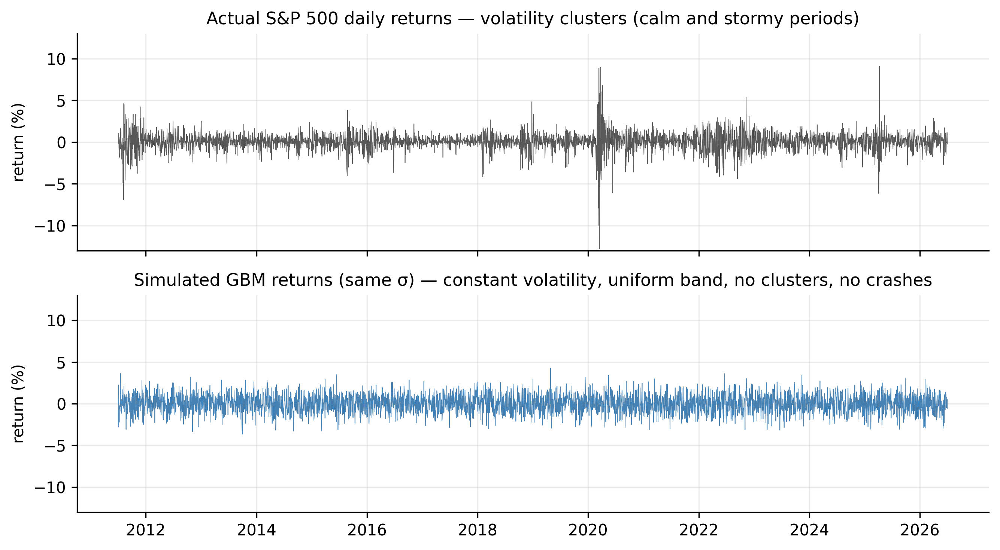
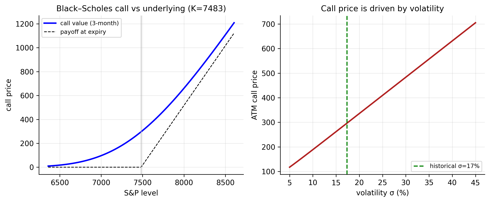

# Continuous-Time Models {#sec-continuous}

Every model so far has been **discrete**: one observation per trading day. But the
theory that underpins modern finance — above all **option pricing** — is written in
**continuous time**, where prices move over infinitesimal instants $dt$. This chapter
builds that framework: the stochastic processes (Brownian motion, Itô), the
**Geometric Brownian Motion (GBM)** model of prices, and the **Black–Scholes**
option-pricing formulas. Then it does what the rest of the book has trained us to do —
holds the elegant theory against our six tickers and the option chains of
@sec-options, and sees where it breaks.

The punchline is worth stating first. GBM rests on two assumptions — **volatility is
constant** and **log returns are normal** — and those are exactly the two our data
demolished: volatility *clusters* (Chapters 8–10) and returns are *fat-tailed*
(Chapter 2). So this chapter is both the theoretical foundation *and* a full-circle
account of why the empirical models were necessary.

## Some continuous-time stochastic processes {#sec-ct-processes}

### The Wiener process (Brownian motion) {#sec-ct-brownian}

The building block is the **Wiener process** (standard Brownian motion) $W_t$ — the
continuous-time limit of a random walk. Its defining property concerns the increment
over a tiny interval $dt$:

$$
dW_t \sim N(0,\, dt), \qquad W_T - W_0 \sim N(0,\, T).
$$ {#eq-wiener}

Two features matter: the variance of the increment is proportional to *time* (so the
standard deviation scales like $\sqrt{dt}$ — the "square-root-of-time" rule for
volatility), and increments over non-overlapping intervals are independent. A Wiener
process is continuous but nowhere smooth — it wanders like a price.

### Generalized Wiener process {#sec-ct-genwiener}

Pure Brownian motion has zero drift and unit variance rate. A **generalized Wiener
process** adds a constant drift $a$ and scales the noise by a constant $b$:

$$
dx_t = a\, dt + b\, dW_t .
$$ {#eq-genwiener}

Over an interval $T$, $x$ changes by $aT$ on average with standard deviation
$b\sqrt{T}$: a deterministic trend plus Brownian noise. This is the continuous-time
cousin of the random-walk-with-drift from @sec-unitroot.

### Itô process and Itô's lemma {#sec-ct-ito}

Allowing the drift and volatility to depend on the current state gives an **Itô
process**,

$$
dx_t = a(x_t,t)\, dt + b(x_t,t)\, dW_t .
$$ {#eq-itoprocess}

The tool for working with functions of such a process is **Itô's lemma** — the
continuous-time chain rule, with one extra term. For a smooth $G(x,t)$,

$$
dG = \Bigl(G_x\, a + G_t + \tfrac{1}{2} G_{xx}\, b^2\Bigr) dt + G_x\, b\, dW_t .
$$ {#eq-ito}

The extra $\tfrac{1}{2}G_{xx}b^2$ term — absent from ordinary calculus — is the
signature of Itô's lemma, and it produces the famous "$-\sigma^2/2$" correction below.

## Geometric Brownian Motion: the model of prices {#sec-ct-gbm}

::: {.definition}
**Geometric Brownian Motion (GBM)** is the standard continuous-time model of a price:
its *proportional* changes are Brownian, which makes the price lognormal and log
returns normal with constant volatility.
:::

The standard continuous-time model for a price $P_t$ is **Geometric Brownian Motion**:
the *proportional* change is a generalized Wiener process,

$$
\frac{dP_t}{P_t} = \mu\, dt + \sigma\, dW_t .
$$ {#eq-gbm}

Here $\mu$ is the expected annual **drift** and $\sigma$ the annual **volatility**.
Applying Itô's lemma with $G = \ln P$ gives the log price:

$$
d\ln P_t = \Bigl(\mu - \tfrac{1}{2}\sigma^2\Bigr) dt + \sigma\, dW_t,
$$ {#eq-logprice}

so the **log price is a random walk with drift** — the continuous-time form of the
$I(1)$ result of @sec-unitroot — and the log **return** over $T$ is normal:

$$
\ln\frac{P_T}{P_0} \sim N\!\Bigl((\mu - \tfrac{1}{2}\sigma^2)T,\;\; \sigma^2 T\Bigr).
$$ {#eq-lognormal}

Prices are therefore **lognormal**, and daily log returns are **independent, normal,
with constant volatility $\sigma$**. Estimating the two parameters is direct:
$\hat\sigma = s_{\text{daily}}\sqrt{252}$ and
$\hat\mu = \bar r_{\text{daily}}\cdot 252 + \tfrac12\hat\sigma^2$.

::: {.panel-tabset}

## R

```r
gbm_params <- function(sym) {
  d <- read.csv(sprintf("data/%s.csv", sym)); d$Date <- as.Date(d$Date)
  r <- diff(log(d$Adjusted[d$Date <= as.Date("2026-07-01")]))
  c(sigma = sd(r)*sqrt(252), mu = mean(r)*252 + 0.5*(sd(r)*sqrt(252))^2)
}
sapply(c("AAPL","MSFT","AMZN","SPX","GLD","GCF"), gbm_params)
```

## Python

```python
import pandas as pd, numpy as np
def gbm_params(sym):
    d = pd.read_csv(f"data/{sym}.csv", parse_dates=["Date"]).set_index("Date")
    r = np.log(d[d.index <= "2026-07-01"]["Adjusted"]).diff().dropna()
    sigma = r.std(ddof=1)*np.sqrt(252)
    return sigma, r.mean()*252 + 0.5*sigma**2
for s in ["AAPL","MSFT","AMZN","SPX","GLD","GCF"]: print(s, gbm_params(s))
```

:::

| Ticker | last price | volatility $\hat\sigma$ | drift $\hat\mu$ |
|:-------|:----------:|:-----------------------:|:---------------:|
| AAPL | 294.38 | 28.4% | 26.5% |
| MSFT | 384.28 | 26.2% | 23.2% |
| AMZN | 241.70 | 32.8% | 26.4% |
| SPX  | 7483.23 | 17.4% | 13.0% |
| GLD  | 370.60 | 16.8% | 7.7% |
| GCF  | 4068.30 | 17.3% | 8.6% |

: Geometric Brownian Motion parameters, estimated from each series {#tbl-gbm}

## Distributions of stock prices and log returns {#sec-ct-dist}

Exponentiating @eq-lognormal, the **price is lognormal** — right-skewed and bounded
below by zero (the model respects limited liability). Its first two moments are

$$
E[P_T] = P_0\, e^{\mu T}, \qquad
\operatorname{Var}(P_T) = P_0^2\, e^{2\mu T}\bigl(e^{\sigma^2 T} - 1\bigr),
$$ {#eq-price-moments}

while its **median** is $P_0\, e^{(\mu - \sigma^2/2)T}$. The mean sits above the median
— the signature of right skew — because a few large upward moves drag the average
above the typical outcome. For the S&P one year out (spot $7483$, $\hat\mu = 13\%$,
$\hat\sigma = 17.4\%$): the **mean** is $8523$, the **median** $8395$, and the **90%
range** $[6310,\ 11170]$ — a $\pm25\%$-ish band, the uncertainty dwarfing the drift.

## Where GBM meets our data — and breaks {#sec-ct-fails}

GBM claims **constant volatility** and **normality**. Both fail, and we have already
proved it.

**Constant volatility fails.** @fig-ct-gbmreal simulates GBM returns with the S&P's
$\sigma$ beside the real ones. The simulation is a featureless, uniform band; reality
*clusters* — calm stretches and violent ones, the 2020 crash towering over everything.
Capturing that is exactly what ARCH and GARCH did (the discrete-time version of
**stochastic volatility**).

{#fig-ct-gbmreal}

**Normality fails in the tails.** Under GBM a large daily move is essentially
impossible, yet every series has crash days that are enormous in $\sigma$ units:

| Ticker | worst day | size under GBM | GBM probability |
|:-------|:---------:|:--------------:|:---------------:|
| AAPL | −13.8% |  −7.7σ | ~1 in 100 trillion |
| MSFT | −15.9% |  −9.6σ | ~1 in $10^{21}$ |
| AMZN | −15.1% |  −7.3σ | ~1 in 4 trillion |
| SPX  | −12.8% | −11.7σ | ~1 in $10^{31}$ |
| GLD  | −10.8% | −10.2σ | ~1 in $10^{24}$ |
| GCF  | −12.1% | −11.1σ | ~1 in $10^{28}$ |

: Each series' worst day, measured against GBM {#tbl-ct-sigma}

The S&P's worst day is an $11.7\sigma$ event whose GBM probability has thirty zeros
after the decimal — it should never occur, yet it did. The continuous-time fix is a
**jump-diffusion** model (@sec-ct-jumps).

## The Black–Scholes differential equation {#sec-ct-pde}

The Black–Scholes formula is not assumed — it is **derived** from a no-arbitrage
argument. The idea: an option $f(S,t)$ can be perfectly hedged by holding
$\partial f/\partial S$ shares of the stock (**delta hedging**), and since the hedged
portfolio is riskless, it must earn the risk-free rate $r$. That single condition
yields the **Black–Scholes partial differential equation**:

$$
f_t + rS\, f_S + \tfrac{1}{2}\sigma^2 S^2 f_{SS} = r f .
$$ {#eq-bspde}

The striking feature is what is **absent**: the drift $\mu$. Because the hedge removes
all the risk, the fair price cannot depend on the stock's expected return — only on its
volatility. The full step-by-step derivation is given in the
[appendix](#sec-ct-appendix); the important consequence is developed next.

## Black–Scholes pricing formulas {#sec-ct-bs}

### A risk-neutral world {#sec-ct-riskneutral}

That $\mu$ vanishes from @eq-bspde is the gateway to the most powerful idea in
derivatives pricing: **risk-neutral valuation**. Since the price does not depend on the
real-world drift, we may compute it *as if* every asset drifted at the risk-free rate
$r$ — a fictitious "risk-neutral world." In that world an option is worth the
**discounted expected value of its payoff**:

$$
C = e^{-rT}\, E^{\mathbb{Q}}\!\bigl[\max(S_T - K,\ 0)\bigr],
$$ {#eq-riskneutral}

where the expectation $\mathbb{Q}$ uses drift $r$ in place of $\mu$. This is not a
claim that investors are risk-neutral; it is a computational device justified by the
hedging argument. Optimists and pessimists, who disagree about $\mu$, must still agree
on the option's price — because the hedge makes $\mu$ irrelevant. Evaluating
@eq-riskneutral under the lognormal law gives the formulas.

### The formulas {#sec-ct-formulas}

For a European **call** (right to buy at $K$ after time $T$):

$$
C = S\,N(d_1) - K e^{-rT} N(d_2),
$$ {#eq-bs}

$$
d_1 = \frac{\ln(S/K) + (r + \tfrac12\sigma^2)\,T}{\sigma\sqrt{T}}, \qquad
d_2 = d_1 - \sigma\sqrt{T},
$$ {#eq-bs-d}

with $N(\cdot)$ the standard normal CDF. The **put** follows from put–call parity,
$C - P = S - K e^{-rT}$:

$$
P = K e^{-rT} N(-d_2) - S\,N(-d_1).
$$ {#eq-bs-put}

Applied to the S&P (spot $S=7483$, ATM $K=7483$, $r=4\%$, $T=3$ months,
$\hat\sigma=17.4\%$): a call worth **297 index points ($4\%$ of spot)** and a put worth
**222**, with parity exact ($297-222 = 74.7 = S - Ke^{-rT}$). The only unobservable
input is $\sigma$ — so, as @sec-options stressed, **pricing an option is forecasting
volatility**, and everything in the GARCH chapters feeds directly into it. @fig-ct-bs
shows the call value sitting above its payoff (the gap is time value) and its near-linear
dependence on $\sigma$.

{#fig-ct-bs}

::: {.panel-tabset}

## R

```r
bs_call <- function(S, K, r, T, sigma) {
  d1 <- (log(S/K) + (r + 0.5*sigma^2)*T) / (sigma*sqrt(T)); d2 <- d1 - sigma*sqrt(T)
  S*pnorm(d1) - K*exp(-r*T)*pnorm(d2)
}
bs_call(7483, 7483, 0.04, 0.25, 0.174)                        # ~297
# implied volatility: invert the formula on a market price
uniroot(function(s) bs_call(7483,7483,0.04,0.25,s) - 320, c(1e-4, 2))$root
```

## Python

```python
from scipy.stats import norm
from scipy.optimize import brentq
def bs_call(S, K, r, T, sigma):
    d1 = (np.log(S/K) + (r + 0.5*sigma**2)*T)/(sigma*np.sqrt(T)); d2 = d1 - sigma*np.sqrt(T)
    return S*norm.cdf(d1) - K*np.exp(-r*T)*norm.cdf(d2)
print(bs_call(7483, 7483, 0.04, 0.25, 0.174))                 # ~297
print(brentq(lambda s: bs_call(7483,7483,0.04,0.25,s) - 320, 1e-4, 2))  # implied vol
```

:::

### Lower bounds of European options {#sec-ct-bounds}

Even without a model, no-arbitrage forces bounds on option prices. A European call can
never be worth more than the stock, nor less than the stock minus the discounted
strike:

$$
\max\!\bigl(S - K e^{-rT},\ 0\bigr) \;\le\; C \;\le\; S .
$$ {#eq-call-bound}

The lower bound is the intuitive one: if $C$ fell below $S - Ke^{-rT}$, you could buy
the call, short the stock, and lock in a riskless profit. The corresponding put bounds
are

$$
\max\!\bigl(K e^{-rT} - S,\ 0\bigr) \;\le\; P \;\le\; K e^{-rT} .
$$ {#eq-put-bound}

These hold for *any* pricing model, Black–Scholes included, and are a useful sanity
check: the S&P call of $297$ sits comfortably inside $[\,S-Ke^{-rT},\ S\,] =
[74.7,\ 7483]$. Because a European call is always worth *at least* its discounted
intrinsic value, it is never optimal to exercise a non-dividend-paying call early —
the reason American and European calls on such stocks have the same price.

### Discussion {#sec-ct-discussion}

Black–Scholes is a triumph, but its assumptions are the very ones our data rejects, and
knowing where it strains is part of using it well. It assumes **constant volatility**
(reality: clustering, @fig-ct-gbmreal), **normal returns with continuous paths**
(reality: fat tails and jumps, @tbl-ct-sigma), **no transaction costs**, and
**continuous hedging**. The market's own verdict is visible in **implied volatility**:
inverting @eq-bs on traded prices recovers the $\sigma$ that matches the market. If
Black–Scholes were true, implied volatility would be identical across strikes. It is
not — plotted against strike it forms the famous **volatility smile/skew**, with
out-of-the-money puts trading at higher implied vol. The smile is the options market
pricing in exactly the fat tails and time-varying volatility our data showed — the same
verdict, in dollars. The fixes are the continuous-time analogues of our discrete models:
**stochastic volatility** (Heston) for clustering and **jump-diffusion** for the tails.

## Jump-diffusion models {#sec-ct-jumps}

To let the model produce the crashes of @tbl-ct-sigma, Merton's **jump-diffusion** adds
a jump term to GBM:

$$
\frac{dP_t}{P_t} = \mu\, dt + \sigma\, dW_t + dJ_t,
$$ {#eq-jump}

where $J_t$ is a compound Poisson process — rare, sudden jumps arriving at intensity
$\lambda$ per year, with random sizes. Between jumps the price diffuses as GBM;
occasionally it leaps. This one addition gives the model **fat tails and discontinuous
paths**, matching the $-11.7\sigma$ days that pure GBM rules out, and it produces a
volatility smile.

### Option pricing under the jump-diffusion model {#sec-ct-jumpprice}

Merton showed that a European option under jump-diffusion has a strikingly simple price:
a **Poisson-weighted average of Black–Scholes prices**, one for each possible number of
jumps before expiry:

$$
C = \sum_{n=0}^{\infty} \frac{e^{-\lambda' T}(\lambda' T)^n}{n!}\; C_{\text{BS}}(\sigma_n, r_n),
$$ {#eq-merton}

where $C_{\text{BS}}(\sigma_n, r_n)$ is the ordinary Black–Scholes call price computed
with a variance and drift adjusted for having $n$ jumps, and $\lambda'$ is the
jump intensity adjusted for the average jump size. Intuitively, the option's value
averages over "no jump happens" (the dominant term, close to plain Black–Scholes),
"one jump happens," "two jumps," and so on, weighted by how likely each is. The extra
mass in the tails raises the price of out-of-the-money options — which is precisely the
volatility smile, now *produced by the model* rather than patched in.

## Estimating continuous-time models {#sec-ct-estimation}

We estimate GBM's two parameters from the same daily returns — but not equally well,
and the gap is one of the deepest facts in finance.

**Volatility is easy.** The estimator $\hat\sigma = s_{\text{daily}}\sqrt{252}$ has
standard error $\approx \hat\sigma/\sqrt{2n}$, which shrinks with the number of
observations. Sampling more frequently (intraday) sharpens it further — the idea behind
**realised volatility**.

**The drift is nearly impossible.** The estimator $\hat\mu$ has standard error
$\approx \hat\sigma/\sqrt{T}$, where $T$ is the **calendar span in years** — depending
only on total elapsed time, not on sampling frequency. Over our $\sim\!15$-year span:

| Ticker | $\hat\sigma$ | $\hat\sigma$ 95% CI | $\hat\mu$ | $\hat\mu$ 95% CI |
|:-------|:------------:|:-------------------:|:---------:|:----------------:|
| AAPL | 28.4% | [27.7, 29.0] | 26.5% | [11.8, 41.1] |
| MSFT | 26.2% | [25.6, 26.8] | 23.2% | [ 9.6, 36.8] |
| AMZN | 32.8% | [32.1, 33.6] | 26.4% | [ 9.4, 43.3] |
| SPX  | 17.4% | [17.0, 17.8] | 13.0% | [ 4.0, 22.0] |
| GLD  | 16.8% | [16.4, 17.2] |  7.7% | [**−1.0**, 16.4] |
| GCF  | 17.3% | [16.9, 17.7] |  8.6% | [**−0.3**, 17.6] |

: Estimation asymmetry — volatility precise, drift barely knowable {#tbl-ct-est}

Every **volatility** estimate is pinned to a fraction of a percent; every **drift**
estimate spans tens of points, and for **gold** the interval *includes zero* — with
fifteen years of data we cannot confirm gold has a positive drift. This is the rigorous
form of the theme running through the whole book: **volatility can be measured; the
mean cannot.**

## Concept check {#sec-ct-concept}

Decide first, then expand each answer.

**Q1. For a Wiener process, the variance of the change over an interval $T$ is:**

- **(a)** constant, independent of $T$.
- **(b)** proportional to $T$ (standard deviation grows like $\sqrt{T}$).
- **(c)** proportional to $T^2$.
- **(d)** zero.

::: {.callout-note collapse="true"}
## Show answer
**(b).** $W_T-W_0 \sim N(0,T)$ — the square-root-of-time rule.
:::

**Q2. Applying Itô's lemma to $\ln P$ under GBM gives a log-price drift of:**

- **(a)** $\mu$.  **(b)** $\mu - \tfrac12\sigma^2$.  **(c)** $\tfrac12\sigma^2$.  **(d)** $\sigma$.

::: {.callout-note collapse="true"}
## Show answer
**(b).** The extra Itô term produces the $-\tfrac12\sigma^2$ correction.
:::

**Q3. In the Black–Scholes PDE the drift $\mu$ disappears because:**

- **(a)** it is assumed zero.
- **(b)** the delta-hedged portfolio is riskless, so by no-arbitrage the price depends
  only on volatility — **risk-neutral pricing**.
- **(c)** it cannot be estimated.
- **(d)** the option has no time value.

::: {.callout-note collapse="true"}
## Show answer
**(b).** Hedging removes the risk; a riskless portfolio earns $r$, and $\mu$ drops out.
We may then price *as if* the drift were $r$ (@eq-riskneutral).
:::

**Q4. A European call must satisfy the lower bound:**

- **(a)** $C \ge S$.
- **(b)** $C \ge \max(S - Ke^{-rT},\ 0)$ — otherwise a riskless arbitrage exists.
- **(c)** $C \le K$.
- **(d)** $C = 0$ before expiry.

::: {.callout-note collapse="true"}
## Show answer
**(b).** Below this bound you could buy the call, short the stock, and lock in a
profit. It also implies a non-dividend call is never exercised early.
:::

**Q5. Volatility can be estimated precisely but the drift almost not at all because:**

- **(a)** volatility is observable, drift is not.
- **(b)** the drift's standard error $\sigma/\sqrt{T}$ depends only on the calendar span
  (more frequent sampling does not help), while volatility's $\sigma/\sqrt{2n}$ shrinks
  with the number of observations.
- **(c)** the drift is always zero.
- **(d)** they are estimated equally well.

::: {.callout-note collapse="true"}
## Show answer
**(b).** Sample more often to sharpen $\hat\sigma$; only a longer history sharpens
$\hat\mu$. Over 15 years gold's drift interval even includes zero (@tbl-ct-est).
:::

::: {.callout-tip}
## Key takeaways
- The **Wiener process** (@eq-wiener), **generalized Wiener process** (@eq-genwiener),
  and **Itô process** (@eq-itoprocess) are the building blocks; **Itô's lemma**
  (@eq-ito) is the chain rule with the extra $\tfrac12 G_{xx}b^2$ term.
- **Geometric Brownian Motion** (@eq-gbm) makes the log price a random walk with drift
  $\mu-\tfrac12\sigma^2$ and log returns **normal, constant-σ** (@eq-lognormal); the
  price is **lognormal** (@eq-price-moments). Estimated $\sigma$ is $17$–$33\%$
  (@tbl-gbm).
- GBM's two assumptions **both fail**: volatility clusters (@fig-ct-gbmreal) and returns
  are fat-tailed — worst days are $7$–$12\sigma$ events (@tbl-ct-sigma).
- **Black–Scholes** is derived by delta-hedging (Appendix), which makes $\mu$ vanish and
  licenses **risk-neutral pricing** (@eq-riskneutral). The formulas (@eq-bs, @eq-bs-put)
  obey put–call parity and no-arbitrage **bounds** (@eq-call-bound); the only
  unobservable input is **volatility**, and the **implied-volatility smile** is the
  market pricing in fat tails.
- **Jump-diffusion** (@eq-jump) adds crashes GBM cannot make; its option price is a
  **Poisson-weighted average of Black–Scholes prices** (@eq-merton).
- **Estimation is asymmetric** (@tbl-ct-est): $\hat\sigma$ is precise, $\hat\mu$ barely
  knowable — "volatility can be measured; the mean cannot."
:::

## Appendix: Derivation of the Black–Scholes equation {#sec-ct-appendix}

Let $f(S,t)$ be the value of an option on a stock $S$ that follows GBM (@eq-gbm). By
Itô's lemma (@eq-ito),

$$
df = \Bigl(f_t + \mu S f_S + \tfrac12 \sigma^2 S^2 f_{SS}\Bigr)dt + \sigma S f_S\, dW.
$$ {#eq-df}

Build a portfolio that is **short one option and long $f_S$ shares**,
$\Pi = -f + f_S\, S$, with change $d\Pi = -df + f_S\, dS$. Substituting @eq-df and
@eq-gbm, the random $dW$ terms **cancel exactly**:

$$
d\Pi = \Bigl(-f_t - \tfrac12 \sigma^2 S^2 f_{SS}\Bigr) dt .
$$ {#eq-dpi}

The portfolio is instantaneously **riskless** — the option's Brownian shock is offset
by holding $f_S$ shares (**delta hedging**). By no-arbitrage it must earn the risk-free
rate, $d\Pi = r\Pi\, dt = r(-f + f_S S)\,dt$. Equating the two expressions for $d\Pi$
and simplifying gives the Black–Scholes PDE (@eq-bspde),

$$
f_t + rS f_S + \tfrac12 \sigma^2 S^2 f_{SS} = r f .
$$

Solving it with the call payoff boundary condition $f(S,T) = \max(S-K,0)$ yields the
pricing formula @eq-bs.
