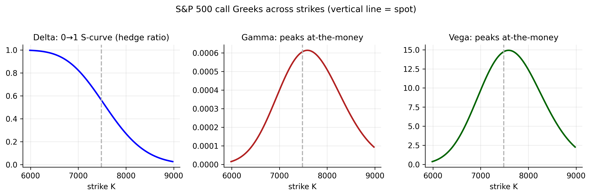

# Options: Contracts, Payoffs, and the Greeks {#sec-options}

Before we can *price* an option — the subject of the next chapter — we need to know
what an option is and how it behaves. This chapter is a self-contained primer. It
introduces the contract and its many variations, explains what an option is worth and
why, shows how to read an **option chain** (with realistic chains for three of our
tickers), and then works carefully through the **Greeks** — the sensitivities that
are the daily language of options risk management — one at a time.

::: {.callout-note appearance="simple"}
## A note on the option data
Live option prices come from the same data providers we could not reach when
downloading the stock histories, so the chains shown here are **computed with the
Black–Scholes model** (@sec-continuous) from each ticker's real spot price and its
estimated volatility. The `yfinance` code below pulls *real* market chains on your own
machine; drop those in and every number updates. The shapes and lessons are the same.
:::

## What is an option? {#sec-opt-what}

An **option** is a contract that gives its holder the **right, but not the
obligation**, to trade an underlying asset at a fixed **strike price** $K$ by a fixed
**expiry** $T$, in exchange for a price paid up front — the **premium**. There are two
kinds:

- A **call** gives the right to **buy** at $K$ (you want the price to *rise*).
- A **put** gives the right to **sell** at $K$ (you want the price to *fall*).

Every option has two sides. The **buyer** (holder, "long") pays the premium and owns
the right; the **seller** (writer, "short") receives the premium and takes on the
**obligation** to deliver if the holder exercises. Combining the two contract types
with the two sides gives the four basic positions — long call, long put, short call,
short put — from which every options strategy is built.

## Variations of options {#sec-opt-types}

Those four positions are the atoms. Real listed contracts then vary along several
further dimensions, two of which change how an option is priced and how it behaves:

| Dimension | Variants |
|:----------|:---------|
| Type | **call** (right to buy) vs **put** (right to sell) |
| Exercise style | **European** (exercise only *at* expiry) vs **American** (any time up to expiry) |
| Side | **long** (holder, paid premium) vs **short** (writer, received premium) |
| Moneyness | **in-the-money** (ITM), **at-the-money** (ATM), **out-of-the-money** (OTM) |
| Maturity | short-dated, or long-dated **LEAPS** (a year or more) |
| Payoff | **vanilla** (standard call/put) vs **exotic** (barrier, Asian, lookback, …) |

: The main ways options vary {#tbl-opt-types}

Two of these matter most here. **Exercise style**: American options can be exercised
early, which makes them (weakly) worth more and harder to price; European options can
only be exercised at expiry, and the Black–Scholes formula prices *European* options.
Most single-stock options are American, while many index options (including S&P 500
options) are European. **Moneyness** describes where the strike sits relative to the
spot $S$:

- A call is **ITM** if $S > K$ (exercising it has positive value now), **ATM** if
  $S \approx K$, and **OTM** if $S < K$. For a put the inequalities reverse.

Moneyness drives almost everything about how an option behaves, as the Greeks below
will show.

## Payoffs and profit at expiry {#sec-opt-payoff}

With the contract and its variations in hand, we can ask what an option is actually
*worth*. The cleanest place to start is the one moment when the answer is beyond
dispute — **expiry**, where all the time left to move has run out and only the outcome
remains.

At expiry the value of an option is unambiguous — its **payoff**. A call is worth
whatever the holder gains by buying at $K$ and selling at the market price $S_T$; a
put, the reverse:

$$
\text{call payoff} = \max(S_T - K,\ 0), \qquad
\text{put payoff} = \max(K - S_T,\ 0).
$$ {#eq-opt-payoff}

The holder's **profit** subtracts the premium paid; the writer's profit is the mirror
image (premium received, minus any payoff owed). @fig-opt-payoffs draws all four
positions.

{#fig-opt-payoffs}

The four positions have distinct risk profiles. A **long call** is a bullish bet with
loss capped at the premium and unbounded upside. A **long put** profits when the price
falls and is the classic way to **insure** a holding. A **short call** collects the
premium but faces unlimited loss if the price soars. A **short put** collects the
premium but is exposed to a large drop. These asymmetries are exactly what the Greeks
quantify.

## What an option is worth before expiry {#sec-opt-value}

Before expiry an option's price splits into two parts:

$$
\text{option price} \;=\; \underbrace{\text{intrinsic value}}_{\text{payoff if exercised now}}
\;+\; \underbrace{\text{time value}}_{\text{extra, for the chance of doing better}}.
$$ {#eq-opt-value}

The **intrinsic value** is what the option is worth exercised immediately —
$\max(S-K,0)$ for a call. The **time value** is the premium on top, reflecting the
chance the option finishes *deeper* in the money before expiry; it is largest for ATM
options and decays to zero as expiry approaches. Six inputs set the total: the spot
$S$, strike $K$, time $T$, interest rate $r$, dividends, and — the crucial one —
the **volatility $\sigma$**. Higher volatility raises *both* calls and puts, because a
wider range of outcomes makes the valuable tail more likely without hurting the
capped side. That single fact is why the entire volatility-modelling half of this book
feeds straight into option pricing.

## Reading an option chain {#sec-opt-chain}

Those six inputs fix the price of a *single* option. In practice a trader watches
dozens at once — every strike for a given expiry, laid out side by side — and reads the
patterns straight off the screen. That table is the **option chain**.

An **option chain** lists, for one expiry, every strike alongside its call and put
prices (bid, ask, last), trading volume, open interest, and implied volatility.
Downloading a real one is a few lines:

::: {.panel-tabset}

## R

```r
# install.packages("quantmod")  # getOptionChain pulls a live chain
library(quantmod)
chain <- getOptionChain("AAPL", Exp = "2026-09-18")   # nearest listed expiry
head(chain$calls); head(chain$puts)                   # strike, bid, ask, IV, OI...
```

## Python

```python
import yfinance as yf
tk = yf.Ticker("AAPL")
exp   = tk.options[3]                 # pick an expiry date
chain = tk.option_chain(exp)
print(chain.calls[["strike","bid","ask","lastPrice","impliedVolatility","openInterest"]].head())
```

:::

Our model-built chain for the **S&P 500** (spot $7483$, $\sigma = 17.4\%$, 3-month,
$r = 4\%$) looks like this — and Apple and gold chains have the same shape:

| Strike | Moneyness | Call | Put | Δ (call) | Γ (per pt) | Vega (per 1% σ) | Θ (pts/day) |
|:------:|:---------:|:----:|:---:|:--------:|:----------:|:---------------:|:-----------:|
| 6735 | ITM | 841.5 |  26.2 | 0.92 | 0.00024 |  5.8 | −1.21 |
| 7109 | ITM | 534.0 |  89.0 | 0.77 | 0.00046 | 11.3 | −1.65 |
| **7483** | **ATM** | **296.8** | **222.1** | **0.56** | **0.00061** | **14.7** | **−1.83** |
| 7857 | OTM | 142.2 | 437.8 | 0.34 | 0.00057 | 13.8 | −1.58 |
| 8232 | OTM |  58.2 | 725.1 | 0.17 | 0.00040 |  9.6 | −1.05 |

: Illustrative S&P 500 option chain — Black–Scholes, 3-month. Call, put, vega and theta are in **index points**. {#tbl-opt-chain}

Read down @tbl-opt-chain and the structure is clear. Deep **ITM calls** ($K=6735$)
are worth almost their intrinsic value ($748$) plus a little — they behave nearly like
the stock (delta $0.92$). **OTM calls** ($K=8232$) are cheap lottery tickets (delta
$0.17$). The **ATM** option in the middle carries the *most time value* and the largest
Greeks — which brings us to the Greeks themselves.

## The Greeks, line by line {#sec-opt-greeks}

::: {.definition}
The **Greeks** are an option's sensitivities — how its price moves with the underlying
(delta), with volatility (vega), with time (theta), and so on. Managing an options
book *is* managing the Greeks.
:::

The **Greeks** measure how an option's price responds to a change in each input.
Running an options book *is* managing the Greeks — you hedge each sensitivity you do
not want. @fig-opt-greeks shows the three most important against the strike; we take
them one at a time, with the S&P ATM call for concrete numbers.

{#fig-opt-greeks}

### Delta (Δ) — sensitivity to the underlying {#sec-opt-delta}

$$
\Delta = \frac{\partial(\text{price})}{\partial S}, \qquad
\Delta_{\text{call}} = N(d_1) \in [0,1], \qquad \Delta_{\text{put}} = \Delta_{\text{call}} - 1 .
$$ {#eq-greek-delta}

**Delta is the hedge ratio**: it is how many shares move the option's value one-for-one
with the stock. The S&P ATM call has $\Delta = 0.56$, so a trader who *sells* that call
hedges it by *buying* $0.56$ shares of the index per option — this is **delta
hedging**, and it is exactly the portfolio that derives the Black–Scholes equation
(@sec-ct-pde). Delta also doubles as a rough **probability of finishing in-the-money**:
deep-ITM calls have $\Delta \to 1$ (they *are* the stock), deep-OTM calls $\Delta \to
0$. **Why it matters:** delta is a position's directional exposure; a "delta-neutral"
book has no first-order bet on where the market goes.

### Gamma (Γ) — how fast delta changes {#sec-opt-gamma}

$$
\Gamma = \frac{\partial \Delta}{\partial S} = \frac{\partial^2(\text{price})}{\partial S^2}
       = \frac{\phi(d_1)}{S\,\sigma\sqrt{T}} .
$$ {#eq-greek-gamma}

Gamma is the **curvature** — the rate at which delta itself moves as the underlying
moves. It **peaks at-the-money** and near expiry (the S&P ATM call's $\Gamma =
0.00061$, largest in @tbl-opt-chain). **Why it matters:** a high-gamma position needs
constant **re-hedging** — every move changes the delta, forcing the hedger to trade —
and near expiry an ATM option's delta can swing violently, making gamma the source of
the trickiest risk in an options book. Long-gamma positions profit from big moves;
short-gamma positions (option sellers) are hurt by them.

### Vega (ν) — sensitivity to volatility {#sec-opt-vega}

$$
\nu = \frac{\partial(\text{price})}{\partial \sigma} = S\,\phi(d_1)\sqrt{T} .
$$ {#eq-greek-vega}

Vega measures exposure to **volatility itself** — how much the price moves when $\sigma$
changes by one point. Like gamma it **peaks at-the-money** (the S&P ATM call gains
$\approx 14.7$ index points per $1\%$ of volatility). **Why it matters — and this is
the bridge to the whole book:** an option is, at its core, a *bet on volatility*, and
vega is that exposure. Because $\sigma$ is the one unobservable input to an option's
price, **forecasting volatility is managing vega** — every ARCH/GARCH/$t$-GARCH model
we built is, in the options world, a tool for pricing and hedging vega.

### Theta (Θ) — time decay {#sec-opt-theta}

$$
\Theta = \frac{\partial(\text{price})}{\partial t} \;<\; 0 \quad(\text{for a long option}).
$$ {#eq-greek-theta}

Theta is the **bleed of time value**: with each passing day, an option has less chance
left to move in your favour, so a long option *loses* value even if nothing else
changes (the S&P ATM call loses $\approx 1.8$ points per day). **Why it matters:**
theta is the *rent* you pay to hold optionality. Option **buyers pay theta** (time
works against them); option **sellers earn it** (time is on their side). The
theta–vega trade-off — you cannot collect time decay without being short volatility —
is the central tension of most option strategies.

### Rho (ρ) — sensitivity to interest rates {#sec-opt-rho}

$$
\rho = \frac{\partial(\text{price})}{\partial r} .
$$ {#eq-greek-rho}

Rho measures sensitivity to the risk-free rate (the S&P ATM call gains $\approx 9.8$
points per $1\%$ rise in rates; the put *loses* about the same). **Why it matters:**
rho is usually the smallest Greek for short-dated options and often ignored, but it
grows with maturity and matters for **long-dated** options (LEAPS) and in
rate-sensitive markets.

| Greek | Sensitivity to | S&P ATM call | What it means, and why you hedge it |
|:------|:--------------|:-----------:|:------------------------------------|
| **Delta** ($\Delta$) | the underlying price $S$ | $0.56$ | the call moves about \$0.56 per \$1 the index moves — the **hedge ratio** and your directional exposure |
| **Gamma** ($\Gamma$) | delta itself | $0.0006$ per point | how fast delta shifts ($\approx 0.05$ per $1\%$ index move); high gamma means costly **re-hedging**, and it is largest at-the-money |
| **Vega** ($\nu$) | volatility $\sigma$ | $14.7$ per vol-point | a $+1\%$ rise in volatility adds $\approx 15$ index points — the **volatility bet**, and the bridge to the GARCH models |
| **Theta** ($\Theta$) | the passage of time | $-1.8$ per day | the option **bleeds** value each day; buyers pay it, sellers earn it |
| **Rho** ($\rho$) | the interest rate $r$ | $9.8$ per rate-point | a $+1\%$ rise in rates adds $\approx 10$ points; matters mainly for **long-dated** options |

: The five Greeks at a glance (values for the 3-month at-the-money S&P call) {#tbl-greeks}

## Put–call parity {#sec-opt-parity}

The Greeks describe how a single option responds to the world. One last relation
describes how calls and puts respond to *each other* — and it needs no pricing model at
all, only the absence of arbitrage.

Calls and puts are tied together by a no-arbitrage relation, **put–call parity**:

$$
C - P = S - K e^{-rT}.
$$ {#eq-opt-parity}

A call minus a put (same strike and expiry) must equal the stock minus the
discounted strike — otherwise a riskless profit exists. For our S&P options it holds
exactly: $296.8 - 222.1 = 74.7 = 7483 - 7483\,e^{-0.04\times0.25}$. Parity means that
once you can price a call, the put comes for free, and it underlies much of how the two
markets stay consistent.

## Concept check {#sec-opt-concept}

Decide first, then expand each answer.

**Q1. The holder of a *call* option has:**

- **(a)** the obligation to buy the underlying at $K$.
- **(b)** the **right, not the obligation**, to buy the underlying at $K$.
- **(c)** the right to sell at $K$.
- **(d)** no position until expiry.

::: {.callout-note collapse="true"}
## Show answer
**(b).** A call is the *right* to buy at the strike; the buyer exercises only if it
pays ($S_T > K$). The *seller* carries the obligation.
:::

**Q2. An option's **delta** of 0.56 means:**

- **(a)** the option costs $0.56.
- **(b)** the price moves about $0.56 per \$1 move in the underlying, and you hedge
  with 0.56 shares per option.
- **(c)** it expires in 0.56 years.
- **(d)** its volatility is 56%.

::: {.callout-note collapse="true"}
## Show answer
**(b).** Delta is the hedge ratio and the price's sensitivity to the underlying (also a
rough probability of finishing in-the-money).
:::

**Q3. Which Greek is the direct link between option trading and the GARCH models of
this book?**

- **(a)** Rho — interest-rate sensitivity.
- **(b)** Theta — time decay.
- **(c)** **Vega** — sensitivity to volatility; since $\sigma$ is the one unknown input,
  forecasting it *is* managing vega.
- **(d)** Delta — directional exposure.

::: {.callout-note collapse="true"}
## Show answer
**(c).** An option is a bet on volatility; vega is that exposure, and $\sigma$ is what
the volatility models forecast.
:::

**Q4. A long option position has **negative theta**. This means:**

- **(a)** it gains value as time passes.
- **(b)** it *loses* value with each passing day, all else equal — the "rent" on
  holding optionality, which the option seller earns.
- **(c)** it has no time value.
- **(d)** its delta is negative.

::: {.callout-note collapse="true"}
## Show answer
**(b).** Time decay works against buyers and for sellers; theta is most negative for
at-the-money options near expiry.
:::

::: {.callout-tip}
## Key takeaways
- An **option** is the right (not obligation) to buy (**call**) or sell (**put**) at a
  strike $K$ by expiry $T$, for a premium; the four building blocks are long/short
  call/put (@fig-opt-payoffs).
- Options vary by **type, exercise style (European/American), moneyness, maturity, and
  payoff** (@tbl-opt-types); Black–Scholes prices *European* options.
- Price $=$ **intrinsic $+$ time value** (@eq-opt-value); of the six inputs, **volatility**
  is the crucial (and only unobservable) one — higher $\sigma$ raises calls *and* puts.
- The **Greeks** are the sensitivities you hedge: **delta** (underlying), **gamma**
  (curvature), **vega** (volatility), **theta** (time), **rho** (rates) — summarised in
  @tbl-greeks. **Vega is the bridge to the volatility models.**
- **Put–call parity** (@eq-opt-parity) ties calls and puts together by no-arbitrage.
:::
