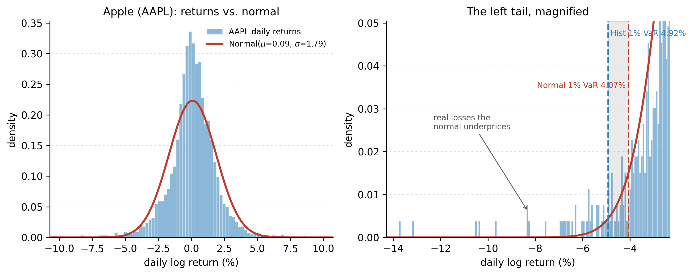
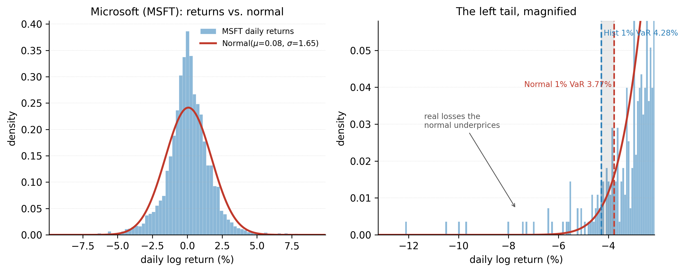
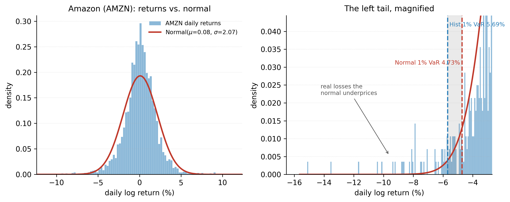
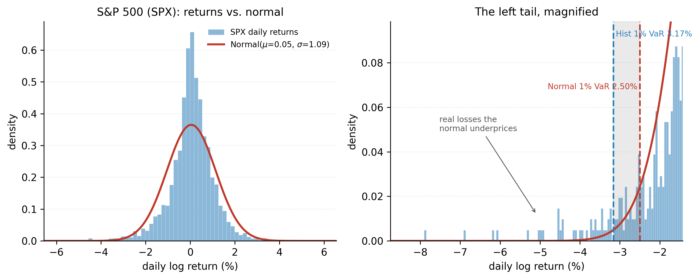
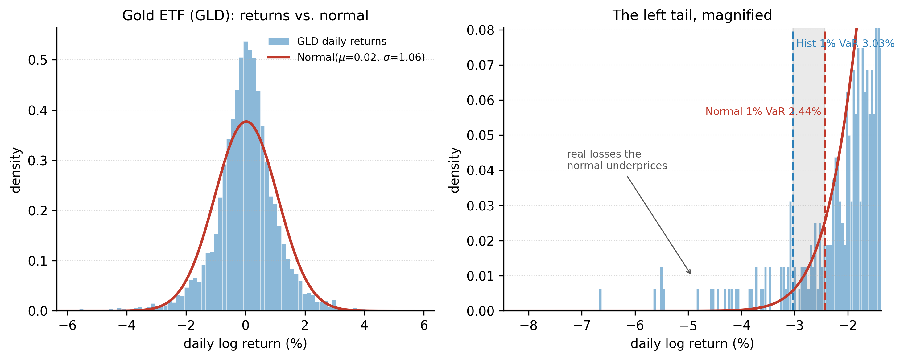
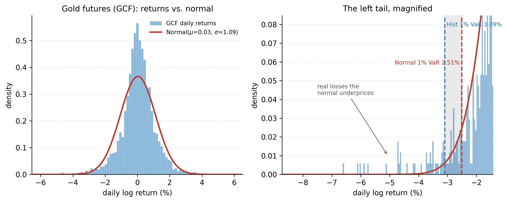
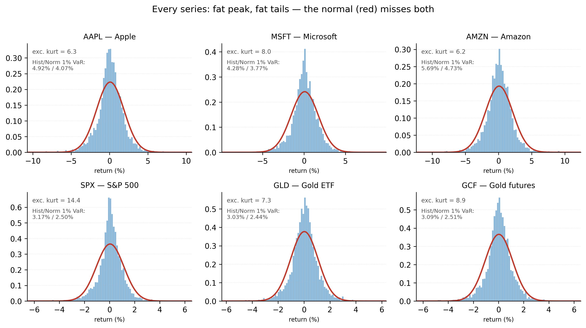
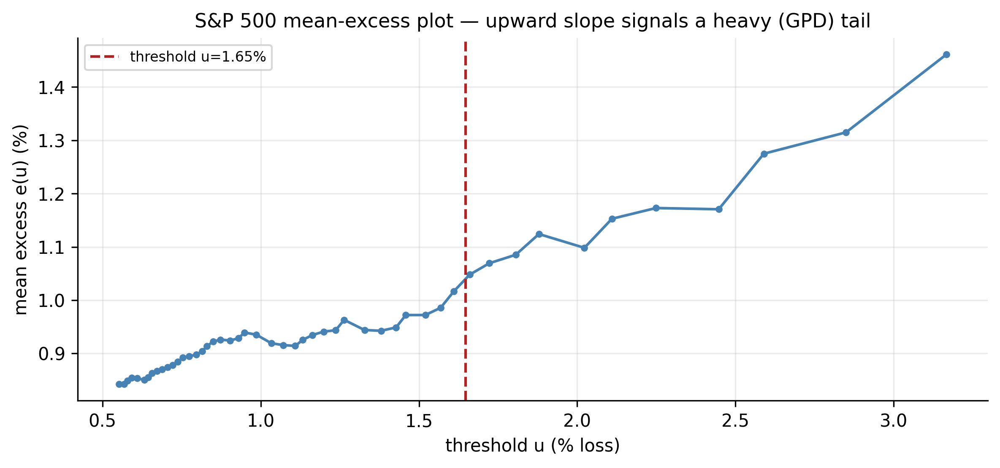
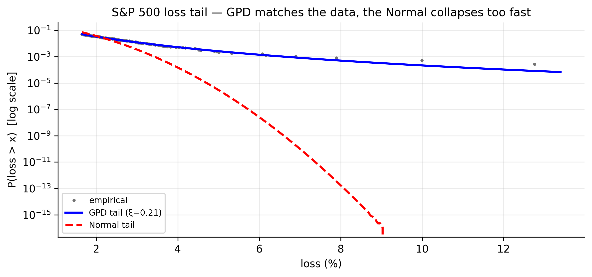

# Extreme Values, Quantiles, and Value at Risk {#sec-evt}

The whole book has repeated one fact: financial returns are **fat-tailed**. This
chapter is where that fact is finally turned into a **risk number**. We define
**Value at Risk (VaR)**, compute it four ways — RiskMetrics, an econometric
(GARCH) approach, empirical quantiles, and **Extreme Value Theory (EVT)** — and see,
starkly, how badly the Normal-based numbers understate the danger in the deep tail.
The chapter's own tail-fit figure (@fig-evt-tailfit) tells the story in advance: the
Normal curve plunges *ten orders of magnitude* below where the S&P's real losses
actually sit.

## What is Value at Risk? {#sec-evt-var}

::: {.definition}
**Value at Risk (VaR)** at level $p$ over a horizon $h$ is the loss that will be
exceeded with probability $p$. A 1-day 99% VaR of \$1m means: on 99 days out of 100
the loss stays under \$1m; on the 100th it may be worse.
:::

Formally, if $L$ is the loss over the horizon, $\text{VaR}_p$ is the number with
$P(L > \text{VaR}_p) = p$ — the upper $p$-quantile of the loss distribution. Three
ingredients are needed: the **horizon** (1 day, 10 days), the **confidence** ($p =
1\%$ or $5\%$), and an estimate of the **loss distribution**. The methods of this
chapter differ only in that last ingredient.

The simplest estimate is **historical** — the empirical quantile of past losses —
and comparing it to the **Normal** estimate already exposes the problem:

| Ticker | Hist VaR 5% | Normal 5% | Hist VaR 1% | Normal 1% | Hist ES 1% | Normal ES 1% |
|:-------|:-----------:|:---------:|:-----------:|:---------:|:----------:|:------------:|
| AAPL | 2.71% | 2.85% | **4.92%** | 4.07% | **6.80%** | 4.68% |
| MSFT | 2.54% | 2.64% | **4.28%** | 3.77% | **6.19%** | 4.33% |
| AMZN | 3.11% | 3.32% | **5.69%** | 4.73% | **7.82%** | 5.43% |
| SPX  | 1.65% | 1.75% | **3.17%** | 2.50% | **4.63%** | 2.87% |
| GLD  | 1.67% | 1.72% | **3.03%** | 2.44% | **4.26%** | 2.80% |
| GCF  | 1.69% | 1.76% | **3.10%** | 2.51% | **4.49%** | 2.88% |

: 1-day VaR and Expected Shortfall, historical vs Normal (as % loss) {#tbl-evt-var}

At the $5\%$ level the two agree; the Normal is even a touch *higher*. But at the
$1\%$ level the historical VaR pulls decisively ahead — the S&P's real 1% loss is
$3.17\%$ against the Normal's $2.50\%$ — and the **Expected Shortfall** (defined
below) diverges far more. The deeper into the tail we look, the worse the Normal
does. VaR itself has a known flaw, which motivates that Expected Shortfall column:
it says nothing about *how bad* losses beyond it can be.

The mismatch is easiest to *see*. @fig-evt-histnorm plots the S&P's daily returns
against a normal with the *same* mean and standard deviation: identical spread, but the
wrong **shape** — a taller, thinner peak and far too little mass in the tail. The right
panel magnifies the left tail, where the normal's $1\%$ VaR ($2.50\%$) sits *inside* the
true $1\%$ loss ($3.17\%$): the real loss days beyond it are exactly the ones the bell
curve treats as all but impossible.

{#fig-evt-histnorm width=95%}

The same diagnostic for **every series** tells the same story — each is fat-tailed, and
its historical $1\%$ VaR sits outside the normal's. Flip through the tabs:

::: {.panel-tabset}

## AAPL



## MSFT



## AMZN



## SPX



## GLD



## GCF



:::

Across all six, the gap between the historical and normal 1% VaR is the same lesson in
six different magnitudes: @fig-evt-histnormgrid lines them up side by side.

{#fig-evt-histnormgrid width=100%}

::: {.panel-tabset}

## R

```r
r <- diff(log(read.csv("data/SPX.csv")$Adjusted))
hist_var <- -quantile(r, c(0.05, 0.01))                 # historical VaR
norm_var <- -(mean(r) + qnorm(c(0.05, 0.01)) * sd(r))   # Normal VaR
es_1     <- -mean(r[r <= quantile(r, 0.01)])            # historical Expected Shortfall
```

## Python

```python
import pandas as pd, numpy as np
from scipy.stats import norm
r = np.log(pd.read_csv("data/SPX.csv")["Adjusted"]).diff().dropna()
hist_var = -r.quantile([0.05, 0.01])                    # historical VaR
norm_var = -(r.mean() + norm.ppf([0.05, 0.01]) * r.std())   # Normal VaR
es_1     = -r[r <= r.quantile(0.01)].mean()             # historical Expected Shortfall
```

:::

### A map of the four methods {#sec-evt-roadmap}

Historical and Normal are the two crudest estimates, and beyond thin tails they
share a deeper limitation: both are **static**. Each collapses the entire sample into
a single unconditional number and so ignores the fact this book keeps returning to —
volatility clusters, so the risk that matters is *today's*, not the fifteen-year
average. The rest of the chapter estimates the loss distribution more carefully, and
it is easiest to read as a chain in which each method repairs a specific flaw in the
one before it:

- **RiskMetrics** makes the volatility time-varying, so the number breathes with the
  market — but it keeps the normal assumption.
- The **econometric (GARCH)** approach fixes RiskMetrics' two remaining faults: its
  forced unit persistence and its thin tail.
- **Quantile methods** stop modelling volatility altogether and target the single
  object every method is really after — a quantile of the loss distribution.
- **Extreme Value Theory** models the *shape* of the tail itself, the one region where
  every data-based method eventually runs out of observations.

We take them in that order, and each section states what it fixes and what it still
leaves open.

## RiskMetrics {#sec-evt-rm}

### What is RiskMetrics? {#sec-evt-rm-what}

The smallest possible improvement over the static picture is to stop treating
volatility as a constant. RiskMetrics does exactly that, and little more.

::: {.definition}
**RiskMetrics** (J.P. Morgan, 1990s) is a simple, industry-standard VaR method: model
volatility with an **exponentially weighted moving average (EWMA)** and assume
conditionally normal returns.
:::

The volatility recursion is

$$
\sigma_t^2 = \lambda\, \sigma_{t-1}^2 + (1-\lambda)\, a_{t-1}^2,
\qquad \lambda = 0.94 \text{ (daily)},
$$ {#eq-ewma}

which is exactly a GARCH(1,1) with $\alpha_0 = 0$, $\alpha_1 = 1-\lambda$, $\beta_1 =
\lambda$ — an **IGARCH** with persistence $\alpha_1+\beta_1 = 1$ (@sec-continuous
touched on integrated variance). Today's variance is a decaying weighted average of
all past squared returns, most weight on the recent ones. The VaR is then just a
Normal quantile of today's volatility, $\text{VaR}_p = -z_p\,\sigma_t$ (the drift is
ignored over short horizons). For our tickers the current one-day $99\%$ figure is:

| Ticker | EWMA $\sigma_T$ | RiskMetrics 99% VaR |
|:-------|:---------------:|:-------------------:|
| AAPL | 2.11% | 4.92% |
| MSFT | 2.52% | 5.87% |
| AMZN | 2.27% | 5.27% |
| SPX  | 0.95% | 2.20% |
| GLD  | 1.73% | 4.02% |
| GCF  | 1.76% | 4.08% |

: RiskMetrics (EWMA, λ = 0.94) one-day 99% VaR {#tbl-evt-rm}

RiskMetrics is simple and **adapts to current conditions** — the S&P's low $\sigma_T$
gives a tight $2.2\%$ VaR because July 2026 was calm. Its two weaknesses are the two
this book keeps returning to: it forces persistence to exactly $1$, and it assumes
**normality**, so it inherits the thin-tail error of @tbl-evt-var.

### Multiple positions {#sec-evt-rm-multi}

For a portfolio the volatility comes from the **covariance matrix** $\Sigma$ of the
positions: with weights $w$, the portfolio variance is $\sigma_p^2 = w^\top \Sigma\,
w$ and $\text{VaR}_p = -z_p\,\sigma_p$. Because correlations are below one,
**diversification lowers VaR**: the portfolio's risk is less than the sum of its
parts. A 50/50 S&P–gold book illustrates it — the two are almost **uncorrelated**
(correlation $0.06$), so the combined $99\%$ VaR is **$1.79\%$**, well below the
$2.47\%$ you would get by adding the two positions' VaRs. The $0.68$-point gap is the
diversification benefit, and it is why gold earns its place beside equities.

### Expected Shortfall {#sec-evt-rm-es}

::: {.definition}
**Expected Shortfall (ES)**, or conditional VaR, is the *average* loss in the worst
$p\%$ of cases: $\text{ES}_p = E[L \mid L > \text{VaR}_p]$. It answers "if we breach
the VaR, how bad is it on average?"
:::

ES fixes VaR's blind spot — it accounts for the *size* of tail losses, not just their
frequency — and unlike VaR it is **coherent** (a diversified book never has higher ES
than the sum of parts). Under conditional normality it has a clean form,

$$
\text{ES}_p = -\mu + \sigma\,\frac{\phi(z_p)}{p},
$$ {#eq-es-normal}

with $\phi$ the normal density and $z_p = \Phi^{-1}(p)$. The last two columns of
@tbl-evt-var show the catch: because ES lives *further* out in the tail than VaR, the
Normal underestimates it even more — the S&P's historical 1% ES is $4.63\%$ versus the
Normal's $2.87\%$, a $60\%$ shortfall. Regulators have moved from VaR toward ES for
exactly this reason.

## An econometric approach to VaR {#sec-evt-econ}

The RiskMetrics volatility is a fixed-$\lambda$ special case; the **econometric
approach** replaces it with a properly estimated volatility model and a properly
chosen innovation distribution — precisely the GARCH machinery of Chapters 8–10. The
one-day VaR becomes

$$
\text{VaR}_{t}(p) = -\bigl(\mu + q_p\,\sigma_t\bigr),
$$ {#eq-econ-var}

where $\sigma_t$ is the GARCH conditional volatility and $q_p$ the $p$-quantile of the
innovation — the **Normal** quantile, or (better, from @sec-garch-est) the fatter
**Student-$t$** quantile. We already saw the payoff: Normal-innovation VaR was
breached far too often; $t$-innovations restored honest coverage.

### Multiple periods {#sec-evt-econ-multi}

For an $h$-day horizon, if returns are iid the variance adds, so volatility — and VaR
— scale with $\sqrt{h}$ (the **square-root-of-time rule**), with the drift scaling
linearly:

$$
\text{VaR}_p(h) \approx \sqrt{h}\;\sigma\,(-q_p) - h\mu .
$$ {#eq-multiperiod-var}

The S&P's 10-day 99% VaR is thus roughly $\sqrt{10} \approx 3.2$ times the one-day
figure. Under GARCH the rule is only approximate: the $h$-step variance forecast
**mean-reverts** (@sec-garch-forecast), so from an elevated start the true multiperiod
VaR grows *slower* than $\sqrt{h}$, and from a calm start, faster.

### Expected shortfall under conditional normality {#sec-evt-econ-es}

Combining the ES formula @eq-es-normal with a GARCH volatility gives a **conditional**
Expected Shortfall that breathes with the market: $\text{ES}_t(p) = -\mu +
\sigma_t\,\phi(z_p)/p$. On a calm day the shortfall is small; after a shock it widens
— the same adaptivity as the conditional VaR, now measuring the *severity* of tail
events rather than their threshold.

## Quantile estimation {#sec-evt-quantile}

The three methods so far are increasingly elaborate *parametric* machines:
RiskMetrics bolts a normal onto an EWMA variance, and the econometric approach layers
a GARCH and a Student-$t$ on top. Before adding still more structure it is worth
stepping back to the single idea sitting underneath all of them. Whatever the model, a
VaR number is nothing but a **quantile** of the loss distribution — so the most basic
question is how to estimate a quantile *directly*, with as few assumptions as
possible. That question has two answers, one unconditional and one conditional, and
between them they bracket everything else in the chapter.

### Quantiles and order statistics {#sec-evt-orderstat}

::: {.definition}
The **$p$-quantile** of a distribution is the value below which a fraction $p$ of the
outcomes fall. VaR *is* a quantile of the loss distribution, so estimating VaR is
estimating a quantile.
:::

The model-free estimate uses **order statistics**: sort the returns $r_{(1)} \le
r_{(2)} \le \cdots \le r_{(n)}$; the empirical $p$-quantile is about $r_{(\lceil np
\rceil)}$. Historical VaR (the left column of @tbl-evt-var) is exactly this — no
distributional assumption, which is its strength. Its weakness is the **tail**: the
$1\%$ quantile of $3{,}770$ days rests on only $\sim\!38$ observations, and the
$0.1\%$ quantile on fewer than four, so historical VaR is noisy exactly where it
matters most and *cannot* speak to losses larger than the worst one observed. That
limitation is the entire motivation for Extreme Value Theory below.

### Quantile regression {#sec-evt-qreg}

::: {.definition}
**Quantile regression** models a conditional *quantile* of the response as a function
of covariates — where ordinary regression models the conditional *mean*.
:::

Instead of minimising squared errors, quantile regression (Koenker–Bassett) minimises
the asymmetric **check-function** loss

$$
\min_{\beta}\ \sum_t \rho_\tau\!\bigl(r_t - x_t^\top\beta\bigr),
\qquad \rho_\tau(u) = u\,\bigl(\tau - \mathbf{1}\{u<0\}\bigr),
$$ {#eq-qreg}

which penalises under- and over-prediction unequally so that the fitted line is the
conditional $\tau$-quantile. For risk this is direct: set $\tau = 0.01$ and regress
the return quantile on covariates such as lagged volatility or a volatility index, and
you have a VaR that moves with the state of the market *without* assuming a
distribution. It is a semiparametric middle ground between the fully parametric GARCH
VaR and the fully empirical historical VaR.

## Extreme value theory {#sec-evt-theory}

Order statistics gave us historical VaR, but with a warning attached: the empirical
quantile is built from data, and in the far tail the data simply run out. Quantile
regression added covariates but still needs observations wherever we choose to look.
Both fall silent exactly where the largest losses live — beyond the worst day yet
seen. Extreme Value Theory is the branch of statistics built for that region: instead
of counting tail observations it never has, it models the tail's *shape* and
extrapolates it outward.

### A review of extreme value theory {#sec-evt-review}

::: {.definition}
**Extreme Value Theory (EVT)** describes the distribution of the *most extreme*
observations, giving a principled way to model — and extrapolate into — the far tail
where ordinary data run out.
:::

The classical result concerns **block maxima**. Take the maximum of each block of $n$
iid observations; the **Fisher–Tippett–Gnedenko** theorem says that, suitably
rescaled, this maximum can only converge to the **Generalized Extreme Value (GEV)**
distribution,

$$
G(x) = \exp\!\Bigl[-\bigl(1 + \xi\,\tfrac{x-\mu}{\sigma}\bigr)^{-1/\xi}\Bigr],
$$ {#eq-gev}

whose **shape parameter $\xi$** sorts all tails into three families: **Gumbel**
($\xi = 0$, thin tails like the normal), **Fréchet** ($\xi > 0$, heavy power-law
tails), and **Weibull** ($\xi < 0$, bounded). The single number $\xi$ decides how
fat the tail is.

### Empirical estimation {#sec-evt-empirical}

To fit the GEV, split the losses into blocks (say, monthly), take each block's maximum
loss, and estimate $(\mu, \sigma, \xi)$ from those maxima by maximum likelihood. The
sign and size of $\hat\xi$ then classify the tail.

### Application to stock returns {#sec-evt-application}

For financial losses the answer is always the same: **$\hat\xi > 0$, the Fréchet
case** — heavy, power-law tails, exactly the fat tails of Chapter 2 seen through the
lens of extremes. We quantify $\hat\xi$ precisely with the more efficient
peaks-over-threshold method in @sec-evt-pot; every one of our six series comes out
Fréchet.

## An extreme-value approach to VaR {#sec-evt-var-block}

This section sets out *what* EVT buys a risk manager — safe extrapolation, a clean
multiperiod scaling law, and return levels — while stating the results in terms of a
fitted tail. The tail itself is estimated in the next section, @sec-evt-pot, using the
more efficient peaks-over-threshold method, and the numbers quoted here are read back
from that fit. Concept first; estimation next.

### Discussion {#sec-evt-var-disc}

The point of EVT for risk is **extrapolation**. Historical VaR cannot exceed the worst
observed loss; the Normal has the wrong tail shape; but a fitted extreme-value tail can
give a sensible VaR at $0.1\%$ or $0.01\%$ — probabilities so small that few or no
observations reach them. EVT models the *shape* of the tail from the moderately-extreme
data and projects it outward.

### Multiperiod VaR {#sec-evt-multi}

Extremes aggregate through their own scaling law: for heavy ($\xi>0$) tails the
$h$-period VaR grows roughly like $h^{\xi}$ times the one-period tail, *slower* than
the number of periods but governed by the same shape parameter — a cleaner
multiperiod rule than the Normal's $\sqrt{h}$ when the tail is fat.

### Return levels {#sec-evt-return}

::: {.definition}
The **$N$-period return level** is the loss expected to be exceeded on average once
every $N$ periods — i.e. VaR at $p = 1/N$. A "10-year return level" is the daily loss
you would see about once a decade.
:::

Computed from the S&P's fitted tail (estimated by peaks-over-threshold in
@sec-evt-pot), the return levels are **$4.4\%$ once a
year, $8.5\%$ once a decade, and $12.2\%$ once every 40 years** — and that last figure
lands right on the actual worst day in our sample ($-12.8\%$), a reassuring check that
the extreme-value model is calibrated.

## A modern approach: peaks over threshold {#sec-evt-pot}

This is where the fitted tail promised above actually comes from. The block-maxima
route behind the GEV is wasteful — it keeps one observation per block and discards the
rest — so in practice the tail is estimated a different way, which we develop now and
then feed back into the VaR and return-level formulas already stated.

### Statistical theory {#sec-evt-pot-theory}

::: {.definition}
The **peaks-over-threshold (POT)** method models *every* loss above a high threshold
$u$, not just block maxima. The **Pickands–Balkema–de Haan** theorem says these
exceedances follow a **Generalized Pareto Distribution (GPD)**.
:::

Block maxima waste data — one number per block. POT keeps every exceedance, and for a
high enough threshold $u$ the excess $Y = X - u$ (given $X > u$) has the GPD

$$
P(Y \le y \mid X > u) = 1 - \Bigl(1 + \xi\,\tfrac{y}{\beta}\Bigr)^{-1/\xi},
$$ {#eq-gpd}

with the same **shape $\xi$** (tail heaviness) as the GEV and a **scale $\beta$**. Two
parameters describe the whole tail.

### The mean-excess function {#sec-evt-me}

::: {.definition}
The **mean-excess function** $e(u) = E[X - u \mid X > u]$ is the average overshoot
above a threshold. For a GPD tail it is **linear** in $u$: $e(u) = (\beta + \xi u)/(1
- \xi)$.
:::

That linearity is the practical tool for **choosing the threshold** $u$: plot the
empirical mean excess against $u$ and pick the point beyond which it becomes a straight
line. @fig-evt-meanexcess does this for the S&P — the plot straightens above roughly
$1.5\%$, so we set the threshold at the $95$th percentile of losses.

{#fig-evt-meanexcess}

### Modelling the extreme values {#sec-evt-pot-fit}

Fitting the GPD to the S&P's exceedances above $u = 1.65\%$ ($189$ of them) by maximum
likelihood gives **$\hat\xi = 0.21$** and $\hat\beta = 0.81\%$. A positive $\hat\xi$
is the Fréchet, power-law tail; its reciprocal $1/\hat\xi \approx 4.7$ is the **tail
index** — the effective number of finite moments — and it matches the Student-$t$
degrees of freedom ($\hat\nu \approx 5.6$) we estimated for the S&P in @sec-garch-est.
@fig-evt-tailfit shows the fit: the empirical exceedances lie on the GPD line, while
the Normal tail dives away by ten orders of magnitude. Across all six series the tail
is uniformly heavy:

| Ticker | GPD shape $\hat\xi$ | tail index $1/\hat\xi$ |
|:-------|:-------------------:|:----------------------:|
| AAPL | 0.167 | 6.0 |
| MSFT | 0.203 | 4.9 |
| AMZN | 0.162 | 6.2 |
| SPX  | 0.213 | 4.7 |
| GLD  | 0.251 | 4.0 |
| GCF  | 0.243 | 4.1 |

: GPD tail-shape estimates (POT, 95th-percentile threshold) {#tbl-evt-xi}

{#fig-evt-tailfit}

Every $\hat\xi$ is positive; **gold has the heaviest tail** ($\hat\xi \approx 0.25$,
tail index $\approx 4$), a reminder that "safe haven" refers to low *average*
volatility, not to a thin tail.

::: {.panel-tabset}

## R

```r
library(evir)                                   # or POT / extRemes / ismev
loss <- -diff(log(read.csv("data/SPX.csv")$Adjusted))
fit  <- gpd(loss, threshold = quantile(loss, 0.95))   # fit GPD to exceedances
fit$par.ests                                    # xi (shape), beta (scale)
riskmeasures(fit, 0.999)                         # extreme VaR and ES at 99.9%
```

## Python

```python
from scipy.stats import genpareto
loss = -np.log(pd.read_csv("data/SPX.csv")["Adjusted"]).diff().dropna()
u = loss.quantile(0.95); y = loss[loss > u] - u
xi, _, beta = genpareto.fit(y, floc=0)          # shape xi, scale beta
n, Nu = len(loss), len(y)
VaR = u + (beta/xi) * ((n/Nu * 0.001)**(-xi) - 1)   # 99.9% EVT VaR
```

:::

### VaR from the POT approach {#sec-evt-pot-var}

Inverting the GPD tail gives closed-form extreme VaR and ES:

$$
\text{VaR}_p = u + \frac{\beta}{\xi}\Bigl[\bigl(\tfrac{n}{N_u}\,p\bigr)^{-\xi} - 1\Bigr],
\qquad
\text{ES}_p = \frac{\text{VaR}_p}{1-\xi} + \frac{\beta - \xi u}{1-\xi},
$$ {#eq-gpd-var}

where $N_u$ is the number of exceedances out of $n$. The comparison at deep levels is
the punchline of the chapter:

| Level $p$ | EVT (GPD) VaR | Normal VaR | Historical VaR |
|:---------:|:-------------:|:----------:|:--------------:|
| 1.0% | 3.21% | 2.50% | 3.17% |
| 0.5% | 4.06% | 2.77% | 3.96% |
| 0.1% | **6.61%** | **3.33%** | 6.33% |

: S&P 500 VaR by method, at deep tail levels {#tbl-evt-compare}

At $p = 0.1\%$ the EVT VaR is **$6.6\%$ against the Normal's $3.3\%$** — the Normal
understates the once-in-1000-day loss by half. EVT agrees closely with the historical
figure where data still exist, but unlike historical it **extrapolates** smoothly to
levels beyond any observed loss (its $99.9\%$ ES is $9.0\%$).

### Using explanatory variables {#sec-evt-pot-covariates}

The one thing plain POT misses is *time variation*: the threshold and scale are
constant, but we know volatility clusters. The state of the art fixes this by letting
the tail depend on covariates — most cleanly the **GARCH–EVT (filtered EVT)**
two-step: first fit a GARCH to strip out volatility clustering, then apply POT-GPD to
the **standardised residuals** (which are iid), and finally *rescale* the extreme
quantile by today's GARCH volatility $\sigma_t$. This marries the two halves of the
whole book — **GARCH for the time-varying volatility, EVT for the tail shape** — and
is the best-performing VaR method in practice. One can equivalently make the GPD scale
a function of covariates, $\beta_t = \beta_0\exp(\gamma\,\sigma_t)$.

### A general illustration {#sec-evt-illustration}

Putting the four methods side by side for the S&P sums up the chapter. All agree near
the centre; they diverge in the tail, and the divergence is where risk lives:

- **Historical** — model-free and reliable at $1\%$–$5\%$, but blind beyond the worst
  observed loss and noisy in the far tail.
- **Normal / RiskMetrics** — adapts to current volatility, but its thin tail
  *systematically understates* extreme losses (half the true $0.1\%$ VaR).
- **GARCH-$t$** — adapts to volatility *and* uses a fat-tailed innovation, giving
  well-calibrated VaR (Chapter 10's backtest).
- **EVT / GARCH-EVT** — targets the tail *shape* directly, extrapolates safely to
  extreme levels, and combined with GARCH is the most accurate of all.

The message is the one the book has built toward from Chapter 2: **the tail is fatter
than the bell curve allows, and pretending otherwise is exactly the mistake that shows
up as a blown risk limit on the worst day.**

## The extremal index: when extremes cluster {#sec-evt-extremal}

Everything so far quietly assumed the exceedances were **independent**. They are not.
The whole book has shown volatility *clusters*, and extreme losses cluster with it: the
S&P's worst stretch was not one bad day but a **15-day run** of extreme losses in
February–April 2020. Classical EVT must be corrected for this dependence — and the
correction is a single number.

::: {.definition}
The **extremal index** $\theta \in (0,1]$ measures how much a stationary series'
extremes cluster. $\theta = 1$ means extremes arrive independently; $\theta < 1$ means
they come in clusters, and $1/\theta$ is the **mean cluster size**.
:::

### The D($u_n$) condition {#sec-evt-dun}

For the maximum of a *stationary* (not iid) series to still converge to a Generalized
Extreme Value law, its long-range dependence must fade at high levels — Leadbetter's
**D($u_n$) condition**, a mixing condition under which events far apart in time become
asymptotically independent when the threshold $u_n$ is high. Under D($u_n$) the maximum
still has a GEV limit, but modified by the extremal index:

$$
P(M_n \le u_n) \;\longrightarrow\; G(x)^{\theta},
$$ {#eq-extremal}

so a stationary series' extremes behave like those of an iid series of the *reduced*
effective length $n\theta$. A stronger condition, **D$'(u_n)$**, additionally forbids
*local* clustering; when it holds, $\theta = 1$. For financial returns D($u_n$) holds
(returns mix) but D$'(u_n)$ fails (volatility clustering bunches the extremes), so
$\theta < 1$.

### Estimating the extremal index {#sec-evt-theta-est}

Two standard estimators are used:

- **Blocks method** — split the sample into blocks, then $\hat\theta \approx (\text{number
  of blocks with an exceedance}) / (\text{total exceedances})$.
- **Intervals (Ferro–Segers) method** — uses the *gaps* between exceedances: long gaps
  (isolated extremes) push $\theta$ toward 1, short gaps (clusters) pull it down.

Applied to our series (95th-percentile threshold):

| Ticker | $\hat\theta$ | mean cluster size $1/\hat\theta$ |
|:-------|:------------:|:--------------------------------:|
| AAPL | 0.59 | 1.7 days |
| MSFT | 0.58 | 1.7 days |
| AMZN | 0.59 | 1.7 days |
| SPX  | 0.48 | 2.1 days |
| GLD  | 0.39 | 2.6 days |
| GCF  | 0.54 | 1.8 days |

: Extremal index and mean cluster size (Ferro–Segers, 95th-pct threshold) {#tbl-evt-theta}

Every $\hat\theta$ is well below one: extreme losses **cluster** in all six series,
with typical clusters of two to three days. The S&P's $189$ threshold exceedances form
only about $120$ distinct episodes, and its single largest cluster is the **15-day
Feb–Apr 2020 crash** — one event, not fifteen. Note that **gold has the lowest
$\theta$** ($0.39$, cluster size $2.6$), the most-clustered extremes of the group — the
same message as its highest GARCH persistence and longest volatility half-life: when
gold turns turbulent, it *stays* turbulent.

### Value at Risk for a stationary time series {#sec-evt-var-stationary}

The extremal index tells us what to adjust and what to leave alone. The **one-day
(marginal) VaR is unaffected** — it is a quantile of the marginal loss distribution,
and $\theta$ describes *timing*, not the marginal tail. But two things do change:

- **Return levels and multiperiod VaR.** Because extremes cluster, the *rate of distinct
  extreme events* is $\theta$ times the marginal exceedance rate, so the once-in-$N$
  level uses $n\theta$ in place of $n$ (from @eq-extremal). Ignoring $\theta$ overstates
  how often *new* extreme episodes occur.
- **Drawdown risk.** Since a breach tends to be followed by more (mean cluster size
  $1/\theta \approx 2$–$3$ days), the *cumulative* loss over a cluster is far worse than
  an iid model implies — the real danger of a crash is the run, not the single day.

The clean practical fix is the **GARCH-EVT** procedure of @sec-evt-pot-covariates:
fitting a GARCH first removes the volatility clustering, so the standardised residuals
are close to iid ($\theta \approx 1$) and ordinary POT-EVT applies to them directly.
Filtering restores independence; rescaling by today's $\sigma_t$ puts the clustering
back where it belongs — in the *conditional* forecast. This is why **GARCH and EVT are
complementary**: GARCH captures *when* volatility is high, EVT *how heavy* the tail is,
and the extremal index is the bridge that explains why you need both.

## Concept check {#sec-evt-concept}

Decide first, then expand each answer.

**Q1. A 1-day 99% VaR of 3% means:**

- **(a)** you will lose exactly 3% tomorrow.
- **(b)** on about 1 day in 100 the loss will *exceed* 3%.
- **(c)** the average daily loss is 3%.
- **(d)** you can never lose more than 3%.

::: {.callout-note collapse="true"}
## Show answer
**(b).** VaR is the loss exceeded with probability $p$ — a threshold, not a maximum,
and it says nothing about how bad the breach is (that's Expected Shortfall).
:::

**Q2. Why does Expected Shortfall exceed VaR, and why is it preferred by regulators?**

- **(a)** ES uses a higher confidence level.
- **(b)** ES is the *average* loss beyond the VaR, so it captures tail *severity*; it
  is also coherent (rewards diversification), which VaR is not.
- **(c)** ES ignores the tail.
- **(d)** They are equal.

::: {.callout-note collapse="true"}
## Show answer
**(b).** ES averages over the losses past the VaR threshold, so it is larger and
sensitive to how fat the tail is.
:::

**Q3. Why can't historical VaR estimate a 0.1% (once-in-1000-day) loss reliably?**

- **(a)** It assumes normality.
- **(b)** A $0.1\%$ quantile of a few thousand days rests on only a handful of
  observations, and it cannot exceed the worst loss ever seen.
- **(c)** It requires a GARCH model.
- **(d)** It is always too large.

::: {.callout-note collapse="true"}
## Show answer
**(b).** The far tail has too few data; EVT extrapolates the tail *shape* instead.
:::

**Q4. A fitted GPD tail has $\hat\xi = 0.21 > 0$. This means the tail is:**

- **(a)** thin, like a normal (Gumbel).
- **(b)** bounded (Weibull).
- **(c)** heavy / power-law (Fréchet), with tail index $1/\xi \approx 5$ finite moments.
- **(d)** exactly exponential.

::: {.callout-note collapse="true"}
## Show answer
**(c).** $\xi>0$ is the Fréchet, heavy-tailed case; $1/\xi$ is the tail index, matching
the Student-$t$ degrees of freedom found earlier.
:::

**Q5. A series has an estimated extremal index $\hat\theta = 0.48$. This means:**

- **(a)** its extremes are independent.
- **(b)** its extremes **cluster** — they arrive in episodes of mean size $1/\theta
  \approx 2$ days, so a bad day tends to be followed by more.
- **(c)** it has no extreme values.
- **(d)** its one-day VaR is doubled.

::: {.callout-note collapse="true"}
## Show answer
**(b).** $\theta<1$ signals clustered extremes (here mean cluster size $\approx 2$).
The marginal one-day VaR is unchanged, but return levels and drawdown risk must
account for the clustering — or you filter it out first with GARCH.
:::

::: {.callout-tip}
## Key takeaways
- **VaR** (@eq-econ-var) is the loss exceeded with probability $p$; **Expected
  Shortfall** (@eq-es-normal) averages the losses beyond it and is the coherent,
  regulator-preferred measure.
- **RiskMetrics** is EWMA volatility (@eq-ewma) plus normality — simple and adaptive,
  but thin-tailed; diversification lowers portfolio VaR (S&P–gold correlation $0.06$).
- The **econometric** approach uses GARCH volatility with a $t$ quantile (@eq-econ-var)
  and scales roughly like $\sqrt{h}$ over $h$ days.
- Historical VaR is a **quantile** from order statistics — model-free but tail-limited;
  **quantile regression** (@eq-qreg) models conditional quantiles on covariates.
- **EVT** models the tail directly: block maxima give the **GEV** (@eq-gev), and the
  modern **POT** method gives the **GPD** (@eq-gpd). Our tails are all heavy
  ($\hat\xi = 0.16$–$0.25$, @tbl-evt-xi).
- **EVT VaR** (@eq-gpd-var) extrapolates the tail: at $0.1\%$ the S&P's EVT VaR is
  $6.6\%$ versus the Normal's $3.3\%$ (@tbl-evt-compare). **GARCH-EVT** — GARCH for
  volatility, EVT for the tail — is the most accurate method of all.
- Real extremes **cluster** (returns aren't iid): the **extremal index** $\theta<1$
  (@eq-extremal) measures it — $\hat\theta \approx 0.4$–$0.6$, cluster size $1.7$–$2.6$
  days (@tbl-evt-theta). It leaves the one-day VaR unchanged but worsens **drawdowns**;
  GARCH filtering restores independence.
:::
